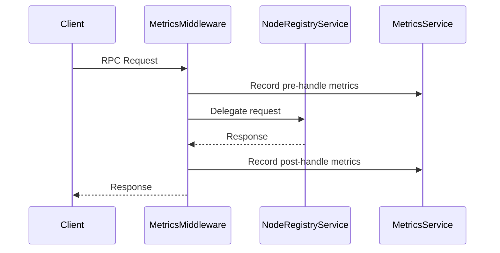

# Middleware Design for Metrics Service

## Overview
This document proposes a middleware architecture to resolve the conflict between metrics collection and node orchestration services. The goal is to separate concerns while preserving functionality.

## Problem Statement
The current `MetricsService` implements `NodeOrchestration` which conflicts with `NodeRegistryService`. This causes:
- Duplicate RPC handling
- Violation of single responsibility principle
- Difficulty in maintaining service boundaries

## Proposed Solution

### Components
1. **MetricsMiddleware**
   - Implements `NodeOrchestration`
   - Wraps inner `NodeOrchestration` service
   - Instruments metrics collection
   
2. **NodeRegistryService**
   - Core orchestration implementation
   - No metrics instrumentation

3. **MetricsService**
   - Metric storage/HTTP endpoint only
   - No RPC handlers

### Sequence Diagram



### Service Registration Changes

**Before**:
```rust
Server::builder()
    .add_service(NodeOrchestrationServer::new(node_registry))
    .add_service(NodeOrchestrationServer::new(metrics))
```

**After**:
```rust
let wrapped_registry = MetricsMiddleware::new(node_registry, metrics.clone());
Server::builder()
    .add_service(NodeOrchestrationServer::new(wrapped_registry))
```

### Migration Path
1. Phase 1: Implement middleware with feature flag
2. Phase 2: Migrate existing metrics handlers
3. Phase 3: Remove legacy metrics implementation

### Code Changes

**New middleware.rs**:
```rust
pub struct MetricsMiddleware<T> {
    inner: T,
    metrics: Arc<MetricsService>,
}

#[tonic::async_trait]
impl<T: NodeOrchestration> NodeOrchestration for MetricsMiddleware<T> {
    async fn register_node(&self, request: Request<NodeInfo>) 
        -> Result<Response<RegistrationResponse>, Status> 
    {
        self.metrics.record_pre_handle("register_node");
        let response = self.inner.register_node(request).await;
        self.metrics.record_post_handle("register_node", &response);
        response
    }
    // Other methods...
}
```

**Updated metrics.rs**:
```rust
pub struct MetricsService {
    // Remove NodeOrchestration implementation
    // Add new instrumentation methods:
    pub fn record_pre_handle(&self, method: &str) { /* ... */ }
    pub fn record_post_handle(&self, method: &str, response: &Result<..., ...>) { /* ... */ }
}
```

## Benefits
- Clear separation of concerns
- No functionality loss
- Backward compatibility
- Enhanced maintainability
- Centralized metrics collection

## Risks
- Temporary increase in complexity during migration
- Potential performance overhead
- Need to update dependent services

## Alternatives Considered
- Decorator pattern (rejected due to trait limitations)
- gRPC interceptors (not available in tonic)