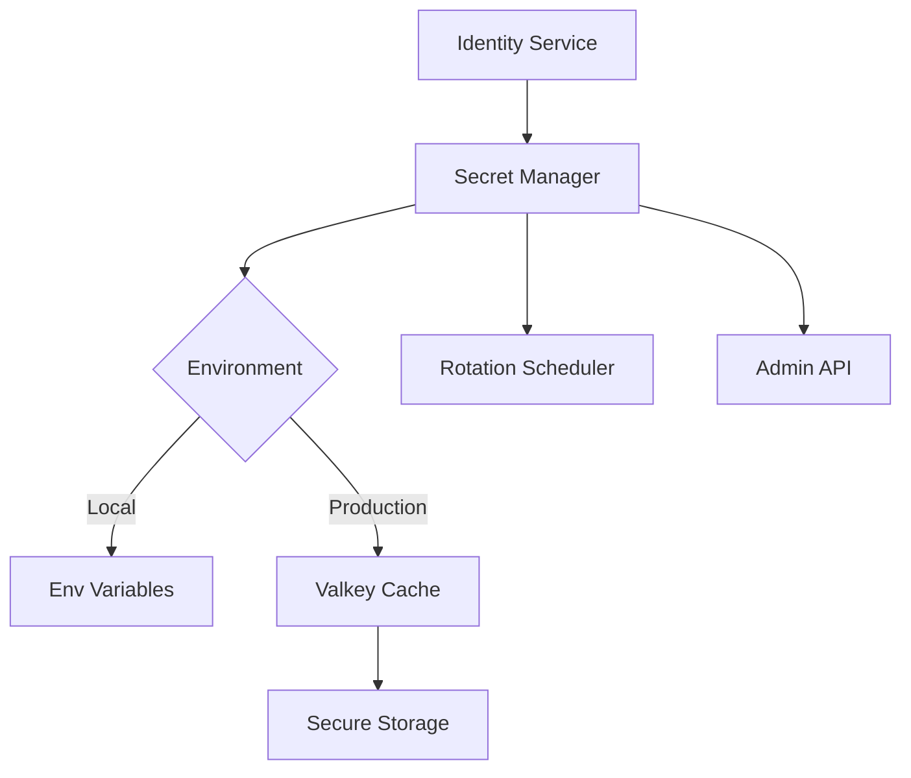

# JWT Secret Management System

## Overview
Secure management of JWT secrets with rotation support and environment-specific handling. This documentation provides comprehensive deployment procedures for production environments.

## Architecture


### Components
1. **Secret Manager**
   - Central interface for secret access
   - Handles versioned secrets
   - Provides current active secret
   - Managed via gRPC API (rotate_secret endpoint)

2. **Storage Layers**
   - **Environment Variables**: For local development
   - **Valkey**: Cached secrets for production with TTL
   - **Secure Storage**: Primary secret storage

3. **Admin API**
   - Protected by ADMIN_TOKEN
   - Requires strong authentication
   - Supports scheduled and emergency rotation

## Deployment Guide

### Valkey Configuration Steps
1. Deploy Valkey cluster with persistence enabled
2. Configure connection pooling:
   ```rust
   let valkey_pool = ValkeyPool::new("redis://orchestrator-secrets:6379").unwrap();
   ```
3. Initialize secrets cache:
   ```bash
   SET jwt_secrets:active "strong-initial-secret-here"
   ```
4. Set TTL for auto-refresh (recommended: 300 seconds)
5. Configure TLS and authentication

### ADMIN_TOKEN Setup Procedures
1. Generate strong ADMIN_TOKEN (min 64 chars):
   ```bash
   openssl rand -base64 48
   ```
2. Set environment variable:
   ```bash
   export ADMIN_TOKEN="your_generated_token"
   ```
3. Verify token access:
   ```bash
   echo $ADMIN_TOKEN | wc -c  # Should be >= 64
   ```
4. Store securely in production environment (never commit to source control)

### Secret Rotation Scheduling
#### Scheduled Rotation (recommended every 90 days)
1. Create rotation cron job:
   ```bash
   0 0 1 */3 * /usr/bin/rotate-secrets.sh
   ```
2. Implement rotation script:
   ```bash
   #!/bin/bash
   NEW_SECRET=$(openssl rand -base64 48)
   grpcurl -d '{"admin_token": "'"$ADMIN_TOKEN"'", "new_secret": "'"$NEW_SECRET"'"}' \\
   orchestrator:50051 cpc.orchestrator.SecretService/RotateSecret
   ```

#### Emergency Rotation
1. Generate new secret:
   ```bash
   openssl rand -base64 48
   ```
2. Execute immediate rotation:
   ```bash
   grpcurl -d '{"admin_token": "YOUR_ADMIN_TOKEN", "new_secret": "NEW_STRONG_SECRET"}' \\
   orchestrator:50051 cpc.orchestrator.SecretService/RotateSecret
   ```
3. Validate rotation in logs:
   ```text
   INFO orchestrator::secret_manager: Rotating JWT secret
   ```

### Production Deployment Checklist
- [ ] Valkey cluster deployed and accessible
- [ ] `jwt_secrets:active` initialized
- [ ] ADMIN_TOKEN configured with min 64 chars
- [ ] Rotation schedule configured (cron or equivalent)
- [ ] All services using identical Valkey configuration
- [ ] Access logs enabled for rotation API
- [ ] Disaster recovery plan documented
- [ ] Validation procedure for secret updates:
   ```rust
   // In identity service
   let key = secret_manager.get_decoding_key();
   ```

## Implementation Details

### Secret Storage
```rust
struct SecretManager {
    current_secret: Arc<RwLock<String>>,
    previous_secrets: Arc<RwLock<Vec<String>>>,
    storage: SecretStorage,
}

enum SecretStorage {
    LocalEnv,
    Valkey(ValkeyPool),
}
```

### Rotation API Integration
```rust
async fn rotate_secret(
    &self,
    request: Request<RotateSecretRequest>,
) -> Result<Response<RotateSecretResponse>, Status> {
    // Validate ADMIN_TOKEN
    if req.admin_token != env::var("ADMIN_TOKEN").unwrap() {
        return Err(Status::permission_denied("Invalid admin token"));
    }
    
    // Validate secret strength
    if req.new_secret.len() < 32 {
        return Err(Status::invalid_argument("Secret too weak"));
    }
    
    // Perform rotation
    self.secret_manager.rotate_secret(req.new_secret).await?;
    
    Ok(Response::new(RotateSecretResponse {
        success: true,
        message: "Secret rotated".into(),
    }))
}
```

### Valkey Integration
```rust
fn load_secret(storage: &SecretStorage) -> Result<String, SecretError> {
    match storage {
        SecretStorage::Valkey(pool) => {
            let mut conn = pool.get()?;
            conn.get("jwt_secrets:active")
        }
        // ... other cases
    }
}
```

## Security Best Practices
1. **Never** store secrets in source code
2. Rotate secrets every 90 days (minimum)
3. Encrypt secrets in transit (TLS 1.3)
4. Limit access to Valkey instances (network policies)
5. Audit secret access monthly
6. Use separate secrets per environment
7. Automate rotation with strong secrets

### Verification Process Update
```rust
fn verify_token(&self, token: &str) -> Result<Claims, AuthError> {
    // First try current secret
    if let Ok(claims) = self.validate_with_key(token, self.current_key()) {
        return Ok(claims);
    }
    
    // Then try previous secrets (24h grace period)
    for secret in self.previous_secrets.iter() {
        if let Ok(claims) = self.validate_with_key(token, secret) {
            return Ok(claims);
        }
    }
    
    Err(AuthError::InvalidToken)
}
```