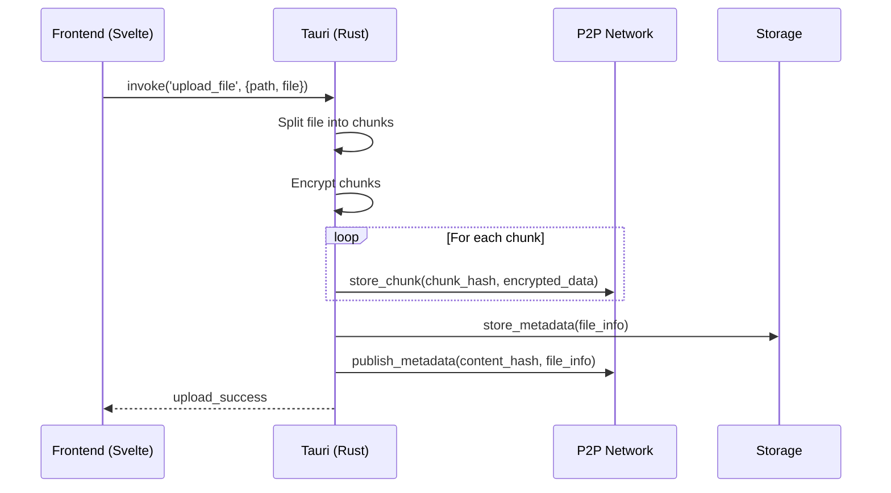
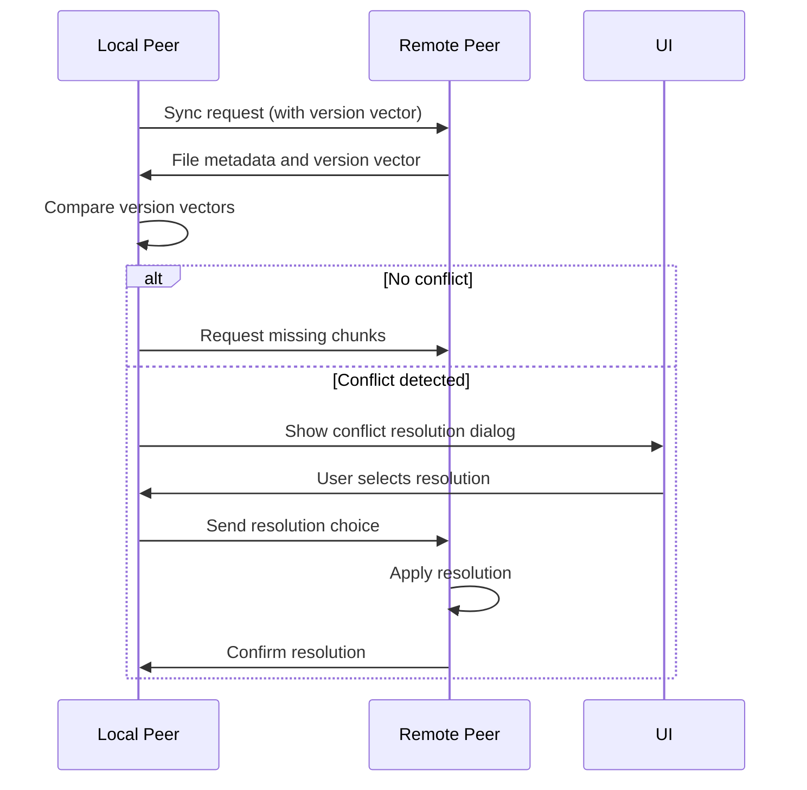

# P2P File Storage Integration

## File Operations Design

### Upload Process
1. User selects file in ContentBrowser
2. File is split into 256KB chunks
3. Each chunk is encrypted (AES-256-GCM)
4. Chunks are distributed to peers via Kademlia DHT
5. File metadata stored in local SQLite DB
6. File entry added to DHT (key = content hash)

### Download Process
1. User selects file to download
2. DHT queried for chunk locations
3. Chunks retrieved from multiple peers in parallel
4. Chunks decrypted and reassembled
5. File saved to local storage

### File Listing
1. Query local SQLite DB for metadata
2. Return file names, sizes, and types
3. Support path-based organization

## Tauri-P2P Interaction



## Metadata Storage Specification

```rust
struct FileMetadata {
    id: String,           // Content hash (SHA-256)
    name: String,         // Original filename
    size: u64,            // File size in bytes
    chunks: Vec<String>,  // List of chunk hashes
    chunk_size: u32,      // Fixed chunk size (262144 bytes)
    created_at: i64,      // Unix timestamp
    encryption_key: Vec<u8>, // Encrypted with user's public key
    merkle_root: String,  // Root hash of Merkle tree
    version_vector: HashMap<PeerId, u64>, // Version vector for conflict detection
}

enum ConflictResolution {
    KeepLocal,
    KeepRemote,
    Merge,
    RenameLocal(String),
    RenameRemote(String)
}
```

## Chunking Strategy

- Fixed chunk size: 256KB (262,144 bytes)
- Merkle tree built from chunk hashes
- Parallel upload/download of chunks
- LRU caching of frequently accessed chunks
- Integrity verification via Merkle proofs

## Content Verification

### Merkle Tree Verification Process
1. During upload, each 256KB chunk is hashed using SHA-256
2. A Merkle tree is built from these chunk hashes
3. The root hash is stored as the file's content address
4. During download, the root hash from metadata is verified against:
   a. Recalculated Merkle root from downloaded chunks
   b. Provided content address in metadata

### Chunk Validation Workflow
1. Each downloaded chunk is immediately validated:
   a. Compute SHA-256 hash of encrypted chunk
   b. Compare with expected chunk hash from metadata
2. Invalid chunks are retried up to 3 times
3. If validation fails after retries, download fails

### Error Handling Scenarios
- `VerificationFailed`: Merkle root mismatch or invalid chunk hash
- `NotFound`: Chunk metadata unavailable
- `InvalidData`: Chunk decryption failure
- `StorageFull`: Insufficient space for reassembly

## Conflict Resolution

When multiple peers modify the same file concurrently, we detect conflicts using vector clocks (version vectors). Each peer maintains a version vector that tracks the latest version of the file from each peer.

### Automatic Conflict Detection
- On synchronization, peers exchange version vectors for each file
- If the local version vector is neither an ancestor nor a descendant of the remote version vector, a conflict is detected

### User-Guided Resolution Workflow
1. UI presents conflict details with file comparison
2. User selects resolution option:
   - Keep Local: Preserve current version
   - Keep Remote: Accept remote version
   - Merge: Combine changes (supported file types only)
   - Rename Local/Remote: Preserve both versions
3. Resolution choice is propagated to all peers
4. Version vectors are merged according to resolution



## Synchronization Protocol

Synchronization occurs periodically and when network connectivity changes:

1. **Peer Discovery**: Find peers with matching files using Kademlia DHT
2. **Version Exchange**: Exchange version vectors to detect changes
3. **Change Detection**: Compare local and remote version vectors
4. **Chunk Transfer**: Transfer missing chunks using parallel requests
5. **Conflict Handling**: Resolve conflicts through user-guided workflow
6. **Metrics Collection**: Track synchronization performance (latency, throughput)

### Metrics Collected
- Synchronization duration
- Conflict resolution count
- Data transfer throughput
- Peer connection success rate

## Embedded Sequence Diagrams

See separate diagram files:
- [File Upload](diagrams/file-upload.mmd)
- [File Download](diagrams/file-download.mmd)
- [File Listing](diagrams/file-listing.mmd)
- [Conflict Resolution](diagrams/conflict-resolution.mmd)