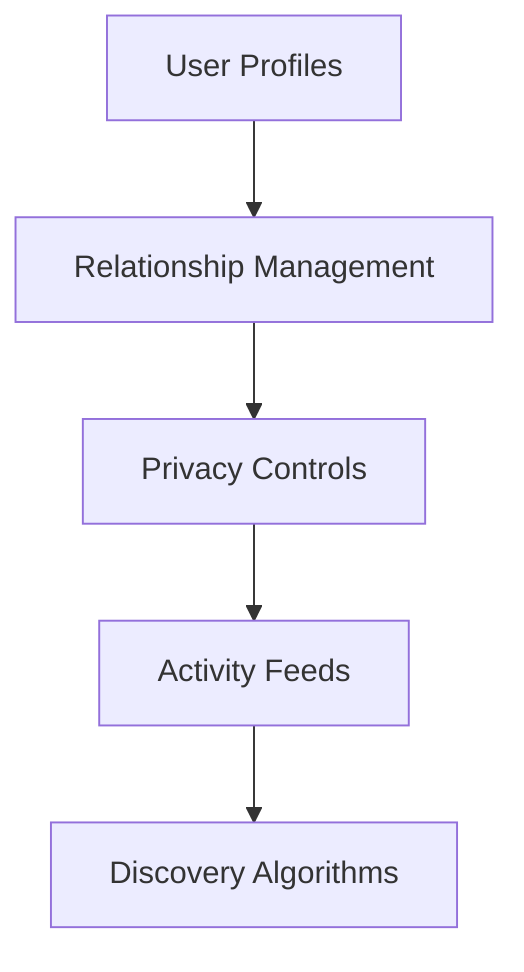
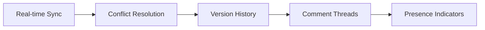
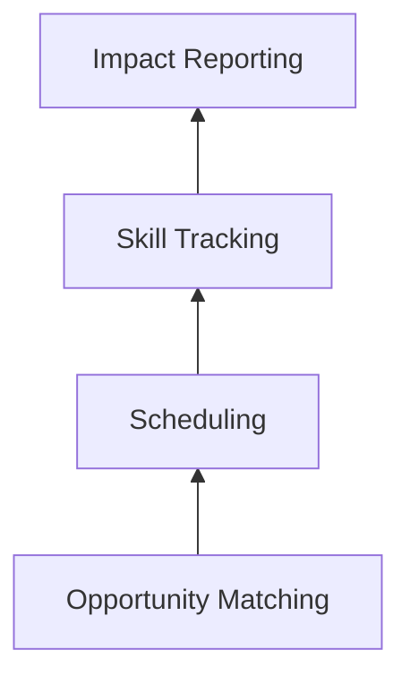
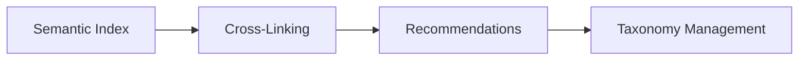
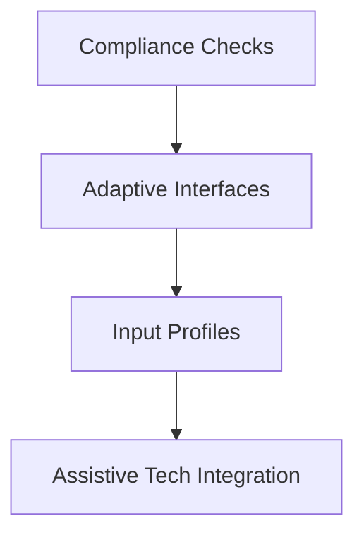
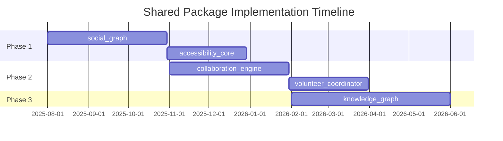

# Proposed Shared Packages

## Introduction
This document proposes new shared packages to enhance social collaboration, volunteer coordination, and knowledge sharing capabilities across our app ecosystem. The proposals address gaps in our current shared functionality.

## 1. social_graph

**Purpose**: Centralized social connection management  
**Key Features**:
- Relationship modeling (friends, followers, teams)
- Granular privacy settings
- Activity aggregation across apps
- Connection recommendation engine

**Integrations**:
- Messenger: Enhanced presence indicators
- Allat/Yapper: Content sharing controls
- Identity: Profile synchronization

---

## 2. collaboration_engine

**Purpose**: Foundation for collaborative editing  
**Key Features**:
- CRDT-based synchronization
- Document versioning
- Collaborative cursors
- Commenting/annotation system

**Integrations**:
- Docs/Sheets: Co-editing
- Research: Annotation sharing
- Task Manager: Collaborative planning

---

## 3. volunteer_coordinator

**Purpose**: Volunteer management infrastructure  
**Key Features**:
- Opportunity discovery engine
- Availability-based scheduling
- Skill gap analysis
- Contribution tracking

**Integrations**:
- Task Manager: Volunteer assignments
- Reputation System: Contribution recognition
- Commons: Community resource coordination

---

## 4. knowledge_graph

**Purpose**: Connect knowledge across the ecosystem  
**Key Features**:
- Content relationship mapping
- Federated search
- Contextual recommendations
- Taxonomy editor

**Integrations**:
- Wiki: Knowledge structuring
- Learn: Content discovery
- Research: Information mapping

---

## 5. accessibility_core

**Purpose**: Centralized accessibility services  
**Key Features**:
- WCAG validation
- Screen reader support
- Color contrast management
- Input adaptation profiles

**Integrations**:
- All UI modules: Compliance enforcement
- Visualization: Accessible charts
- Media: Captioning support

---

## Prioritization Matrix

| Package             | Dev Velocity | Social Impact | Complexity | Total |
|---------------------|-------------|---------------|------------|-------|
| social_graph        | 9           | 10            | 7          | 26    |
| collaboration_engine| 8           | 9             | 8          | 25    |
| accessibility_core  | 7           | 10            | 6          | 23    |
| volunteer_coordinator| 7          | 9             | 7          | 23    |
| knowledge_graph     | 6           | 8             | 9          | 23    |

## Implementation Roadmap

## Next Steps
1. Social_graph prototype development
2. Accessibility audit of core components
3. Volunteer coordination workflow design
4. Knowledge graph schema definition