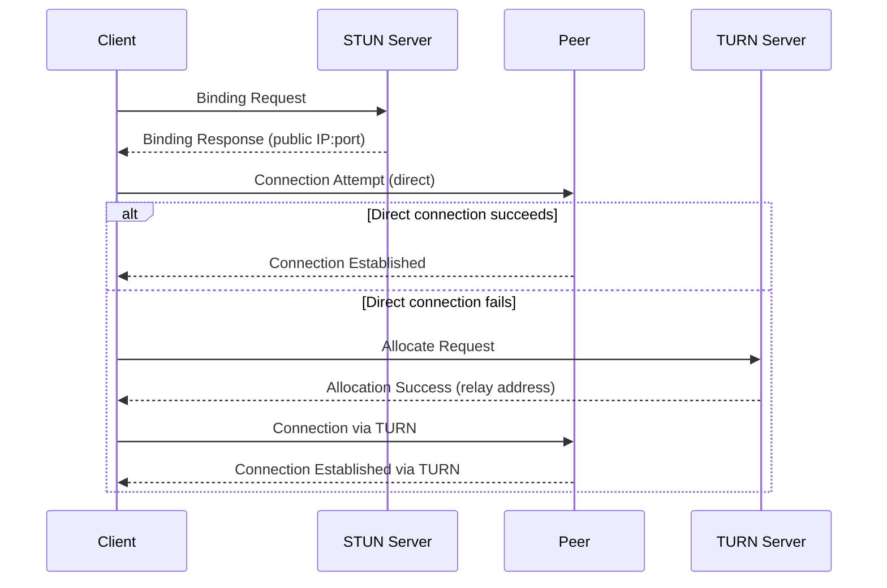
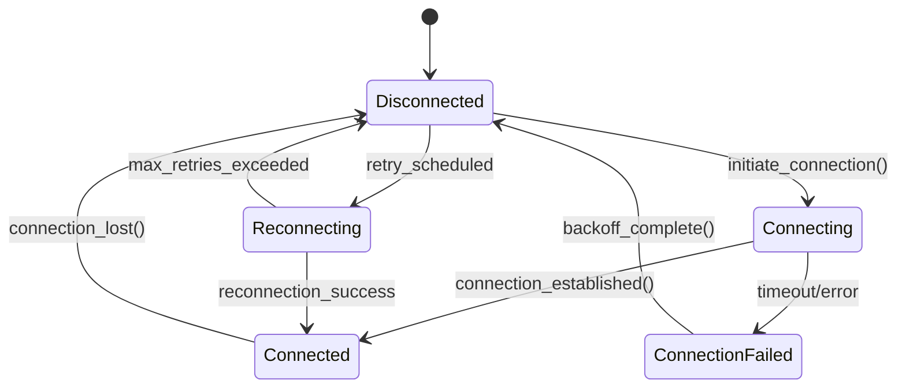

# QUIC Transport Implementation Design for p2panda Network

## Overview
This document details the architecture design for implementing QUIC transport layer in CPC's p2panda network with comprehensive NAT traversal support. The implementation replaces the current placeholder (referenced in P2PANDA_INTEGRATION_SUMMARY.md lines 41, 74-78) with a production-ready solution that meets our key requirements for connection management, NAT traversal, and message routing.

## Architectural Principles
- **Hexagonal Architecture**: QUIC transport implementation will be isolated as a distinct port/adapter
- **Screaming Architecture**: Clear separation between transport concerns and business logic
- **Vertical Slices**: Implementation organized by feature (connection setup, NAT traversal, etc.)
- **Rust Safety**: Leverage Rust's type system for safe network operations

## System Context

### Current State
The existing `PandaNetwork` implementation (src/collaboration/panda_network.rs) contains placeholder code for QUIC transport initialization (lines 55-61):

```rust
// TODO: Initialize QUIC transport with STUN fallback
// This would involve:
// 1. Creating a QUIC endpoint
// 2. Setting up STUN client for NAT traversal
// 3. Configuring connection management
// 4. Implementing message routing
```

The integration summary identifies "Full QUIC Transport Implementation" as the top remaining task with specific requirements (P2PANDA_INTEGRATION_SUMMARY.md lines 74-78).

## High-Level Architecture

### Component Diagram

```
+---------------------+       +----------------------+       +------------------+
|                     |       |                      |       |                  |
|  PandaNetwork       |       |  QUIC Transport      |       |  STUN/TURN       |
|  (NetworkInterface) |<----->|  Implementation      |<----->|  Services        |
|                     |       |                      |       |                  |
+----------^----------+       +----------^-----------+       +------------------+
           |                            |
           |                            |
+----------v-----------+      +---------v------------+
|                      |      |                      |
|  CRDT Document       |      |  p2panda Core        |
|  System              |      |  (p2panda_net::Network)|
|                      |      |                      |
+----------------------+      +----------------------+
```

### Key Components

1. **QUIC Endpoint Manager**: Creates and manages QUIC connections
2. **NAT Traversal Service**: Handles STUN/TURN protocols
3. **Connection State Machine**: Manages connection lifecycle
4. **Message Router**: Routes operations to appropriate document channels
5. **Error Recovery System**: Handles network failures and reconnections

## Detailed Design

### 1. QUIC Endpoint Implementation

#### Architecture
We'll use the `quinn` crate as our QUIC implementation, configured with optimal parameters for real-time collaboration:

```rust
pub struct QuicEndpoint {
    endpoint: quinn::Endpoint,
    server_config: quinn::ServerConfig,
    client_config: quinn::ClientConfig,
    local_addr: SocketAddr,
    stun_servers: Vec<SocketAddr>,
    turn_servers: Vec<TurnServerConfig>,
}
```

#### Implementation Details

**Endpoint Configuration:**
- Use QUIC version draft-29 (current IETF standard)
- Configure for low-latency with:
  ```rust
  let mut endpoint_config = quinn::EndpointConfig::default();
  endpoint_config.max_udp_payload_size(1500);
  endpoint_config.concurrent_connections(1000);
  ```
- Enable connection migration for mobile clients

**Security Configuration:**
- TLS 1.3 with X.509 certificates (using p2panda's identity system)
- Perfect forward secrecy enabled
- Certificate pinning to cooperative-run STUN/TURN servers

### 2. STUN Client Implementation

#### NAT Traversal Flow



#### Implementation Strategy
- Use `stun_codec` crate for STUN protocol implementation
- Implement custom STUN client with cooperative-run STUN servers
- Cache NAT mapping results to reduce STUN server load
- Maintain connection keep-alives to prevent NAT table expiration

### 3. TURN Fallback Mechanism

#### TURN Configuration
```rust
pub struct TurnServerConfig {
    address: SocketAddr,
    username: String,
    password: String,
    realm: String,
}
```

#### Fallback Logic
1. Attempt direct QUIC connection
2. If connection fails (timeout or reset):
   - Initiate STUN request to discover public address
   - If public address differs from local address (symmetric NAT):
     * Request TURN allocation
     * Establish connection via TURN relay
3. Cache NAT type information for future connections

#### Performance Optimization
- Use TURN only when absolutely necessary (symmetric NAT scenarios)
- Implement connection sharing across documents to minimize TURN allocations
- Use short-lived TURN allocations (5-10 minute TTL)

### 4. Connection Reestablishment Protocol

#### State Machine


#### Reconnection Strategy
- Exponential backoff (starting at 500ms, doubling each attempt)
- Maximum retry interval: 30 seconds
- Maintain operation queue during disconnection (leverages existing OperationQueue)
- Session resumption using QUIC session tickets

### 5. Message Routing Architecture

#### Document-Based Routing
- Each document gets a dedicated QUIC stream
- Stream IDs map to document UUIDs
- Message format:
  ```rust
  pub struct NetworkMessage {
      document_id: Uuid,
      payload: Vec<u8>,  // Encrypted PandaOperation
      message_id: u64,
  }
  ```

#### Stream Management
- Stream multiplexing across single QUIC connection
- Priority-based stream scheduling:
  - Document operations: high priority
  - Metadata/sync messages: medium priority
  - Heartbeats: low priority
- Automatic stream cleanup after document inactivity

### 6. Error Handling Strategy

#### Error Classification Matrix

| Error Type | Handling Strategy | Recovery Action |
|------------|-------------------|-----------------|
| Temporary Network Error | Retry with backoff | Automatic reconnection |
| NAT Mapping Changed | STUN requery | Connection migration |
| Symmetric NAT Detected | TURN fallback | Relay connection setup |
| Connection Reset | Full reconnect | Session reinitialization |
| Message Corruption | NACK request | Message retransmission |
| Authentication Failure | Terminate connection | Security alert |

#### Error Propagation
- Errors exposed through `NetworkError` enum with specific variants
- Structured error metrics for monitoring
- Automatic fallback to TURN when connection quality degrades

## Integration with Existing PandaNetwork

### Key Integration Points

1. **Initialization** (replacing placeholder at panda_network.rs:55-61):
```rust
// Initialize QUIC transport with STUN fallback
let transport = QuicTransport::new(
    local_addr,
    config.stun_servers.clone(),
    config.turn_servers.clone(),
)?;
self.transport = Some(Arc::new(Mutex::new(transport)));
```

2. **Connection State Management** (modifying set_connected):
```rust
fn set_connected(&self, connected: bool) {
    // Update transport connection state
    if let Some(transport) = &self.transport {
        transport.lock().unwrap().set_connected(connected);
    }
    // Update existing connection flag
    let mut is_connected = self.is_connected.lock().unwrap();
    *is_connected = connected;
}
```

3. **Operation Broadcasting** (enhancing broadcast_operation):
```rust
async fn broadcast_operation(
    &self, 
    document_id: Uuid, 
    operation: DocumentOperation
) -> Result<(), DocumentError> {
    // [Existing signing/encryption logic]
    
    // Route through QUIC transport
    if let Some(transport) = &self.transport {
        transport.lock().unwrap().send_to_all(
            document_id, 
            &operation_bytes
        ).await?;
    } else {
        // Fallback to local broadcast for testing
        let _ = self.operation_sender.send(operation);
    }
    
    Ok(())
}
```

## Security Considerations

1. **Transport Layer Security**
   - QUIC provides built-in TLS 1.3 encryption
   - Additional application-layer encryption via Double Ratchet
   - Certificate pinning for STUN/TURN servers

2. **NAT Traversal Security**
   - STUN servers must be cooperative-run (no public servers)
   - TURN credentials generated per-session
   - Time-limited TURN allocations

3. **Connection Security**
   - Connection migration protection
   - Anti-amplification measures
   - Rate limiting for connection attempts

4. **Privacy Considerations**
   - Minimal metadata exposure during NAT traversal
   - No persistent identifiers in STUN/TURN requests
   - Cooperative-run infrastructure only

## Performance Targets

| Metric | Target | Measurement Method |
|--------|--------|---------------------|
| Connection Setup Time | < 500ms (direct), < 1.5s (TURN) | QuicTransport::connect() timing |
| Operation Latency | < 100ms (LAN), < 300ms (WAN) | End-to-end operation delivery |
| Max Concurrent Connections | 1,000 | Load testing |
| NAT Traversal Success Rate | > 95% | STUN/TURN fallback metrics |
| Bandwidth Efficiency | 30% reduction vs TCP | Network traffic analysis |

## Testing Strategy

### Test Scenarios
1. **NAT Traversal Tests**
   - Full cone NAT simulation
   - Restricted cone NAT simulation
   - Port-restricted cone NAT simulation
   - Symmetric NAT simulation (requires TURN)

2. **Failure Mode Tests**
   - Network interface switching (Wi-Fi to cellular)
   - Intermittent connectivity
   - STUN/TURN server failures
   - QUIC connection migration

3. **Performance Tests**
   - High-latency network simulation
   - Packet loss scenarios
   - Connection storm testing
   - Long-duration connection stability

## Implementation Plan

### Phase 1: Core QUIC Infrastructure (2 days)
- Implement `QuicEndpoint` manager
- Configure TLS and security parameters
- Basic connection establishment

### Phase 2: NAT Traversal (3 days)
- STUN client implementation
- TURN client integration
- NAT type detection

### Phase 3: Connection Management (2 days)
- Connection state machine
- Reestablishment protocol
- Stream management

### Phase 4: Integration & Testing (3 days)
- Integrate with PandaNetwork
- Implement error handling
- Comprehensive test suite

## Dependencies
- `quinn` crate (0.10.0+)
- `stun_codec` crate (0.7.0+)
- Cooperative-run STUN/TURN servers
- Existing cryptographic infrastructure

## References
- IETF QUIC Specification (RFC 9000)
- STUN Protocol (RFC 5389)
- TURN Protocol (RFC 5766)
- p2panda Protocol Specification