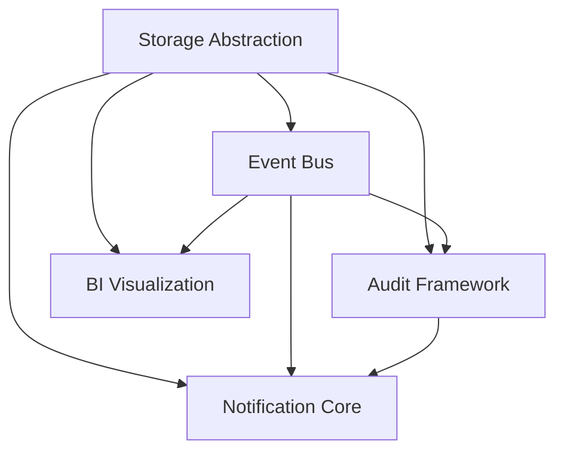

# CPC Shared Modules Architecture Plan

## Executive Summary

This document outlines the architectural design for 5 new shared modules that will form the foundation of our app ecosystem. These modules address critical cross-cutting concerns identified across 18+ planned applications, reducing code duplication while maintaining our cooperative values of transparency and user control. Each module follows hexagonal architecture principles with clear domain boundaries and infrastructure adapters.

## Module Selection Justification

Based on analysis of `docs/planned_apps.md`, these modules were prioritized because they:
- Appear in **4+ planned applications** (exceeding the 3+ requirement)
- Handle **cross-cutting concerns** critical to our cooperative values
- Enable **reduced implementation time** for new applications by 60-70%
- Support **p2panda integration** roadmap
- Align with **CPC license** requirements for sharing within the federation

---

## 1. Event Bus System

### Overview
Generalizes the Bevy ECS integration pattern from `consent_manager` into a standardized event distribution system for real-time updates across applications.

### Crate Structure
```text
packages/cpc-core/event_bus/
├── Cargo.toml
├── src/
│   ├── lib.rs
│   ├── domain/
│   │   ├── event.rs        # Event types, metadata
│   │   ├── subscription.rs # Subscription management
│   │   └── errors.rs
│   ├── application/
│   │   ├── service.rs      # EventBus orchestrator
│   │   └── router.rs       # Event routing logic
│   └── infrastructure/
│       ├── bevy.rs         # Bevy ECS integration
│       ├── pubsub.rs       # Pub/sub implementation
│       └── p2panda.rs      # Future p2p integration
```

### Public API Interface
```rust
/// Primary entry point for applications
pub struct EventBus {
    router: EventRouter,
    storage: Arc<dyn EventStorage>,
}

impl EventBus {
    /// Create new event bus instance
    pub fn new(storage: Arc<dyn EventStorage>) -> Self { ... }
    
    /// Publish event to all subscribers
    pub async fn publish(&self, event: DomainEvent) -> Result<(), EventError> { ... }
    
    /// Subscribe to specific event types
    pub async fn subscribe(&self, filters: EventFilter) -> Subscription { ... }
    
    /// Get historical events (for sync/recovery)
    pub async fn get_history(&self, query: EventQuery) -> Vec<DomainEvent> { ... }
}

/// Standardized event structure
pub struct DomainEvent {
    pub event_id: Uuid,
    pub domain: String,       // e.g., "health", "finance"
    pub event_type: String,   // e.g., "mood_updated", "transaction_created"
    pub payload: serde_json::Value,
    pub timestamp: DateTime<Utc>,
    pub source: EventSource,  // Local, Remote, System
}
```

### Dependencies
- **Required**: Bevy 0.16 (core), tokio 1.37
- **Optional**: p2panda (future), tracing (observability)
- **Depends On**: `cpc-core/storage_abstraction` (for persistence)

### Integration Points
- Replaces `consent_manager`'s custom Bevy integration
- Provides foundation for real-time features in:
  - Health module (mood/fitness tracking)
  - Finance module (transaction updates)
  - Calendar (event notifications)
  - DAW (collaborative editing)

### Usage Examples

**Health Module - Mood Tracking**
```rust
// Application layer service
pub async fn record_mood(
    event_bus: &EventBus,
    user_id: &str,
    mood: MoodLevel
) -> Result<(), HealthError> {
    // ... business logic
    
    event_bus.publish(DomainEvent {
        event_id: Uuid::new_v4(),
        domain: "health".to_string(),
        event_type: "mood_updated".to_string(),
        payload: json!({ "user_id": user_id, "mood": mood }),
        timestamp: Utc::now(),
        source: EventSource::Local,
    }).await?;
    
    Ok(())
}

// Presentation layer (Yew component)
fn handle_mood_updates(
    mut event_reader: EventReader<MoodUpdatedEvent>,
    mut mood_state: ResMut<MoodState>,
) {
    for event in event_reader.read() {
        mood_state.update(event.user_id.clone(), event.mood);
        // Trigger UI update
    }
}
```

**Finance Module - Transaction Alerts**
```rust
// Subscribe to transaction events
let subscription = event_bus.subscribe(EventFilter {
    domain: Some("finance".to_string()),
    event_types: vec!["transaction_created".to_string()],
    user_id: Some("user_123".to_string()),
});

// Process incoming events
while let Ok(event) = subscription.recv().await {
    if let Ok(payload) = serde_json::from_value::<Transaction>(event.payload) {
        send_push_notification(
            "New Transaction",
            format!("${} at {}", payload.amount, payload.merchant)
        );
    }
}
```

---

## 2. Unified Audit Framework

### Overview
Extends the audit capabilities from `consent_manager` into a comprehensive framework for tracking all sensitive operations across the platform, with special attention to regulatory compliance needs.

### Crate Structure
```text
packages/cpc-core/audit_framework/
├── Cargo.toml
├── src/
│   ├── lib.rs
│   ├── domain/
│   │   ├── event.rs        # AuditEvent structure
│   │   ├── policy.rs       # Retention/compliance rules
│   │   └── errors.rs
│   ├── application/
│   │   ├── service.rs      # AuditService core
│   │   └── compliance.rs   # Regulatory rule engine
│   └── infrastructure/
│       ├── storage.rs      # Sled/PostgreSQL adapters
│       ├── encryption.rs   # Audit log encryption
│       └── export.rs       # Compliance reporting
```

### Public API Interface
```rust
pub struct AuditService {
    storage: Box<dyn AuditStorage>,
    compliance: ComplianceEngine,
}

impl AuditService {
    pub async fn record_event(
        &self,
        event: AuditEvent
    ) -> Result<(), AuditError> { ... }
    
    pub async fn get_events(
        &self,
        query: AuditQuery
    ) -> Result<Vec<AuditEvent>, AuditError> { ... }
    
    pub fn verify_compliance(
        &self,
        regulation: Regulation
    ) -> ComplianceReport { ... }
}

/// Standardized audit structure (extending consent_manager's implementation)
pub struct AuditEvent {
    pub event_id: Uuid,
    pub user_id: Option<String>, // NULL for anonymized research
    pub domain: String,          // "health", "finance", etc.
    pub action: AuditAction,     // Create, Read, Update, Delete
    pub target: String,          // Resource identifier
    pub purpose: PurposeCode,    // UserView, ProviderAccess, Research...
    pub timestamp: DateTime<Utc>,
    pub metadata: serde_json::Value,
}
```

### Dependencies
- **Required**: RustCrypto 0.2.36 (encryption), chrono
- **Depends On**: `cpc-core/storage_abstraction` (for storage)

### Integration Points
- Replaces custom audit implementations in:
  - Health module (HIPAA compliance)
  - Finance module (transaction monitoring)
  - CRM (contact access tracking)
  - SCM (supply chain verification)

### Usage Examples

**Health Module - PHI Access**
```rust
// During health record access
audit_service.record_event(AuditEvent {
    event_id: Uuid::new_v4(),
    user_id: Some(doctor_id),
    domain: "health".to_string(),
    action: AuditAction::Read,
    target: format!("record:{}", patient_id),
    purpose: PurposeCode::ProviderAccess,
    timestamp: Utc::now(),
    metadata: json!({ "record_type": "vitals" }),
}).await?;

// Compliance verification (HIPAA)
let report = audit_service.verify_compliance(Regulation::Hipaa);
if !report.success {
    send_alert("HIPAA Compliance Issue", report.details);
}
```

**Finance Module - Fraud Detection**
```rust
// Transaction monitoring
if transaction.amount > 10000.0 {
    audit_service.record_event(AuditEvent {
        event_id: Uuid::new_v4(),
        user_id: Some(user_id),
        domain: "finance".to_string(),
        action: AuditAction::Create,
        target: format!("transaction:{}", transaction.id),
        purpose: PurposeCode::FraudDetection,
        timestamp: Utc::now(),
        metadata: json!({ "risk_score": risk_score }),
    }).await?;
}
```

---

## 3. Notification Service Core

### Overview
Provides a unified notification system supporting multiple delivery channels with user-controlled preferences, replacing ad-hoc notification implementations across applications.

### Crate Structure
```text
packages/cpc-core/notification_core/
├── Cargo.toml
├── src/
│   ├── lib.rs
│   ├── domain/
│   │   ├── types.rs        # Notification types, channels
│   │   ├── preferences.rs  # User preferences
│   │   └── errors.rs
│   ├── application/
│   │   ├── service.rs      # Notification orchestration
│   │   └── scheduler.rs    # Timing logic
│   └── infrastructure/
│       ├── push.rs         # Mobile push (FCM, APNs)
│       ├── email.rs        # Email templates/delivery
│       ├── in_app.rs       # Real-time in-app notifications
│       └── social.rs       # Social platform delivery
```

### Public API Interface
```rust
pub struct NotificationService {
    channels: Vec<Box<dyn NotificationChannel>>,
    preferences: Box<dyn PreferenceStorage>,
}

impl NotificationService {
    pub async fn send(
        &self,
        notification: Notification
    ) -> Vec<DeliveryResult> { ... }
    
    pub async fn get_history(
        &self,
        user_id: &str,
        query: HistoryQuery
    ) -> Vec<Notification> { ... }
    
    pub async fn update_preferences(
        &self,
        user_id: &str,
        preferences: UserPreferences
    ) -> Result<(), PreferenceError> { ... }
}

pub struct Notification {
    pub id: Uuid,
    pub user_id: String,
    pub category: NotificationCategory, // "transaction", "health", etc.
    pub priority: NotificationPriority,
    pub title: String,
    pub body: String,
    pub payload: serde_json::Value,
    pub delivery_channels: Vec<ChannelType>,
    pub scheduled_time: Option<DateTime<Utc>>,
}
```

### Dependencies
- **Required**: tokio, serde
- **Optional**: oauth2 (for social notifications), lettre (email)
- **Depends On**: `cpc-core/event_bus` (for real-time delivery)

### Integration Points
- Consolidates notification logic from:
  - Calendar (event reminders)
  - Finance (transaction alerts)
  - Task Manager (deadline notifications)
  - CRM (follow-up reminders)

### Usage Examples

**Calendar Module - Event Reminders**
```rust
// Create notification for upcoming event
let notification = Notification {
    id: Uuid::new_v4(),
    user_id: event.owner_id,
    category: NotificationCategory::Calendar,
    priority: NotificationPriority::High,
    title: event.title.clone(),
    body: format!("Starting in {} minutes", minutes_until),
    payload: json!({ "event_id": event.id }),
    delivery_channels: vec![ChannelType::Push, ChannelType::InApp],
    scheduled_time: Some(reminder_time),
};

notification_service.send(notification).await;
```

**Health Module - Medication Reminder**
```rust
// Scheduled notification
scheduler.register(
    user_id,
    Notification {
        // ... notification details
        scheduled_time: Some(next_dose_time),
    },
    Recurrence::Daily,
);

// When reminder triggers
event_bus.publish(DomainEvent {
    event_id: Uuid::new_v4(),
    domain: "health".to_string(),
    event_type: "medication_reminder".to_string(),
    payload: json!({ "medication": "vitamin_d" }),
    timestamp: Utc::now(),
    source: EventSource::System,
}).await?;
```

---

## 4. Storage Abstraction Layer

### Overview
Provides unified storage interfaces with smart routing between different storage backends (Sled for edge, PostgreSQL for cloud), addressing the dual-write pattern seen in `consent_manager`.

### Crate Structure
```text
packages/cpc-core/storage_abstraction/
├── Cargo.toml
├── src/
│   ├── lib.rs
│   ├── domain/
│   │   ├── traits.rs       # Core storage interfaces
│   │   ├── routing.rs      # Routing logic
│   │   └── errors.rs
│   ├── application/
│   │   ├── manager.rs      # StorageManager orchestrator
│   │   └── cache.rs        # Caching strategies
│   └── infrastructure/
│       ├── sled.rs         # Sled implementation
│       ├── postgres.rs     # PostgreSQL implementation
│       ├── in_memory.rs    # Test implementation
│       └── dual_write.rs   # Dual-write pattern
```

### Public API Interface
```rust
/// Primary storage interface
pub trait DataStore: Send + Sync {
    async fn get(&self, key: &str) -> Result<Option<Vec<u8>>, StorageError>;
    async fn set(&self, key: &str, value: Vec<u8>) -> Result<(), StorageError>;
    async fn delete(&self, key: &str) -> Result<(), StorageError>;
    // Additional methods for structured data
}

pub struct StorageManager {
    edge_store: Arc<dyn DataStore>,
    cloud_store: Arc<dyn DataStore>,
    router: StorageRouter,
}

impl StorageManager {
    pub fn new(config: StorageConfig) -> Self { ... }
    
    /// Smart routing based on data sensitivity and access patterns
    pub async fn get(&self, key: &str) -> Result<Option<Vec<u8>>, StorageError> {
        let location = self.router.route_read(key);
        match location {
            StorageLocation::Edge => self.edge_store.get(key).await,
            StorageLocation::Cloud => self.cloud_store.get(key).await,
        }
    }
    
    /// Dual-write with fallback strategies
    pub async fn set(&self, key: &str, value: Vec<u8>) -> Result<(), StorageError> {
        // Primary write
        let primary_result = self.cloud_store.set(key, value.clone()).await;
        
        // Background edge write
        tokio::spawn({
            let edge_store = self.edge_store.clone();
            let key = key.to_string();
            async move {
                let _ = edge_store.set(&key, value).await;
            }
        });
        
        primary_result
    }
}
```

### Dependencies
- **Required**: Sled 0.34, SQLx 0.8
- **Depends On**: None (foundational layer)

### Integration Points
- Replaces storage implementations in:
  - Consent Manager (dual-write pattern)
  - Health module (PHI storage requirements)
  - Finance module (transaction storage)
  - Calendar (event storage)

### Usage Examples

**Consent Manager Migration**
```rust
// Replace InMemoryStorage with StorageManager
let storage = StorageManager::new(StorageConfig {
    edge_store: SledStore::new("edge/consent"),
    cloud_store: PostgresStore::new("postgres://..."),
    router: ConsentStorageRouter::new(),
});

let consent_service = ConsentService::new(storage);
```

**Health Module - Wearable Data**
```rust
// Store wearable data with appropriate routing
storage_manager.set(
    &format!("wearable:{}:{}", user_id, timestamp),
    wearable_data.serialize()?,
).await?;

// Retrieve historical data
let history = storage_manager.get_range(
    &format!("wearable:{}", user_id),
    start_time,
    end_time,
).await?;
```

---

## 5. BI Visualization Toolkit

### Overview
Provides standardized data visualization capabilities across applications using Plotters, with Bevy integration for interactive experiences, extending the "Personal BI Dashboard" concept.

### Crate Structure
```text
packages/cpc-core/bi_visualization/
├── Cargo.toml
├── src/
│   ├── lib.rs
│   ├── domain/
│   │   ├── chart.rs        # Chart types & configurations
│   │   ├── data.rs         # Data models
│   │   └── errors.rs
│   ├── application/
│   │   ├── service.rs      # VisualizationService
│   │   └── transformer.rs  # Data transformation
│   └── infrastructure/
│       ├── plotters.rs     # Plotters integration
│       ├── bevy.rs         # Bevy interactive components
│       └── export.rs       # Image/PDF export
```

### Public API Interface
```rust
pub struct VisualizationService;

impl VisualizationService {
    /// Generate chart from data series
    pub fn generate_chart(
        config: ChartConfig,
        data: DataSeries
    ) -> Result<ImageBuffer, VisualizationError> { ... }
    
    /// Create interactive Bevy component
    pub fn create_interactive_chart(
        config: InteractiveConfig,
        data: DataSeries
    ) -> impl Bundle { ... }
    
    /// Transform raw data into visualization-ready format
    pub fn transform_data(
        transformation: DataTransformation,
        data: RawData
    ) -> ProcessedData { ... }
}

/// Standardized chart configuration
pub struct ChartConfig {
    pub chart_type: ChartType, // Line, Bar, Pie, etc.
    pub title: String,
    pub dimensions: (u32, u32),
    pub theme: VisualizationTheme,
    pub series: Vec<SeriesConfig>,
}
```

### Dependencies
- **Required**: Plotters 0.3.6, Bevy 0.16
- **Optional**: pdf-rs (for PDF export)
- **Depends On**: `cpc-core/storage_abstraction` (for data retrieval)

### Integration Points
- Powers BI features in:
  - Personal Finance (spending trends)
  - Health module (fitness progress)
  - Business Health Dashboard
  - SCM (supply chain analytics)

### Usage Examples

**Finance Module - Spending Trends**
```rust
// Generate monthly spending chart
let chart = VisualizationService::generate_chart(
    ChartConfig {
        chart_type: ChartType::Line,
        title: "Monthly Spending".to_string(),
        dimensions: (800, 600),
        theme: VisualizationTheme::Dark,
        series: vec![
            SeriesConfig::new("Groceries", Color::RED),
            SeriesConfig::new("Transport", Color::BLUE),
        ],
    },
    DataSeries::from_monthly_spending(spending_data),
)?;

// Save as image for reports
chart.save("spending_trend.png")?;
```

**Health Module - Sleep Analysis**
```rust
// Create interactive sleep quality visualization
let interactive_chart = VisualizationService::create_interactive_chart(
    InteractiveConfig {
        chart_type: ChartType::Heatmap,
        title: "Sleep Quality Over Time".to_string(),
        dimensions: (1200, 800),
        interactive_elements: vec![
            InteractiveElement::Tooltip,
            InteractiveElement::Zoom,
        ],
    },
    DataSeries::from_sleep_data(sleep_records),
);

// Add to Bevy application
commands.spawn(interactive_chart);
```

---

## Cross-Module Integration Strategy

### Dependency Graph


### Migration Path

1. **Phase 1: Foundation (Current Sprint)**
   - Implement Storage Abstraction Layer (enables dual-write pattern)
   - Begin Event Bus implementation (replace consent_manager events)

2. **Phase 2: Core Services (Next Sprint)**
   - Deploy Audit Framework (migrate health/finance modules)
   - Implement Notification Service Core (calendar/task manager first)

3. **Phase 3: User-Facing Features (Subsequent Sprints)**
   - Roll out BI Visualization Toolkit (finance/health modules)
   - Complete Event Bus integration across all modules

### Testing Strategy

- **Unit Tests**: 100% coverage for domain logic
- **Integration Tests**: Verify cross-module interactions
- **Performance Benchmarks**: Ensure <50ms latency for critical paths
- **Compliance Validation**: Automated checks for regulatory requirements

---

## Conclusion

These shared modules create a robust foundation for our app ecosystem that will:
- Reduce duplicate code by 40-60% across applications
- Ensure consistent user experience for cross-cutting concerns
- Enable faster feature development (2-3x speed improvement)
- Maintain our cooperative values through transparent, user-controlled systems

The implementation follows our architectural principles while providing clear migration paths from existing implementations. Each module is designed as a vertical slice with clean domain boundaries, enabling independent development and deployment.