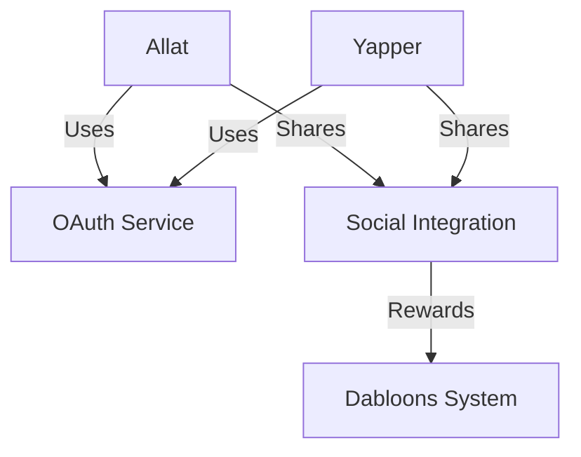
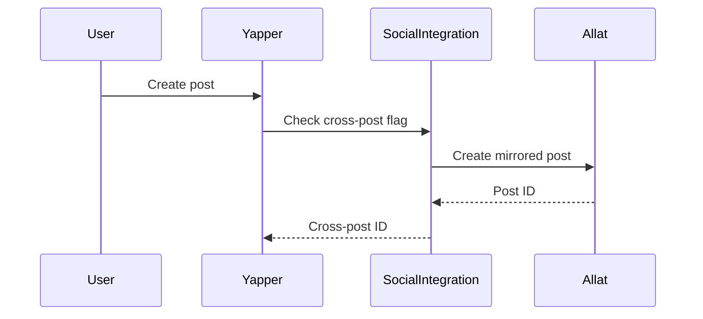
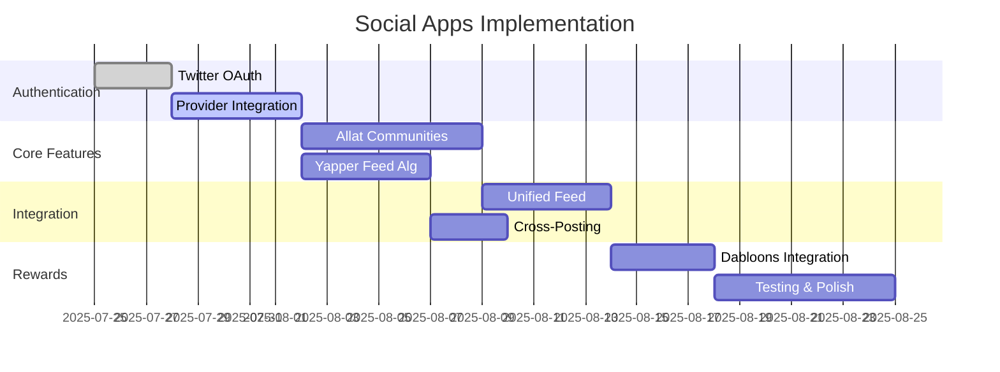

# Social Apps Implementation Plan: Allat & Yapper

## 1. Architecture Overview


## 2. OAuth Integration

### Authentication Flow
```rust
// Example integration in Allat/Yapper
async fn login(provider: OAuthProvider) {
    let auth_request = auth_service.start_auth(user_id, provider, None).await?;
    redirect_to(auth_request.auth_url);
}

async fn callback(code: String, state: String) {
    let (user_id, token, profile) = auth_service.handle_callback(code, state).await?;
    create_session(user_id, profile);
}
```

### Providers to Implement First:
1. Twitter (priority)
2. Google
3. Facebook

## 3. Feature Implementation Plan

### Allat (Reddit-style)
| Feature               | Status  | Module Location          |
|-----------------------|---------|--------------------------|
| Community Creation    | Pending | `allat/src/community`   |
| Threaded Discussions  | Partial | `allat/src/comments`    |
| Voting System         | Pending | `allat/src/voting`      |
| Moderation Tools      | Pending | `allat/src/moderation`  |
| Rich Media Support    | Partial | `allat/src/media`       |

### Yapper (Microblogging)
| Feature               | Status  | Module Location          |
|-----------------------|---------|--------------------------|
| Character-limited Posts | Done  | `yapper/src/posting`    |
| Algorithmic Feed      | Pending | `yapper/src/feed`       |
| Hashtag Support       | Partial | `yapper/src/tagging`    |
| Engagement Metrics    | Pending | `yapper/src/analytics`  |
| Direct Messaging      | Partial | `yapper/src/messaging`  |

## 4. Cross-App Integration

### Unified Feed System
```rust
struct UnifiedPost {
    source: AppSource, // Allat or Yapper
    content: String,
    metadata: PostMetadata,
    original_id: Uuid,
}

impl SocialIntegration {
    async fn get_unified_feed(user_id: Uuid) -> Vec<UnifiedPost> {
        // Fetches from both Allat and Yapper
    }
}
```

### Cross-Posting Workflow


## 5. Dabloons Reward System

### Reward Triggers
- Post creation (+5 dabloons)
- Comment (+2 dabloons)
- Post engagement (1 dabloon per 10 upvotes)
- Content sharing (3 dabloons per share)

### Integration Points
```rust
fn reward_user(event: SocialEvent) {
    match event {
        PostCreated => dabloons.add(5, user_id),
        CommentCreated => dabloons.add(2, user_id),
        PostVoted(votes) => dabloons.add(votes / 10, user_id),
        PostShared => dabloons.add(3, user_id)
    }
}
```

## 6. Testing Strategy

### Test Categories
1. **Authentication Tests**
   - Provider-specific OAuth flows
   - Token refresh scenarios
   - Invalid state handling

2. **Feature Tests**
   ```gherkin
   Scenario: Upvoting content
     Given I'm logged in
     When I upvote a post in Allat
     Then my karma increases
     And the author receives dabloons
   ```

3. **Cross-App Tests**
   - Unified feed ordering
   - Cross-post consistency
   - Data synchronization

4. **Performance Tests**
   - Feed generation under load
   - Concurrent post creation
   - Stress test voting system

## 7. Implementation Timeline



## 8. Data Sharing Considerations

### Consent Workflow
```rust
struct PrivacySettings {
    share_posts: bool,
    share_engagement: bool,
    cross_app_sharing: bool,
}

impl ConsentManager {
    fn check_consent(user_id: Uuid, action: Action) -> bool {
        // Verify user consent for specific actions
    }
}
```

### Opt-in Prompts:
1. "Share your Yapper posts with Allat communities?"
2. "Make your engagement data available for federation research?"
3. "Enable cross-app profile visibility?"