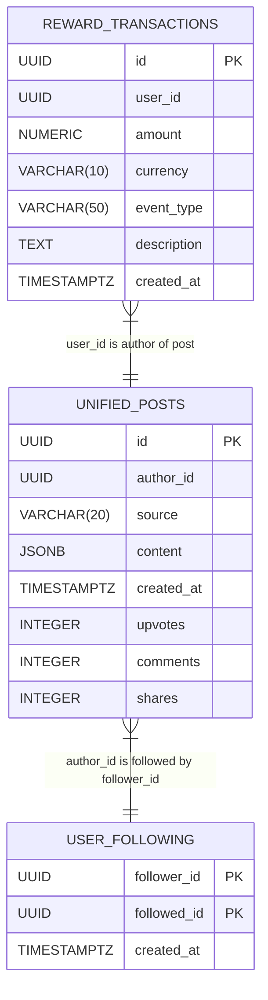

# Social Integration Database Design

## ER Diagram


## Repository Interfaces

### UnifiedPostRepository
```rust
#[async_trait]
pub trait UnifiedPostRepository: Send + Sync {
    async fn save(&self, post: &UnifiedPost) -> Result<(), Box<dyn Error + Send + Sync>>;
    async fn find_by_id(&self, id: Uuid) -> Result<Option<UnifiedPost>, Box<dyn Error + Send + Sync>>;
    async fn find_by_author(&self, author_id: Uuid) -> Result<Vec<UnifiedPost>, Box<dyn Error + Send + Sync>>;
    async fn find_by_source(&self, source: AppSource) -> Result<Vec<UnifiedPost>, Box<dyn Error + Send + Sync>>;
}
```

### UserFollowingRepository
```rust
#[async_trait]
pub trait UserFollowingRepository: Send + Sync {
    async fn follow(&self, follower_id: Uuid, followed_id: Uuid) -> Result<(), Box<dyn Error + Send + Sync>>;
    async fn unfollow(&self, follower_id: Uuid, followed_id: Uuid) -> Result<(), Box<dyn Error + Send + Sync>>;
    async fn get_following(&self, follower_id: Uuid) -> Result<Vec<Uuid>, Box<dyn Error + Send + Sync>>;
}
```

### RewardTransactionRepository
```rust
#[async_trait]
pub trait RewardTransactionRepository: Send + Sync {
    async fn record_transaction(
        &self, 
        user_id: Uuid, 
        amount: Money, 
        event_type: String, 
        description: String
    ) -> Result<(), Box<dyn Error + Send + Sync>>;
}
```

## PostgreSQL Schema

### Unified Posts Table
```sql
CREATE TABLE unified_posts (
    id UUID PRIMARY KEY,
    author_id UUID NOT NULL,
    source VARCHAR(20) NOT NULL,
    content JSONB NOT NULL,
    created_at TIMESTAMPTZ NOT NULL,
    updated_at TIMESTAMPTZ NOT NULL,
    upvotes INTEGER NOT NULL DEFAULT 0,
    comments INTEGER NOT NULL DEFAULT 0,
    shares INTEGER NOT NULL DEFAULT 0
);

CREATE INDEX idx_unified_posts_author_id ON unified_posts (author_id);
CREATE INDEX idx_unified_posts_source ON unified_posts (source);
```

### User Following Table
```sql
CREATE TABLE user_following (
    follower_id UUID NOT NULL,
    followed_id UUID NOT NULL,
    created_at TIMESTAMPTZ NOT NULL DEFAULT NOW(),
    PRIMARY KEY (follower_id, followed_id)
);

CREATE INDEX idx_user_following_follower_id ON user_following (follower_id);
CREATE INDEX idx_user_following_followed_id ON user_following (followed_id);
```

### Reward Transactions Table
```sql
CREATE TABLE reward_transactions (
    id UUID PRIMARY KEY,
    user_id UUID NOT NULL,
    amount NUMERIC(20, 8) NOT NULL,
    currency VARCHAR(10) NOT NULL,
    event_type VARCHAR(50) NOT NULL,
    description TEXT,
    created_at TIMESTAMPTZ NOT NULL DEFAULT NOW()
);

CREATE INDEX idx_reward_transactions_user_id ON reward_transactions (user_id);
```

## Migration Plan

1. Create migration scripts in `packages/social_integration/migrations`:
   - `0001_create_unified_posts_table.sql`
   - `0002_create_user_following_table.sql`
   - `0003_create_reward_transactions_table.sql`

2. Implement PostgreSQL repositories:
   - `PostgresUnifiedPostRepository` in `packages/social_integration/src/infrastructure/repositories/postgres_unified_post_repository.rs`
   - `PostgresUserFollowingRepository` in `packages/social_integration/src/infrastructure/repositories/postgres_user_following_repository.rs`
   - `PostgresRewardTransactionRepository` in `packages/social_integration/src/infrastructure/repositories/postgres_reward_transaction_repository.rs`

3. Update FeedService to use UserFollowingRepository:
   - Replace in-memory HashMap with Postgres implementation
   - Add repository to FeedService constructor

4. Update RewardService to record transactions:
   - Add RewardTransactionRepository dependency
   - Call `record_transaction` after calculating rewards