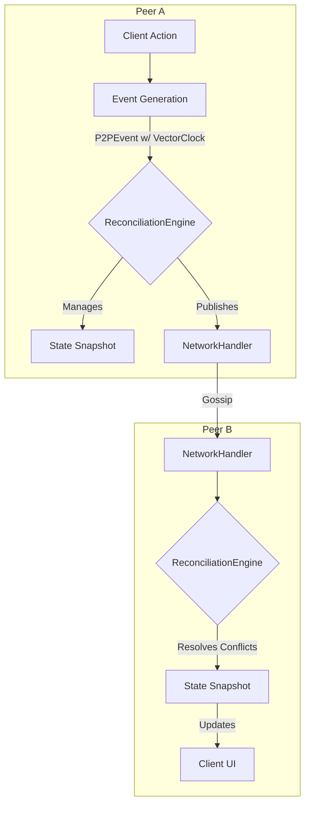
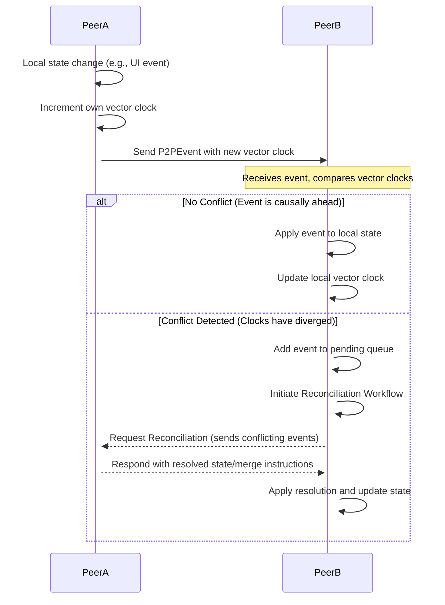

# P2P Synchronization and Reconciliation Protocol

## 1. Overview

This document specifies the protocol for event synchronization and state reconciliation in the cpc P2P network. The primary goal is to ensure data consistency and convergence across all peers in a decentralized environment, handling conflicts gracefully and providing a resilient user experience.

The protocol relies on a combination of vector clocks for causal ordering and conflict detection, CRDTs (Conflict-free Replicated Data Types) for specific state-merging scenarios, and a gossip-based mechanism for anti-entropy.

## 2. Core Components



- **P2PEvent:** The fundamental unit of data exchange, containing a vector clock for ordering.
- **ReconciliationEngine:** The core component on each peer responsible for processing incoming events, detecting and resolving conflicts, and maintaining the local state snapshot.
- **State Snapshot:** A complete or partial representation of the shared state maintained by each peer.
- **Vector Clock:** A mechanism for maintaining a partial causal order of events.

## 3. Vector Clock Conflict Resolution

Vector clocks are the primary mechanism for detecting concurrent updates.

- **Structure:** Each shared data entity will have an associated vector clock, which is a map of `PeerID -> LogicalTimestamp`.
- **Update Rule:**
    1. When a peer modifies a local entity, it increments its own logical clock in the entity's vector clock.
    2. When a peer sends an event, it attaches the updated vector clock.
- **Conflict Detection:** A conflict is detected when a peer receives an event and the incoming vector clock is not a direct descendant or ancestor of the local vector clock. Specifically, for two vector clocks `V_a` and `V_b`:
  - `V_a` descends `V_b` if `V_a[p] >= V_b[p]` for all peers `p`.
  - `V_b` descends `V_a` if `V_b[p] >= V_a[p]` for all peers `p`.
  - A conflict occurs if neither `V_a` descends `V_b` nor `V_b` descends `V_a`.

- **Resolution Strategy:** See the Conflict Resolution Matrix in `p2p_event_system.md`. For automated resolution (e.g., Last Write Wins), the event with the higher timestamp from the originating peer prevails. For more complex merges, CRDTs should be used where possible.

## 4. State Reconciliation Flow

The following diagram illustrates the flow for reconciling state between peers.



## 5. Event Ordering Guarantees

- **Causal Ordering:** Guaranteed by the vector clock implementation. An event will only be applied after all its causal dependencies have been met.
- **Eventual Consistency:** The system guarantees that all peers will eventually converge to the same state, assuming network partitions are eventually healed.
- **Strong Consistency:** Not guaranteed by default. For specific use cases requiring strong consistency, a consensus algorithm (e.g., Raft) would need to be implemented among a designated set of authority nodes, which is outside the scope of this core protocol.

## 6. Failure Recovery Mechanisms

- **Anti-Entropy (Gossip):** Peers will periodically exchange their vector clocks or a hash of their state (e.g., a Merkle root) with their neighbors. If a discrepancy is detected, they will exchange the missing events to synchronize. This handles cases where events are dropped.
- **State Snapshot Transfer:** A peer that has been offline for an extended period or is newly joining the network can request a full state snapshot from one or more trusted peers. After receiving the snapshot, it can apply any subsequent events from its pending queue to catch up.

## 7. Reconciliation API

The `ReconciliationEngine` will expose the following conceptual API.

### Endpoint: `resolve_conflicts`
- **Action:** Internally triggered to process the queue of pending events.
- **Workflow:**
    1. Dequeue an event.
    2. Check its vector clock against the local state's vector clock.
    3. If ready to be applied, apply it.
    4. If not, keep it in a holding queue until its dependencies are met.

### Endpoint: `request_reconciliation`
- **Action:** Initiates a reconciliation process with a peer when a non-trivial conflict is detected.
- **Payload Structure:**
    ```json
    {
      "type": "RECONCILIATION_REQUEST",
      "source_peer_id": "string",
      "target_peer_id": "string",
      "conflicting_events": [
        // Array of P2PEvent objects
      ]
    }
    ```
- **Workflow:**
    1. Send the request to the peer(s) involved in the conflict.
    2. The receiving peer's `ReconciliationEngine` uses the provided information and its own state to determine the correct resolution.
    3. The resolving peer sends back a `RECONCILIATION_RESPONSE` with the merged event or state.