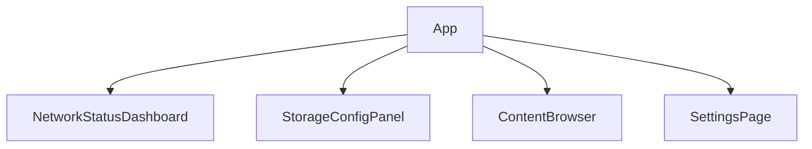
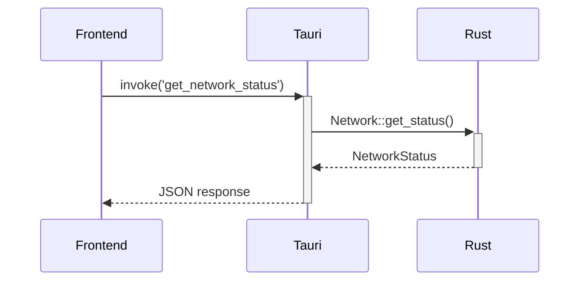

# PDS Tauri UI Architecture

## 1. Framework Selection: Svelte
- **Justification**:
  - Minimal runtime overhead (critical for resource-constrained devices)
  - Excellent reactivity model for real-time network updates
  - Simple state management without complex libraries
  - Small bundle size (faster loading)
  - Seamless Tauri integration via `@tauri-apps/api`

## 2. Component Structure

### Core Components:


### Component Details:
1. **NetworkStatusDashboard.svelte**
   - Connection status indicators (online/offline)
   - Bandwidth usage graph (upload/download)
   - Peer list with connection quality
   - Network protocol indicators (TCP/QUIC/WebSockets)

2. **StorageConfigPanel.svelte**
   - Storage limit slider (GB)
   - Cache eviction policy selector
   - Storage usage visualization (pie chart)
   - Data encryption status indicator

3. **ContentBrowser.svelte**
   - File list with type icons
   - Upload/Download action buttons
   - Search and filter functionality
   - File preview capability
   - Conflict badge indicator on conflicting files
   - Right-click "Resolve Conflict" option connecting to Tauri command

4. **SettingsPage.svelte**
   - Encryption key management
   - Network preference toggles
   - Bootstrap node configuration
   - Log viewer

## 3. State Management
### UI ↔ Rust Communication:


### Implementation Patterns:
1. **Tauri Commands** (src-tauri/src/commands.rs)
   - `get_network_status()` - Fetch real-time network metrics
   - `set_storage_limit(limit: u64)` - Configure storage
   - `list_files(path: &str)` - Browse stored content

2. **Event System** (real-time updates)
   - Subscribe to network events via Tauri events
   - Use Svelte stores for reactive UI updates

3. **Error Handling**:
   - Uniform error codes across Rust/JS boundary
   - Toast notifications for user-facing errors

## 4. Layout Design

### Main Dashboard Wireframe:
```
+---------------------------------+
|  Header: PDS v1.0 [Network Icon]|
+-------------------+-------------+
| Navigation        |             |
| - Network         |             |
| - Storage         | Network     |
| - Content         | Dashboard   |
| - Settings        |             |
|                   | [Graphs]    |
|                   | [Peer List] |
+-------------------+-------------+
```

### Responsive Considerations:
- Collapsible sidebar on smaller screens
- Adaptive component stacking
- Touch-friendly controls

## 5. Implementation Plan

### Directory Structure:
```
pds/
├── src/
│   └── main.rs             # Tauri entry point
├── src-tauri/
│   ├── src/
│   │   ├── commands.rs      # Tauri command handlers
│   │   ├── events.rs        # Event management
│   │   └── main.rs          # Tauri setup
│   └── tauri.conf.json
├── frontend/
│   ├── src/
│   │   ├── App.svelte       # Root component
│   │   ├── components/      # UI components
│   │   ├── stores/          # Svelte stores
│   │   └── main.js          # Entry point
│   ├── public/
│   └── package.json
└── ...
```

### Dependencies (npm):
```json
{
  "dependencies": {
    "@tauri-apps/api": "^2.0.0",
    "svelte": "^4.0.0",
    "svelte-routing": "^1.0.0",
    "chart.js": "^4.0.0",
    "svelte-chartjs": "^3.0.0"
  }
}
```

### Integration Points:
1. **Rust Exposure** (src-tauri/src/commands.rs):
   ```rust
   #[tauri::command]
   fn get_network_status(state: State<AppState>) -> Result<NetworkStatus, String> {
       state.network.get_status().map_err(|e| e.to_string())
   }
   ```

2. **Frontend Consumption** (frontend/src/stores/network.js):
   ```javascript
   import { invoke } from '@tauri-apps/api';
   import { writable } from 'svelte/store';
   
   export const networkStatus = writable({});
   
   export async function refreshNetworkStatus() {
       const status = await invoke('get_network_status');
       networkStatus.set(status);
   }
   ```

### Build Process:
1. Vite for Svelte frontend
2. Tauri bundler for Rust backend
3. Cross-platform builds via `tauri build`

## Next Steps
1. Implement Tauri command scaffolding
2. Develop core UI components
3. Establish event subscription system
4. Create responsive layout system

## 5. Metrics Enhancements (v1.1)

### 5.1 Periodic Refresh Implementation
- **Network Metrics**: Refresh every 5 seconds
- **Storage Metrics**: Refresh every 10 seconds
- **Inactive Tab Handling**: Pause refresh when tab/window inactive
- **Implementation Approach**:
  ```mermaid
  sequenceDiagram
      Browser->>+NetworkDashboard: Component mounted
      NetworkDashboard->>+NetworkStore: Subscribe to metrics
      NetworkStore->>+Tauri: Periodic invoke('get_network_status')
      alt Tab active
        Tauri-->>-NetworkStore: Fresh data
      else Tab inactive
        NetworkStore-->>NetworkDashboard: Paused
      end
      NetworkStore-->>-NetworkDashboard: Update metrics
  ```

### 5.2 Error Handling Design
- **UI States**:
  - Loading: Spinner animation
  - Error: Warning icon with retry button
  - Empty: Placeholder message
  - Conflict: Merge icon with resolve action
- **Storage Error Example**:
  ```svelte
  {#if error}
    <div class="error-state">
      <Icon name="warning" />
      <p>Failed to load storage data</p>
      <button on:click={retry}>Retry</button>
    </div>
  {:else}
    <!-- Normal content -->
  {/if}
  ```
- **Conflict Error Example**:
  ```svelte
  {#if error?.type === 'ConflictDetected'}
    <div class="conflict-error">
      <Icon name="merge" />
      <p>Conflict detected in {error.fileName}</p>
      <button on:click={() => resolveConflict(error)}>Resolve</button>
    </div>
  {/if}
  ```
- **Logging**: Capture errors to persistent log (visible in Settings)

### 5.3 Storage Visualization
- **Breakdown Components**:
  1. Storage type pie chart (local vs P2P)
  2. File type distribution (images, docs, media)
  3. Usage trend graph (7-day history)
- **Implementation**:
  ```svelte
  <PieChart
    data={[
      {label: 'Local', value: localUsage},
      {label: 'P2P', value: p2pUsage}
    ]}
  />
  ```

### 5.4 Data Presentation Standards
- **Units**:
  - Bandwidth: KB/s (convert from bytes)
  - Storage: GB (convert from bytes: bytes / 1e9)
- **Metadata**:
  - Tooltips explaining metrics
  - "Last updated" timestamps
  - Delta indicators (▲/▼) for changes
- **Component Updates**:
  - NetworkStatusDashboard: Add timestamp and tooltips
  - StorageConfigPanel: Add pie chart and file type breakdown
### 5.5 ContentBrowser Implementation Details

- **File Icons**: Implemented via `fileUtils.js` mapping
- **Preview System**:
  - Text files: Display as-is
  - Images: Shown as base64-encoded previews
  - Other types: Generic "unsupported" message
- **Search/Filter**: Real-time client-side filtering
- **Responsive Design**: Maintains grid layout on all screen sizes

### Verification Status Indicators
- **In Progress**:
  - "Downloading chunks..." (during download)
  - "Verifying chunks..." (during verification)
- **Success**: "File integrity verified"
- **Error**:
  - "Verification failed: corrupted data"
  - "Chunk validation failed"
  - "Merkle root mismatch"

### Conflict Resolution UI

The `ConflictResolutionModal.svelte` component provides side-by-side file comparison with these features:

- Visual diff highlighting for text files
- Thumbnail comparison for images
- Action buttons:
  - Keep Local
  - Keep Remote
  - Merge (for supported file types)
  - Rename Local
  - Rename Remote
- Progress indicators during resolution

```svelte
<!-- ConflictResolutionModal.svelte -->
<script>
  import { resolveConflict } from '../stores/conflict';
  export let conflict; // { localFile, remoteFile, fileName }
</script>

<div class="modal">
  <h2>Conflict: {conflict.fileName}</h2>
  <div class="versions">
    <div class="version local">
      <h3>Your Version</h3>
      <FilePreview file={conflict.localFile} />
    </div>
    <div class="version remote">
      <h3>Remote Version</h3>
      <FilePreview file={conflict.remoteFile} />
    </div>
  </div>
  <div class="actions">
    <button on:click={() => resolveConflict('keepLocal')}>Keep Local</button>
    <button on:click={() => resolveConflict('keepRemote')}>Keep Remote</button>
    <button on:click={() => resolveConflict('merge')}>Merge</button>
    <button on:click={() => resolveConflict('renameLocal')}>Rename Local</button>
    <button on:click={() => resolveConflict('renameRemote')}>Rename Remote</button>
  </div>
</div>
```

### User-Facing Messages
```svelte
{#if downloadState === 'verifying'}
  <div class="verification-status">
    <Spinner />
    Verifying file integrity...
  </div>
{:else if downloadState === 'verified'}
  <div class="verification-success">
    <CheckmarkIcon />
    File integrity verified
  </div>
{:else if downloadState === 'verification_failed'}
  <div class="verification-error">
    <WarningIcon />
    Verification failed: corrupted data
    <button on:click={retry}>Retry Download</button>
  </div>
{/if}

<!-- Conflict error state in main UI -->
{#if error?.type === 'ConflictDetected'}
  <div class="conflict-error">
    <MergeIcon />
    <span>Conflict detected in {error.fileName}</span>
    <button on:click={showConflictResolution}>Resolve</button>
  </div>
{/if}
```