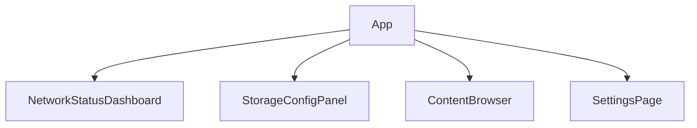
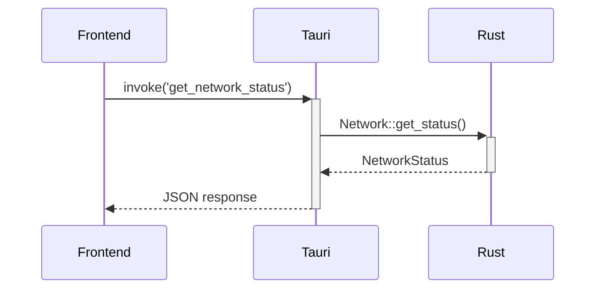

# PDS Tauri UI Architecture

## 1. Framework Selection: Yew
- **Justification**:
  - Leverages Rust's performance, safety, and concurrency for the frontend.
  - Enables a unified Rust codebase across the entire stack (backend, core, and frontend).
  - Component-based architecture similar to React, but with Rust's strong typing.
  - Compiles to high-performance WebAssembly (WASM).
  - Excellent integration with the Rust ecosystem and Tauri.

## 2. Component Structure

### Core Components:


### Component Details:
1. **network_status_dashboard.rs**
   - Connection status indicators (online/offline)
   - Bandwidth usage graph (upload/download)
   - Peer list with connection quality
   - Network protocol indicators (TCP/QUIC/WebSockets)

2. **storage_config_panel.rs**
   - Storage limit slider (GB)
   - Cache eviction policy selector
   - Storage usage visualization (pie chart)
   - Data encryption status indicator

3. **content_browser.rs**
   - File list with type icons
   - Upload/Download action buttons
   - Search and filter functionality
   - File preview capability
   - Conflict badge indicator on conflicting files
   - Right-click "Resolve Conflict" option connecting to Tauri command

4. **settings_page.rs**
   - Encryption key management
   - Network preference toggles
   - Bootstrap node configuration
   - Log viewer

## 3. State Management
### UI ↔ Rust Communication:


### Implementation Patterns:
1. **Tauri Commands** (src-tauri/src/commands.rs)
   - `get_network_status()` - Fetch real-time network metrics
   - `set_storage_limit(limit: u64)` - Configure storage
   - `list_files(path: &str)` - Browse stored content

2. **Event System** (real-time updates)
   - Subscribe to network events via Tauri events
   - Use Yew's state management (e.g., `use_state` hooks, `Yewdux` for global state) for reactive UI updates

3. **Error Handling**:
   - Uniform error codes across Rust/JS boundary
   - Toast notifications for user-facing errors

## 4. Layout Design

### Main Dashboard Wireframe:
```
+---------------------------------+
|  Header: PDS v1.0 [Network Icon]|
+-------------------+-------------+
| Navigation        |             |
| - Network         |             |
| - Storage         | Network     |
| - Content         | Dashboard   |
| - Settings        |             |
|                   | [Graphs]    |
|                   | [Peer List] |
+-------------------+-------------+
```

### Responsive Considerations:
- Collapsible sidebar on smaller screens
- Adaptive component stacking
- Touch-friendly controls

## 5. Implementation Plan

### Directory Structure:
```
pds/
├── src/
│   └── main.rs             # Tauri entry point
├── src-tauri/
│   ├── src/
│   │   ├── commands.rs      # Tauri command handlers
│   │   ├── events.rs        # Event management
│   │   └── main.rs          # Tauri setup
│   └── tauri.conf.json
├── frontend/
│   ├── src/
│   │   ├── main.rs          # Yew entry point
│   │   ├── app.rs           # Root component
│   │   ├── components/      # UI components
│   │   └── state/           # Global state management
│   ├── static/
│   │   └── index.html
│   └── Trunk.toml           # Build configuration
└── ...
```

### Dependencies (Cargo.toml):
```toml
[dependencies]
yew = "0.20"
yew-router = "0.17"
yewdux = "0.9"
# A Yew-compatible charting library would be added here
wasm-bindgen = "0.2"
wasm-bindgen-futures = "0.4"
gloo-net = "0.2"
```

### Integration Points:
1. **Rust Exposure** (src-tauri/src/commands.rs):
   ```rust
   #[tauri::command]
   fn get_network_status(state: State<AppState>) -> Result<NetworkStatus, String> {
       state.network.get_status().map_err(|e| e.to_string())
   }
   ```

2. **Frontend Consumption** (frontend/src/components/network_status.rs):
   ```rust
   use yew::prelude::*;
   use wasm_bindgen_futures::spawn_local;
   // Assume 'invoke' is a custom wrapper around Tauri's JS API
   use crate::bindings::{invoke, NetworkStatus};

   #[function_component(NetworkStatusComponent)]
   pub fn network_status_component() -> Html {
       let status = use_state(|| NetworkStatus::default());

       let refresh_status = {
           let status = status.clone();
           Callback::from(move |_| {
               let status = status.clone();
               spawn_local(async move {
                   if let Ok(new_status) = invoke("get_network_status", ()).await {
                       status.set(new_status);
                   }
               });
           })
       };

       html! {
           <div>
               // Render status...
               <button onclick={refresh_status}>{ "Refresh" }</button>
           </div>
       }
   }
   ```

### Build Process:
1. Trunk for Yew/WASM frontend
2. Tauri bundler for Rust backend
3. Cross-platform builds via `tauri build`

## Next Steps
1. Implement Tauri command scaffolding
2. Develop core UI components
3. Establish event subscription system
4. Create responsive layout system

## 5. Metrics Enhancements (v1.1)

### 5.1 Periodic Refresh Implementation
- **Network Metrics**: Refresh every 5 seconds
- **Storage Metrics**: Refresh every 10 seconds
- **Inactive Tab Handling**: Pause refresh when tab/window inactive
- **Implementation Approach**:
  ```mermaid
  sequenceDiagram
      Browser->>+NetworkDashboard: Component mounted
      NetworkDashboard->>+NetworkStore: Subscribe to metrics
      NetworkStore->>+Tauri: Periodic invoke('get_network_status')
      alt Tab active
        Tauri-->>-NetworkStore: Fresh data
      else Tab inactive
        NetworkStore-->>NetworkDashboard: Paused
      end
      NetworkStore-->>-NetworkDashboard: Update metrics
  ```

### 5.2 Error Handling Design
- **UI States**:
  - Loading: Spinner animation
  - Error: Warning icon with retry button
  - Empty: Placeholder message
  - Conflict: Merge icon with resolve action
- **Storage Error Example**:
  ```rust
  // Example in a Yew component
  html! {
      if let Some(error) = &*error_state {
          html! {
              <div class="error-state">
                  <Icon name="warning" />
                  <p>{"Failed to load storage data"}</p>
                  <button onclick={retry_callback}>{"Retry"}</button>
              </div>
          }
      } else {
          html! { /* Normal content */ }
      }
  }
  ```
- **Conflict Error Example**:
  ```rust
  // Example in a Yew component
  html! {
      if let Some(ErrorType::ConflictDetected { file_name }) = &*error_state {
          html! {
              <div class="conflict-error">
                  <Icon name="merge" />
                  <p>{format!("Conflict detected in {}", file_name)}</p>
                  <button onclick={resolve_callback}>{"Resolve"}</button>
              </div>
          }
      } else {
          html! {}
      }
  }
  ```
- **Logging**: Capture errors to persistent log (visible in Settings)

### 5.3 Storage Visualization
- **Breakdown Components**:
  1. Storage type pie chart (local vs P2P)
  2. File type distribution (images, docs, media)
  3. Usage trend graph (7-day history)
- **Implementation**:
  ```rust
  // Assuming a Yew wrapper for a charting library
  html! {
      <PieChart data={vec![
          ChartData { label: "Local".into(), value: local_usage },
          ChartData { label: "P2P".into(), value: p2p_usage },
      ]} />
  }
  ```

### 5.4 Data Presentation Standards
- **Units**:
  - Bandwidth: KB/s (convert from bytes)
  - Storage: GB (convert from bytes: bytes / 1e9)
- **Metadata**:
  - Tooltips explaining metrics
  - "Last updated" timestamps
  - Delta indicators (▲/▼) for changes
- **Component Updates**:
  - NetworkStatusDashboard: Add timestamp and tooltips
  - StorageConfigPanel: Add pie chart and file type breakdown
### 5.5 ContentBrowser Implementation Details

- **File Icons**: Implemented via a Rust utility module (e.g., `file_utils.rs`)
- **Preview System**:
  - Text files: Display as-is
  - Images: Shown as base64-encoded previews
  - Other types: Generic "unsupported" message
- **Search/Filter**: Real-time client-side filtering
- **Responsive Design**: Maintains grid layout on all screen sizes

### Verification Status Indicators
- **In Progress**:
  - "Downloading chunks..." (during download)
  - "Verifying chunks..." (during verification)
- **Success**: "File integrity verified"
- **Error**:
  - "Verification failed: corrupted data"
  - "Chunk validation failed"
  - "Merkle root mismatch"

### Conflict Resolution UI

The `conflict_resolution_modal.rs` component provides side-by-side file comparison with these features:

- Visual diff highlighting for text files
- Thumbnail comparison for images
- Action buttons:
  - Keep Local
  - Keep Remote
  - Merge (for supported file types)
  - Rename Local
  - Rename Remote
- Progress indicators during resolution

```rust
// conflict_resolution_modal.rs
use yew::prelude::*;

#[derive(Properties, PartialEq)]
pub struct Props {
    pub conflict: Conflict,
    pub on_resolve: Callback<ResolveAction>,
}

#[function_component(ConflictResolutionModal)]
pub fn conflict_resolution_modal(props: &Props) -> Html {
    let resolve = |action: ResolveAction| {
        let on_resolve = props.on_resolve.clone();
        Callback::from(move |_| on_resolve.emit(action))
    };

    html! {
        <div class="modal">
            <h2>{ format!("Conflict: {}", props.conflict.file_name) }</h2>
            <div class="versions">
                <div class="version local">
                    <h3>{ "Your Version" }</h3>
                    <FilePreview file={props.conflict.local_file.clone()} />
                </div>
                <div class="version remote">
                    <h3>{ "Remote Version" }</h3>
                    <FilePreview file={props.conflict.remote_file.clone()} />
                </div>
            </div>
            <div class="actions">
                <button onclick={resolve(ResolveAction::KeepLocal)}>{ "Keep Local" }</button>
                <button onclick={resolve(ResolveAction::KeepRemote)}>{ "Keep Remote" }</button>
                <button onclick={resolve(ResolveAction::Merge)}>{ "Merge" }</button>
                <button onclick={resolve(ResolveAction::RenameLocal)}>{ "Rename Local" }</button>
                <button onclick={resolve(ResolveAction::RenameRemote)}>{ "Rename Remote" }</button>
            </div>
        </div>
    }
}
```

### User-Facing Messages
```rust
// Example in a Yew component's view
match &*download_state {
    DownloadState::Verifying => html! {
        <div class="verification-status">
            <Spinner />
            { "Verifying file integrity..." }
        </div>
    },
    DownloadState::Verified => html! {
        <div class="verification-success">
            <CheckmarkIcon />
            { "File integrity verified" }
        </div>
    },
    DownloadState::VerificationFailed => html! {
        <div class="verification-error">
            <WarningIcon />
            { "Verification failed: corrupted data" }
            <button onclick={retry_callback}>{ "Retry Download" }</button>
        </div>
    },
    _ => html! {},
}

// Conflict error state in main UI
if let Some(ErrorType::ConflictDetected { file_name }) = &*error_state {
    html! {
        <div class="conflict-error">
            <MergeIcon />
            <span>{ format!("Conflict detected in {}", file_name) }</span>
            <button onclick={show_conflict_resolution_callback}>{ "Resolve" }</button>
        </div>
    }
} else {
    html!{}
}
```