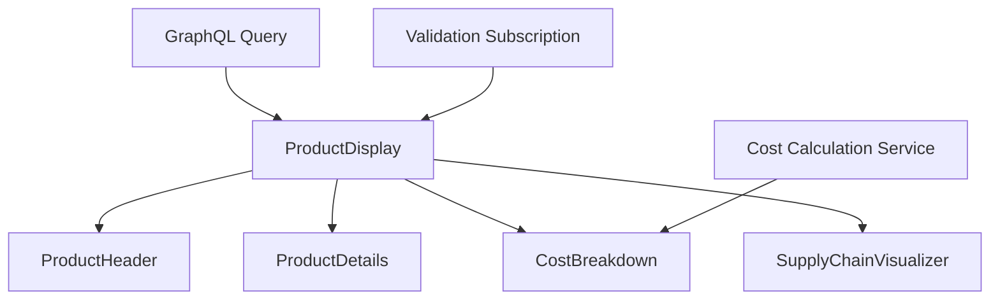

# Product Display Component Design

## Component Hierarchy
```
ProductDisplay (Yew Component)
├── ProductHeader
│   ├── ProductImage
│   ├── ProductTitle
│   └── ValidationStatus
├── ProductDetails
│   ├── Description
│   ├── BarcodeDisplay
│   └── Metadata (brand, manufacturer)
├── CostBreakdown
│   ├── CostItem (Material)
│   ├── CostItem (Labor)
│   ├── TaxCalculation
│   └── TotalCost
├── SupplyChainVisualizer
│   ├── ChainStep (for each step)
│   └── StepDetails
└── ActionBar
    ├── EditButton
    └── ShareButton
```

## Data Flow


## GraphQL Definitions

### Query
```graphql
query GetProductDisplayData($id: ID!) {
  product(id: $id) {
    id
    name
    description
    imageUrl
    cost {
      amount
      currency
    }
    materialCost
    laborCost
    brand
    manufacturer
    barcode
    carbonFootprint
    packagingType
    nutritionalInfo
    currentStock
    reorderLevel
    supplyChain {
      chain {
        stepName
        location
        timestamp
        metadata
      }
    }
    validationStatus
  }
}
```

### Subscription
```graphql
subscription ProductValidationUpdates($id: ID!) {
  productValidationStatus(id: $id) {
    id
    validationStatus
    lastUpdated
    issues
  }
}
```

## File Structure Plan

```
apps/cpc-platform/src/
└── components/
    └── product/
        ├── mod.rs
        ├── display.rs          # Main component
        ├── header.rs
        ├── details.rs
        ├── cost_breakdown.rs
        ├── supply_chain.rs
        └── validation_status.rs
```

## Integration Plan with Tauri

1. Add new GraphQL endpoints in backend:
   - `get_product` query
   - `product_validation_updates` subscription

2. Create Yew components in `apps/cpc-platform/src/components/product/`

3. Implement services in `packages/cpc-core`:
   - `product_display_service.rs` with:
     - GraphQL query builder
     - Data transformation logic
     - Validation status monitoring

4. Update Tauri commands in `src-tauri` to expose:
   - Product fetching via GraphQL
   - Real-time validation updates

5. Implement responsive styling for desktop and mobile views

## Business Logic Integration Points

1. Tax calculation: Use `ProductExt::calculate_tax()`
2. Total cost: Use `ProductExt::total_cost()`
3. Validation: Use `ProductValidate::full_validate()`
4. Supply chain: Visualize `supply_chain.chain` array