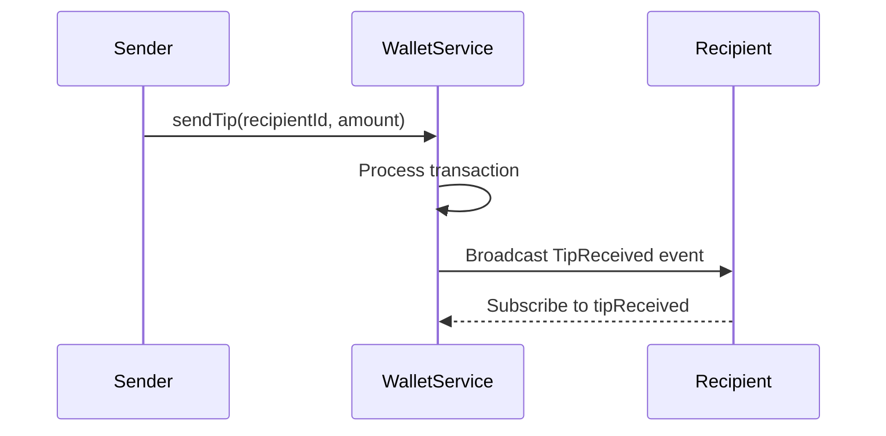

# Wallet Monetization Features

## Real-time Tip Notification Flow



## GraphQL Subscription
```graphql
subscription TipReceived($recipientId: ID!) {
  tipReceived(recipientId: $recipientId) {
    transactionId
    senderId
    amount {
      amount
      currency
    }
    timestamp
    note
  }
}