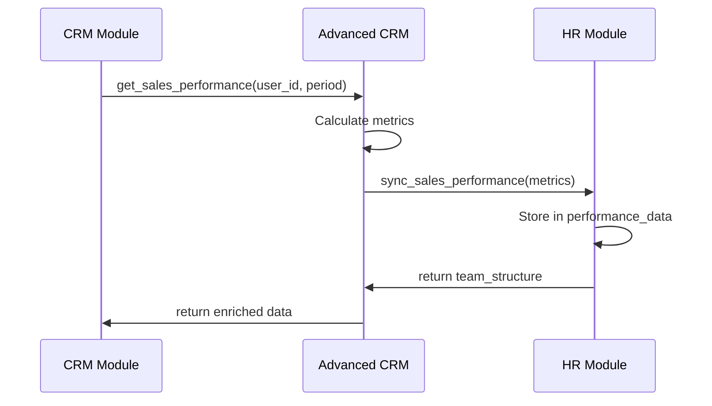

# Advanced CRM & Sales Pipeline Module Architecture

This document outlines the architecture for the advanced CRM module that extends the simple CRM for SMB needs.

## 1. Module Structure

```
packages/cpc-core/advanced_crm/
├── ARCHITECTURE.md
├── Cargo.toml
└── src/
    ├── lib.rs
    ├── domain/
    │   ├── lead_scoring.rs       # Lead scoring models
    │   ├── email_campaign.rs     # Email marketing models
    │   └── integration_points.rs # Integration markers
    ├── application/
    │   ├── lead_scoring_service.rs # Lead scoring implementation
    │   ├── email_campaign_service.rs # Email campaign management
    │   └── hr_integration_service.rs # HR integration
    ├── infrastructure/
    │   ├── email_provider/      # Email service integrations
    │   │   └── smtp.rs
    │   └── reporting/
    │       ├── pdf_generator.rs # Report generation
    │       └── data_export.rs   # Data export functionality
    └── presentation/
        ├── yew/
        │   ├── lead_scoring_ui.rs # Lead scoring UI
        │   └── email_campaign_ui.rs # Email campaign UI
        └── bevy/
            └── advanced_viz.rs  # Enhanced visualizations
```

## 2. Core Domain Models

### Lead Scoring System

```rust
// domain/lead_scoring.rs
pub struct LeadScore {
    pub lead_id: Uuid,
    pub base_score: u8,       // 0-100
    pub engagement_score: u8, // 0-100
    pub fit_score: u8,        // 0-100
    pub total_score: u8,      // 0-100
    pub scoring_factors: ScoringFactors,
    pub last_updated: DateTime<Utc>,
}

pub struct ScoringFactors {
    pub website_visits: u32,
    pub email_opens: u32,
    pub content_downloads: u32,
    pub social_engagement: u32,
    pub company_size: CompanySize,
    pub industry_fit: f32,
}
```

### Email Campaign Model

```rust
pub struct EmailCampaign {
    pub id: Uuid,
    pub name: String,
    pub subject: String,
    pub content: String,
    pub status: CampaignStatus,
    pub scheduled_time: Option<DateTime<Utc>>,
    pub target_segment: TargetSegment,
    pub metrics: CampaignMetrics,
    pub created_at: DateTime<Utc>,
    pub updated_at: DateTime<Utc>,
}

pub enum CampaignStatus {
    Draft,
    Scheduled,
    Sending,
    Completed,
    Cancelled,
}
```

## 3. Key Application Services

### LeadScoringService
- `calculate_lead_score(lead_id: Uuid) -> Result<LeadScore>`: Calculates lead score using multiple factors
- `get_top_leads(limit: u32) -> Result<Vec<(Lead, LeadScore)>>`: Gets highest scoring leads
- `update_scoring_model(model: ScoringModel) -> Result<()>`: Updates scoring algorithm

### EmailCampaignService
- `create_campaign(campaign: NewCampaign) -> Result<EmailCampaign>`: Creates new email campaign
- `schedule_campaign(campaign_id: Uuid, time: DateTime<Utc>) -> Result<()>`: Schedules campaign
- `send_test_email(campaign_id: Uuid, email: String) -> Result<()>`: Sends test email
- `get_campaign_metrics(campaign_id: Uuid) -> Result<CampaignMetrics>`: Gets campaign performance

### HrIntegrationService
- `sync_sales_performance(user_id: Uuid) -> Result<SalesPerformanceData>`: Syncs sales data with HR
- `get_team_performance(team_id: Uuid) -> Result<TeamPerformance>`: Gets team metrics
- `calculate_commissions(user_id: Uuid, period: Period) -> Result<CommissionCalculation>`: Calculates commissions

## 4. Key Design Decisions

### Extending Simple CRM
The Advanced CRM extends the Simple CRM through:

1. **Trait-based Extension**:
```rust
// In simple CRM
pub trait CrmService {
    fn get_contact(&self, id: Uuid) -> Result<Contact>;
    // ...
}

// In advanced CRM
pub trait AdvancedCrmService: CrmService {
    fn calculate_lead_score(&self, lead_id: Uuid) -> Result<LeadScore>;
    fn create_email_campaign(&self, campaign: NewCampaign) -> Result<EmailCampaign>;
    // ...
}
```

2. **Decorator Pattern**:
```rust
pub struct AdvancedCrmServiceDecorator<T: CrmService> {
    base_service: T,
    lead_scoring: LeadScoringEngine,
    email_service: EmailServiceProvider,
}

impl<T: CrmService> CrmService for AdvancedCrmServiceDecorator<T> {
    // Delegate to base service
    fn get_contact(&self, id: Uuid) -> Result<Contact> {
        self.base_service.get_contact(id)
    }
    
    // Add advanced functionality
    fn calculate_lead_score(&self, lead_id: Uuid) -> Result<LeadScore> {
        // Implementation
    }
}
```

### HR Module Integration
We integrate with the HR module through:

1. **Shared Performance Metrics**:
```rust
// In advanced_crm/src/domain/integration_points.rs
#[derive(Serialize, Deserialize)]
pub struct SalesPerformanceData {
    pub user_id: Uuid,
    pub period: Period,
    pub deals_closed: u32,
    pub revenue_generated: i64, // in cents
    pub average_deal_size: i64,
    pub conversion_rate: f32,
    pub sales_velocity: f32,
    pub pipeline_health: PipelineHealth,
}

pub enum PipelineHealth {
    Strong,
    Moderate,
    Weak,
}
```

2. **Two-way Data Flow**:
- CRM sends sales performance data to HR
- HR sends team structure and role information to CRM

### Data Privacy Considerations
- All HR integration data is shared with explicit consent
- Performance data is anonymized for team-level reports
- Individual performance data requires manager+ permissions

## 5. Database Schema Extensions

### Lead Scoring Tables

```sql
CREATE TABLE lead_scoring_models (
    id UUID PRIMARY KEY,
    name VARCHAR(255) NOT NULL,
    description TEXT,
    weights JSONB NOT NULL,  // Scoring weights configuration
    is_default BOOLEAN NOT NULL DEFAULT false,
    created_at TIMESTAMPTZ NOT NULL DEFAULT NOW(),
    updated_at TIMESTAMPTZ NOT NULL DEFAULT NOW()
);

CREATE TABLE lead_scores (
    lead_id UUID PRIMARY KEY REFERENCES crm_contacts(id),
    base_score SMALLINT NOT NULL CHECK (base_score BETWEEN 0 AND 100),
    engagement_score SMALLINT NOT NULL CHECK (engagement_score BETWEEN 0 AND 100),
    fit_score SMALLINT NOT NULL CHECK (fit_score BETWEEN 0 AND 100),
    total_score SMALLINT NOT NULL CHECK (total_score BETWEEN 0 AND 100),
    scoring_factors JSONB NOT NULL,
    last_updated TIMESTAMPTZ NOT NULL DEFAULT NOW()
);
```

### Email Campaign Tables

```sql
CREATE TABLE email_campaigns (
    id UUID PRIMARY KEY,
    name VARCHAR(255) NOT NULL,
    subject VARCHAR(255) NOT NULL,
    content TEXT NOT NULL,
    status VARCHAR(20) NOT NULL DEFAULT 'draft' 
        CHECK (status IN ('draft', 'scheduled', 'sending', 'completed', 'cancelled')),
    scheduled_time TIMESTAMPTZ,
    created_by UUID NOT NULL REFERENCES users(id) ON DELETE CASCADE,
    created_at TIMESTAMPTZ NOT NULL DEFAULT NOW(),
    updated_at TIMESTAMPTZ NOT NULL DEFAULT NOW()
);

CREATE TABLE email_campaign_recipients (
    campaign_id UUID NOT NULL REFERENCES email_campaigns(id) ON DELETE CASCADE,
    contact_id UUID NOT NULL REFERENCES crm_contacts(id) ON DELETE CASCADE,
    status VARCHAR(20) NOT NULL DEFAULT 'pending'
        CHECK (status IN ('pending', 'sent', 'opened', 'clicked', 'bounced', 'unsubscribed')),
    sent_time TIMESTAMPTZ,
    opened_time TIMESTAMPTZ,
    click_count INTEGER NOT NULL DEFAULT 0,
    PRIMARY KEY (campaign_id, contact_id)
);
```

## 6. Integration with HR Module

### Data Flow Architecture



### Integration Points

1. **Performance Data Sharing**:
   - Endpoint: `POST /api/hr/performance/sales`
   - Request: `SalesPerformanceData`
   - Response: `IntegrationResult`

2. **Team Structure Access**:
   - Endpoint: `GET /api/hr/teams/{team_id}/members`
   - Response: `Vec<UserWithRoles>`

3. **Commission Calculation**:
   - Endpoint: `POST /api/hr/commissions/calculate`
   - Request: `CommissionCalculationRequest`
   - Response: `CommissionCalculationResult`

## 7. Dependencies

| Dependency | Purpose |
|------------|---------|
| `cpc-core::crm` | Base CRM functionality |
| `cpc-core::hr` | HR module integration |
| `cpc-net` | P2P data sharing for email campaigns |
| `rodio` | Audio notifications for campaign events |
| `pdf-rs` | PDF report generation |

## 8. Privacy and Cooperative Values Implementation

For information about our privacy policies and consent management, see our [Privacy Policy](../../../docs/privacy_policy.md).

This module extends the cooperative values established in the Simple CRM:

1. **Enhanced Consent Controls**:
   - Granular consent for sharing performance data with managers
   - Opt-in for anonymized data sharing to improve lead scoring models

2. **Transparency in Algorithms**:
   - Clear explanation of lead scoring factors
   - Ability to view and adjust scoring weights

3. **Data Ownership**:
   - Users own their sales performance data
   - Easy export of all CRM data in standard formats

4. **No Vendor Lock-in**:
   - Open data formats for email campaigns
   - Standard interfaces for email service providers

## 9. Migration Path from Simple CRM

1. **Database Migration**:
   - Add new tables for lead scoring and email campaigns
   - Create views for backward compatibility

2. **Service Layer Migration**:
   - Wrap Simple CRM services with Advanced CRM decorators
   - Maintain same interface for existing functionality

3. **UI Migration**:
   - Progressive enhancement of existing CRM UI
   - New features appear as optional modules in UI

This architecture provides a robust foundation for SMB CRM functionality while maintaining compatibility with our modular architecture and cooperative values.