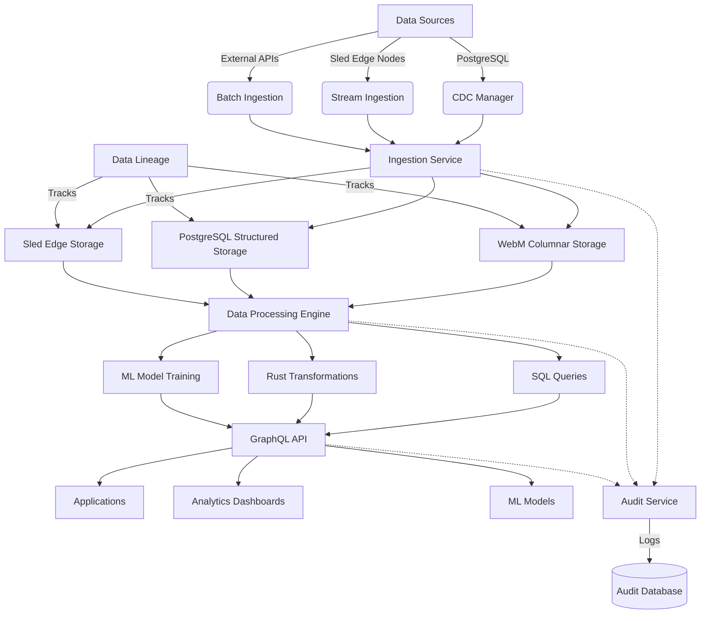
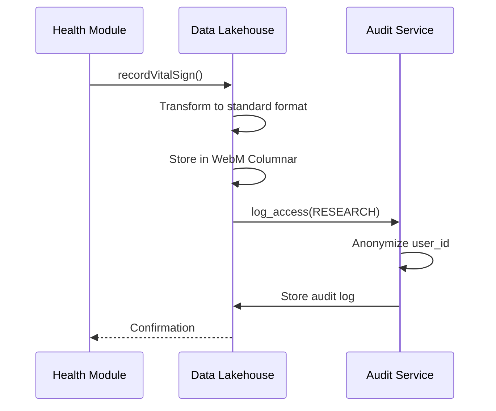
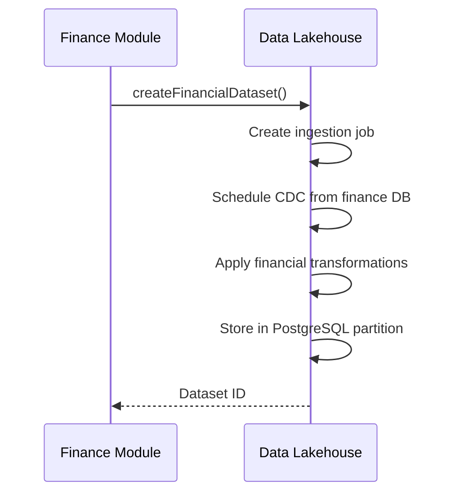
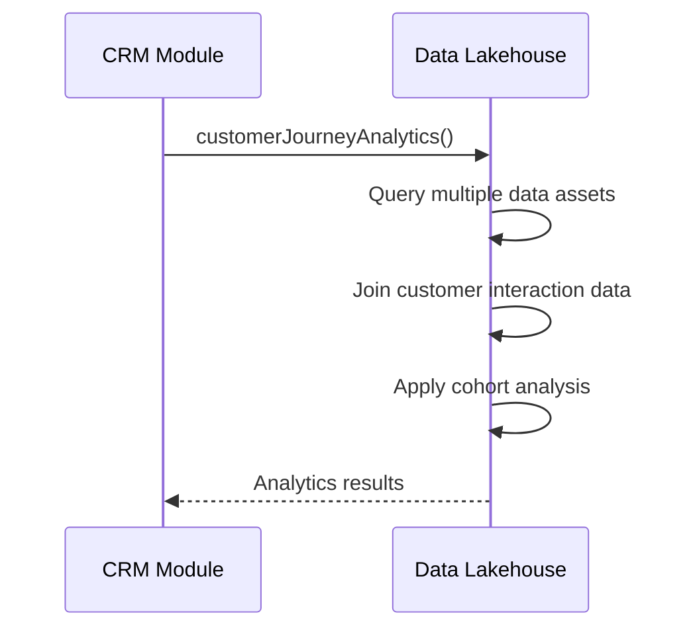
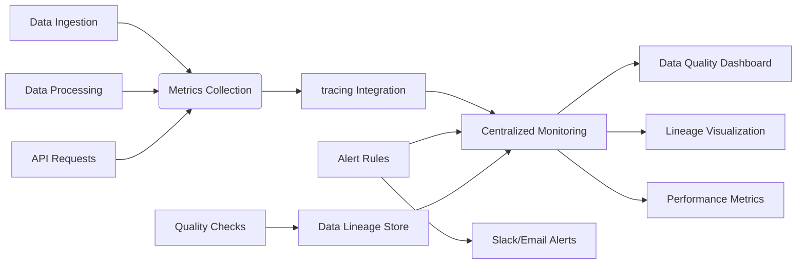

# Data Lakehouse Architecture

## Module Structure (Hexagonal Architecture with Vertical Slices)

The data lakehouse module is implemented in `packages/cpc-core/data_lakehouse/` following screaming architecture principles. All data management logic exists as vertical slices within the core package.

```
packages/cpc-core/data_lakehouse/
├── Cargo.toml
├── ARCHITECTURE.md
├── MIGRATION_GUIDE.md
└── src/
    ├── lib.rs
    ├── domain/          # Pure business models (DataAsset, IngestionJob)
    │   ├── models.rs
    │   ├── primitives.rs
    │   └── mod.rs
    ├── application/     # Service orchestration (IngestionService, ProcessingService)
    │   ├── ingestion_service.rs
    │   ├── processing_service.rs
    │   ├── versioning_service.rs
    │   └── mod.rs
    ├── infrastructure/  # Concrete implementations (storage, APIs)
    │   ├── storage/
    │   │   ├── postgres/
    │   │   ├── sled/
    │   │   ├── webm_columnar/
    │   │   └── mod.rs
    │   ├── cdc/
    │   │   ├── postgres_cdc.rs
    │   │   └── mod.rs
    │   ├── api/
    │   │   ├── graphql/
    │   │   ├── grpc/
    │   │   ├── rest/
    │   │   └── mod.rs
    │   ├── monitoring/
    │   │   ├── tracing_integration.rs
    │   │   ├── data_lineage.rs
    │   │   └── mod.rs
    │   └── mod.rs
    └── presentation/    # UI components (Yew)
        ├── yew/
        │   ├── components.rs
        │   └── mod.rs
        └── mod.rs
```

## Core Domain Models

### Data Asset Model
```rust
pub struct DataAsset {
    pub id: Uuid,
    pub name: String,
    pub description: Option<String>,
    pub asset_type: DataAssetType,
    pub storage_format: StorageFormat,
    pub schema: JsonValue,  // JSON representation of schema
    pub tags: Vec<String>,
    pub created_at: DateTime<Utc>,
    pub updated_at: DateTime<Utc>,
    pub version: u64,
    pub lineage: DataLineage,  // Reference to lineage tracking
}

pub enum DataAssetType {
    Structured,
    SemiStructured,
    Unstructured,
    TimeSeries,
    Geospatial,
    Graph,
}

pub enum StorageFormat {
    PostgreSQL,
    SledEdge,
    WebMColumnar,  // WebM container with AV1 for structured data
}
```

### Ingestion Job Model
```rust
pub struct IngestionJob {
    pub id: Uuid,
    pub name: String,
    pub source: DataSource,
    pub target_asset_id: Uuid,
    pub schedule: Option<JobSchedule>,
    pub transformation_logic: Option<String>,  // Rust code or SQL
    pub status: JobStatus,
    pub last_run: Option<DateTime<Utc>>,
    pub next_run: Option<DateTime<Utc>>,
    pub error_count: u32,
    pub max_errors: u32,
}

pub enum DataSource {
    PostgreSQLTable { connection: String, table: String },
    SledCollection { node_id: Uuid, collection: String },
    ExternalAPI { url: String, auth: Option<ApiAuth> },
    FileDrop { path: String, pattern: String },
}

pub enum JobSchedule {
    Realtime,
    Interval(chrono::Duration),
    Cron(String),
}
```

## Service Interfaces

### Ingestion Service
```rust
pub struct IngestionService {
    repository: Arc<dyn IngestionJobRepository>,
    cdc_manager: Arc<CDCManager>,
    storage_manager: Arc<StorageManager>,
}

impl IngestionService {
    pub async fn create_job(
        &self,
        name: String,
        source: DataSource,
        target_asset_id: Uuid,
        schedule: Option<JobSchedule>,
        transformation_logic: Option<String>,
    ) -> Result<IngestionJob, DataError> {
        let job = IngestionJob::new(
            name, source, target_asset_id, schedule, transformation_logic
        );
        
        // Validate connection to source
        self.cdc_manager.validate_source(&source).await?;
        
        self.repository.save(&job).await?;
        Ok(job)
    }

    pub async fn run_job(&self, job_id: Uuid) -> Result<JobExecutionResult, DataError> {
        let job = self.repository.get(job_id).await?;
        
        // Execute CDC or batch ingestion
        let data = match &job.source {
            DataSource::PostgreSQLTable {..} => {
                self.cdc_manager.ingest_postgres(&job).await?
            }
            DataSource::SledCollection {..} => {
                self.cdc_manager.ingest_sled(&job).await?
            }
            // Other source types...
        };
        
        // Apply transformations
        let transformed = if let Some(logic) = &job.transformation_logic {
            self.storage_manager.apply_transformations(data, logic).await?
        } else {
            data
        };
        
        // Store in appropriate format
        let result = self.storage_manager.store(
            job.target_asset_id,
            transformed,
            job.storage_format
        ).await?;
        
        // Log execution for monitoring
        self.repository.log_execution(job_id, &result).await?;
        
        Ok(result)
    }
}
```

## WebM Columnar Storage Implementation

To comply with royalty-free codec requirements, we implement a novel columnar storage format using WebM containers:

```rust
pub struct WebMColumnarStorage {
    connection: Arc<PostgreSQLConnection>,
}

impl WebMColumnarStorage {
    pub async fn store(&self, asset_id: Uuid, data: DataFrame) -> Result<(), StorageError> {
        // Convert DataFrame to WebM-compatible format
        let webm_data = self.convert_to_webm(&data)?;
        
        // Store as WebM blob in PostgreSQL
        self.connection.execute(
            "INSERT INTO webm_columnar (asset_id, data, schema) 
             VALUES ($1, $2, $3)",
            &[&asset_id, &webm_data, &data.schema().to_json()]
        ).await?;
        
        Ok(())
    }

    fn convert_to_webm(&self, data: &DataFrame) -> Result<Vec<u8>, ConversionError> {
        // 1. Convert each column to a video track using AV1
        // 2. Encode numeric data as video frames
        // 3. Store metadata as WebM headers
        // 4. Return final WebM container bytes
        
        // Simplified example:
        let mut webm_writer = WebMWriter::new();
        
        for (column_name, series) in data.columns() {
            match series.dtype() {
                DataType::Int64 | DataType::Float64 => {
                    let track = self.encode_numeric_as_video(series)?;
                    webm_writer.add_track(column_name, track);
                }
                DataType::Utf8 => {
                    let track = self.encode_text_as_video(series)?;
                    webm_writer.add_track(column_name, track);
                }
                // Other data types...
            }
        }
        
        Ok(webm_writer.finalize())
    }
}
```

### Why WebM for Columnar Storage?
- Uses royalty-free AV1 codec which provides excellent compression
- WebM container supports multiple tracks (one per column)
- Enables video-based analytics on data (novel approach)
- Aligns with CPC's commitment to royalty-free technology
- Can leverage existing ffmpeg.wasm for transcoding

## Extended Audit Logging System

Building on the HIPAA implementation from the health module, we generalize audit trails for all data access:

```rust
pub struct DataAuditService {
    repository: Arc<dyn AuditLogRepository>,
    privacy_config: PrivacyConfig,
}

impl DataAuditService {
    pub async fn log_access(
        &self,
        user_id: Option<Uuid>,
        asset_id: Uuid,
        purpose: AccessPurpose,
        action: DataAction,
    ) -> Result<(), AuditError> {
        let log = AuditLog::new(
            user_id,
            asset_id,
            purpose.clone(),
            action,
            self.get_client_info(),
        );
        
        // Apply anonymization based on purpose
        let anonymized = self.apply_anonymization(&log, &purpose);
        
        self.repository.save(&anonymized).await?;
        Ok(())
    }

    fn apply_anonymization(&self, log: &AuditLog, purpose: &AccessPurpose) -> AuditLog {
        match purpose {
            AccessPurpose::Research => AuditLog {
                user_id: None,  // Anonymize for research
                source_ip: self.redact_ip(&log.source_ip),
                device_info: None,  // Omit for research
                ..log.clone()
            },
            AccessPurpose::UserView | 
            AccessPurpose::ProviderAccess | 
            AccessPurpose::Admin => log.clone(),
            AccessPurpose::DataSync => AuditLog {
                // Minimal redaction for sync operations
                source_ip: self.partial_redact_ip(&log.source_ip),
                ..log.clone()
            },
        }
    }
}

pub enum AccessPurpose {
    UserView,
    ProviderAccess,
    Research,
    DataSync,
    Admin,
    Analytics,
    MachineLearning,
}

pub enum DataAction {
    Read,
    Write,
    Delete,
    SchemaChange,
    VersionRestore,
}
```

## Generalized Privacy Rules

| Log Field       | UserView | Provider | Research | DataSync | Admin | Analytics | ML      |
|-----------------|----------|----------|----------|----------|-------|-----------|---------|
| user_id         | Full     | Full     | NULL     | Full     | Full  | NULL      | NULL    |
| source_ip       | Full     | Full     | Redacted | Full     | Full  | Redacted  | Redacted|
| device_info     | Full     | Full     | Omitted  | Full     | Full  | Omitted   | Omitted |
| data_content    | Full     | Full     | Limited  | Full     | Full  | Aggregated| Features|

## GraphQL API Design

### Core Types
```graphql
type DataAsset {
    id: ID!
    name: String!
    description: String
    assetType: DataAssetType!
    storageFormat: StorageFormat!
    schema: JSON!
    tags: [String!]!
    createdAt: DateTime!
    updatedAt: DateTime!
    version: Int!
    lineage: DataLineage!
}

enum DataAssetType {
    STRUCTURED
    SEMI_STRUCTURED
    UNSTRUCTURED
    TIME_SERIES
    GEOSPATIAL
    GRAPH
}

enum StorageFormat {
    POSTGRESQL
    SLED_EDGE
    WEBM_COLUMNAR
}
```

### Ingestion Management
```graphql
type IngestionJob {
    id: ID!
    name: String!
    source: DataSource!
    targetAssetId: ID!
    schedule: JobSchedule
    status: JobStatus!
    lastRun: DateTime
    nextRun: DateTime
    errorCount: Int!
    maxErrors: Int!
}

input CreateIngestionJobInput {
    name: String!
    source: DataSourceInput!
    targetAssetId: ID!
    schedule: JobScheduleInput
    transformationLogic: String
}

type Mutation {
    createIngestionJob(input: CreateIngestionJobInput!): IngestionJob!
    runIngestionJob(id: ID!): JobExecutionResult!
    updateIngestionJob(id: ID!, input: UpdateIngestionJobInput!): IngestionJob!
}

type Query {
    getDataAsset(id: ID!): DataAsset
    listDataAssets(
        types: [DataAssetType!]
        tags: [String!]
        limit: Int
        offset: Int
    ): [DataAsset!]!
    
    getIngestionJob(id: ID!): IngestionJob
    listIngestionJobs(
        status: JobStatus
        limit: Int
        offset: Int
    ): [IngestionJob!]!
}
```

### Data Processing
```graphql
input TransformationInput {
    assetId: ID!
    transformationType: TransformationType!
    parameters: JSON!
}

enum TransformationType {
    SQL
    RUST_CODE
    ML_MODEL
    COLUMN_RENAME
    FILTER
}

type Mutation {
    applyTransformation(input: TransformationInput!): DataAsset!
    trainModel(
        assetId: ID!
        modelType: MLModelType!
        parameters: JSON!
    ): MLTrainingResult!
}
```

## Data Flow Diagram



## Integration with Existing Modules

### Health Module Integration


### Finance Module Integration


### CRM Module Integration


## Monitoring Architecture



### Key Monitoring Features:
- **Data Quality Tracking**: 
  - Completeness scores
  - Schema conformance
  - Statistical anomaly detection
  - Freshness metrics

- **Lineage Visualization**:
  - End-to-end data flow tracking
  - Impact analysis for schema changes
  - Source-to-consumption mapping

- **Performance Monitoring**:
  - Ingestion latency
  - Query performance
  - Resource utilization
  - Error rate tracking

## Migration Strategy

### Phase 1: Foundation (Current)
- Implement core storage abstractions
- Build CDC connectors for PostgreSQL
- Create basic ingestion framework
- Implement audit logging extension

### Phase 2: Federation Integration (Q3)
- Add Sled edge integration
- Implement data sharing protocols
- Build p2panda compatibility layer
- Add federation-wide access controls

### Phase 3: Advanced Analytics (Q4)
- Integrate Rust ML libraries
- Implement WebM-based analytics
- Build declarative transformation language
- Add data quality automation

## Special Considerations

### Federation-Wide Scalability
- Design for eventual p2panda integration by:
  - Using UUIDs for all identifiers
  - Implementing conflict-free replicated data types where appropriate
  - Building metadata synchronization mechanisms
  - Designing for partial connectivity scenarios

### Data Sharing Principles
- Implement cooperative data sharing patterns:
  - Granular consent management (extend health module's approach)
  - Data trusts for community-controlled datasets
  - Value-sharing mechanisms for contributed data
  - Transparent data usage policies

### Future-Proofing
- Design storage layer to support multiple formats
- Build abstraction for future query engines
- Implement versioned APIs for backward compatibility
- Create hooks for new data sources and processing techniques