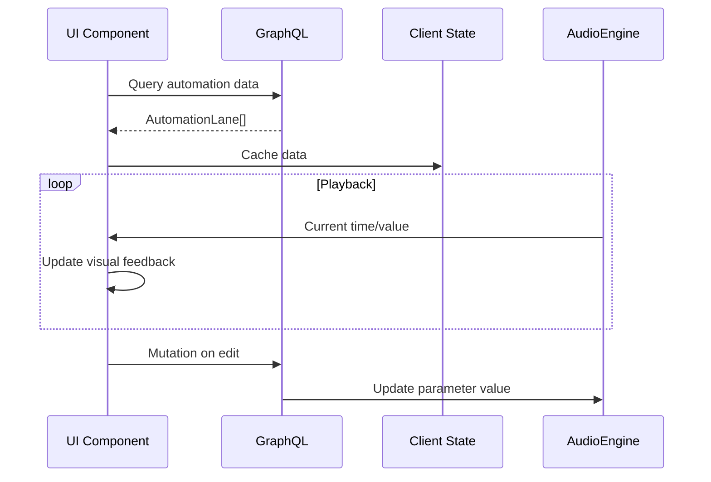

# Automation UI Specification

## Overview
Visualization and editing interface for track/effect parameter automation. Integrates with existing automation data model and timeline concepts.

## Components

### 1. Automation Lane
- Visual representation of automation curve within a track
- **Vertical Scale:** Parameter value (0.0-1.0 normalized)
- **Horizontal Scale:** Timeline (samples/musical time)
- **Rendering:**
  ```mermaid
  graph TD
    A[Track Header] --> B[Automation Lane]
    B --> C[Vertical Value Scale]
    B --> D[Timeline Grid]
    B --> E[Automation Curve]
    E --> F[Control Points]
  ```

### 2. Point Editor
- **Drag-to-Move:** Move points with mouse/touch
- **Context Menu (Right-click):**
  - Delete point
  - Change interpolation (Linear/Bezier/Hold)
  - Reset handles (for Bezier)
- **Snap Options:**
  - Musical time divisions (1/4, 1/8, 1/16, etc.)
  - Value snapping (0.1 increments)

### 3. Parameter Selection
- Dropdown showing automatable parameters
- Visual indicators:
  - Dot icon for currently automated parameters
  - Color-coded by parameter type
- Organization:
  - Group track parameters first (volume, pan)
  - Then effect parameters per effect

### 4. Visual Feedback
- **Playback Highlight:** 
  - Moving cursor showing current position
  - Highlighted curve segment during playback
- **Value Indicator:** Current parameter value at playhead
- **Differentiators:**
  - Color coding (tracks vs effects)
  - Icons (📈 for track, 🎚️ for effect)

## State Management

### Data Flow


### Required GraphQL Extensions
```graphql
# Add to QueryRoot
extend type Query {
  automationLane(
    trackId: ID, 
    effectId: ID, 
    parameterId: String!
  ): AutomationLane!
}

# Add to MutationRoot
extend type Mutation {
  moveAutomationPoint(
    laneId: ID!
    oldPosition: Int!
    newPosition: Int!
    newValue: Float!
  ): AutomationPoint!
  
  setInterpolationType(
    pointId: ID!
    interpolation: InterpolationType!
  ): Boolean!
}

# Add to SubscriptionRoot
extend type Subscription {
  automationChanged(
    laneId: ID!
  ): AutomationLane!
}
```

## Interaction Specifications

### Point Manipulation
1. Click empty space: Create new point
2. Drag point: Move position/value
3. Ctrl+drag (Bezier): Adjust handles
4. Right-click point: Context menu

### Keyboard Shortcuts
- `Delete`: Remove selected point(s)
- `Ctrl+Z`: Undo
- `Ctrl+Shift+Z`: Redo
- `G`: Toggle grid snapping

### Visual Feedback States
| State | Visual Cue |
|-------|------------|
| Normal | Solid line |
| Hovered | Highlighted point |
| Dragging | Larger point + helper lines |
| Bezier Editing | Handles visible |
| Playback | Pulsing current value indicator |

## Performance Considerations
1. Virtualized rendering - only draw visible timeline range
2. WebGL for curve rendering (especially for Bezier)
3. Debounce frequent updates (point dragging)
4. LOD (Level of Detail) for distant points
5. Web Workers for curve calculation

## Implementation Plan
1. Create `AutomationLane` Yew component
2. Build `AutomationPointEditor` for point manipulation
3. Implement `ParameterSelector` dropdown
4. Add visual feedback systems
5. Integrate with GraphQL API
6. Optimize rendering performance

## Next Steps
1. Implement UI components in `apps/daw/src/web/ui/automation/`
2. Update GraphQL schema and resolvers
3. Add integration with audio engine