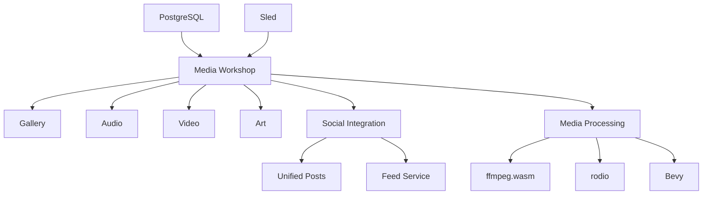

# Media Workshop Architecture

## Overview
The Media Workshop provides integrated tools for media creation and sharing across four domains:
- **Gallery**: Photo/video management
- **Audio**: Music creation and sharing
- **Video**: Editing and streaming
- **Art**: Digital creation tools

## Architectural Principles
- **Hexagonal Architecture**: Separation of core domain from infrastructure
- **Screaming Architecture**: Feature-oriented module structure
- **Vertical Slices**: End-to-end feature implementation
- **Rust First**: Prioritize Rust implementation where possible

## System Components


## Module Boundaries
1. **Core Domain** (`media_core`):
   - Media asset models
   - Editing operations
   - Collaboration primitives

2. **Application Services** (`media_services`):
   - Media ingestion
   - Processing pipelines
   - Social integration

3. **Infrastructure** (`media_infrastructure`):
   - Storage adapters (PostgreSQL, Sled)
   - Codec handlers (ffmpeg.wasm)
   - Visualization (Bevy)

## API Contracts
### Internal (gRPC)
```protobuf
service MediaProcessing {
  rpc ProcessMedia(MediaRequest) returns (MediaResponse);
  rpc StreamMedia(StreamRequest) returns (stream MediaChunk);
}

message MediaRequest {
  bytes raw_data = 1;
  MediaFormat format = 2;
}
```

### External (GraphQL)
```graphql
type MediaAsset {
  id: ID!
  title: String!
  format: MediaFormat!
  duration: Int
  url: String!
  permissions: [Permission!]!
}

extend type Mutation {
  shareMedia(assetId: ID!, recipients: [ID!]!): ShareResult!
}
```

## Performance Considerations
- Use Sled for edge caching of frequently accessed media
- Implement lazy loading for large assets
- Offload processing to web workers
- Use AV1 for video, Opus for audio to minimize bandwidth
- Chunk large files for streaming

## Privacy Implications
- Explicit consent required for sharing identifiable media
- GDPR-compliant metadata handling
- End-to-end encryption for private collaborations
- Granular permission controls (view, edit, share)