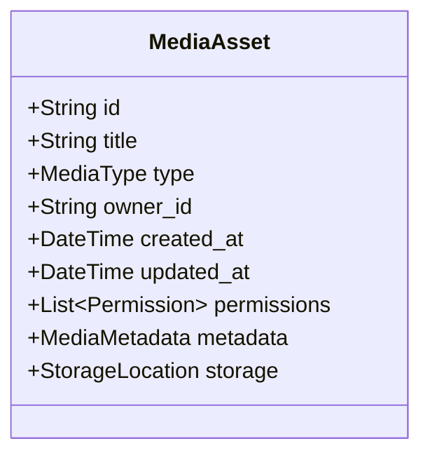
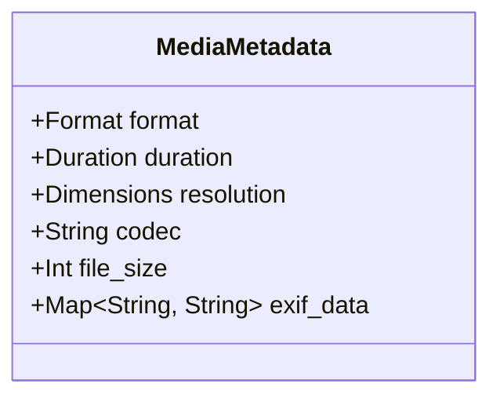
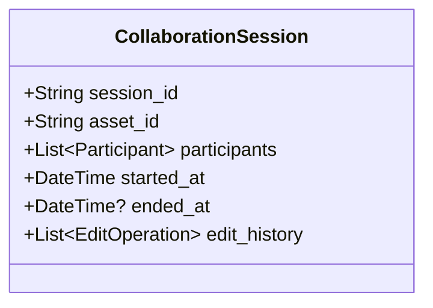
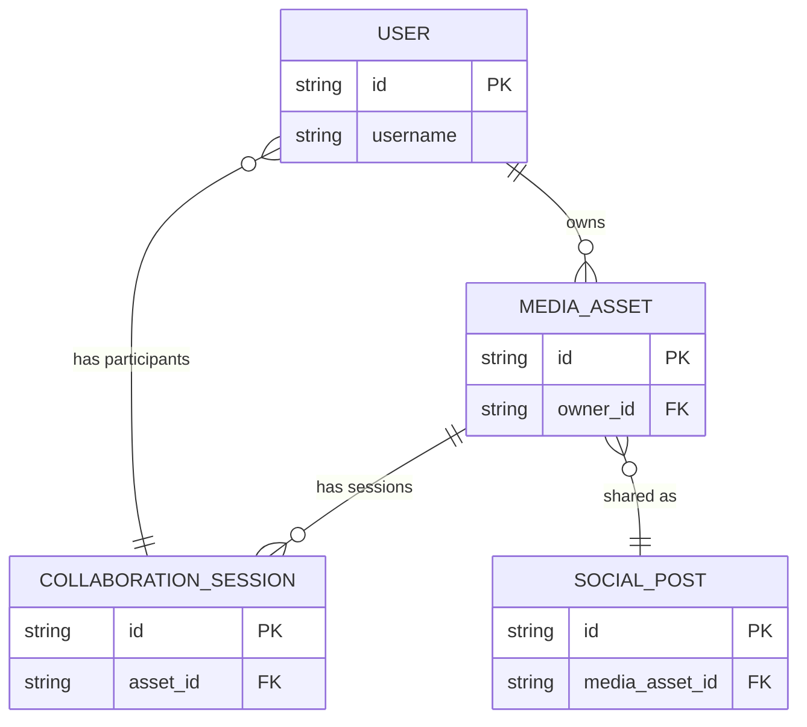

# Media Workshop Domain Models

## Core Entities

### MediaAsset


### MediaMetadata


### CollaborationSession


## Relationships


## Enums

### MediaType
```rust
pub enum MediaType {
    Photo,
    Video,
    AudioTrack,
    AudioProject,
    ArtProject,
    Document,
    Other(String),
}
```

### PermissionLevel
```rust
pub enum PermissionLevel {
    Owner,
    Editor,
    Commenter,
    Viewer,
}
```

### Format
```rust
pub enum VideoFormat {
    WebM,
    // Other formats supported by ffmpeg.wasm
}

pub enum AudioFormat {
    Opus,
    // Other royalty-free formats
}

pub enum ImageFormat {
    Avif,
    WebP,
}
```

## Value Objects

### Dimensions
```rust
pub struct Dimensions {
    pub width: u32,
    pub height: u32,
}
```

### StorageLocation
```rust
pub struct StorageLocation {
    pub node_id: String, // P2P node identifier
    pub path: String,
    pub is_cached: bool,
}
```

### EditOperation
```rust
pub struct EditOperation {
    pub user_id: String,
    pub timestamp: DateTime,
    pub operation_type: EditType,
    pub parameters: Value, // JSON object
}