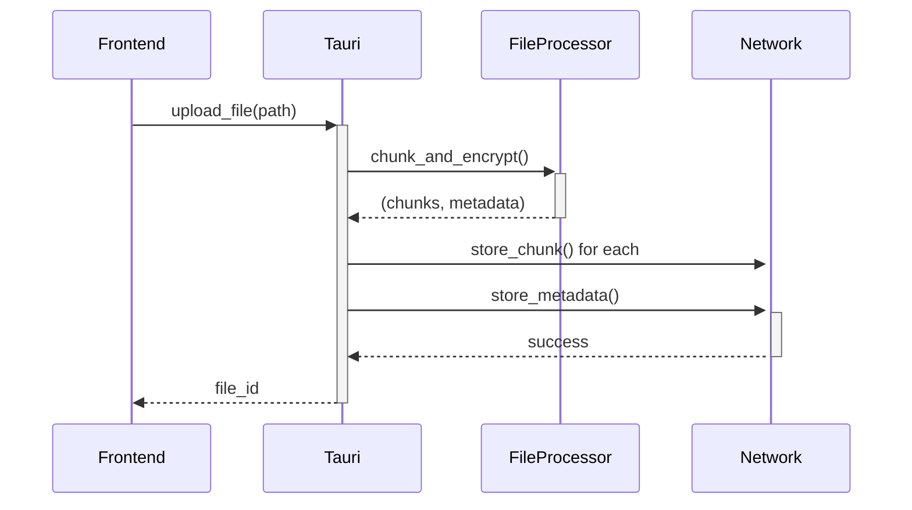
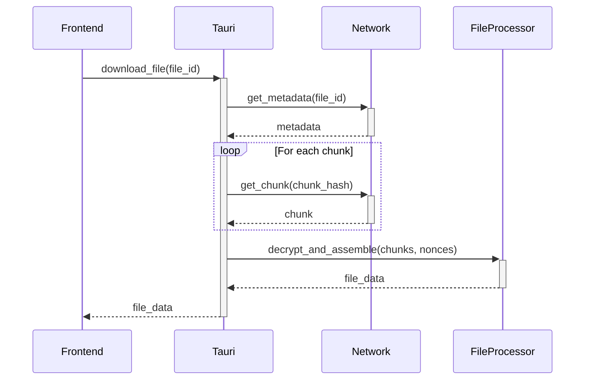

# Phase 2 File Transfer Architecture

## Metadata Management

### Schema Design
```rust
pub struct FileMetadata {
    pub file_id: String,       // Content address (Merkle root)
    pub file_name: String,
    pub size: u64,
    pub mime_type: String,
    pub created_at: DateTime<Utc>,
    pub chunks: Vec<ChunkMetadata>,
}

pub struct ChunkMetadata {
    pub index: u32,
    pub hash: String,          // SHA256 of encrypted chunk
    pub size: usize,
    pub nonce: [u8; 12],       // AES-GCM nonce
}
```

### Storage Implementation
- SQLite database with tables:
  - `files`: (file_id TEXT PRIMARY KEY, file_name TEXT, size INTEGER, mime_type TEXT, created_at TEXT)
  - `chunks`: (chunk_hash TEXT PRIMARY KEY, file_id TEXT, index INTEGER, size INTEGER, nonce BLOB)

## Merkle Tree Verification

### Upload Process
1. Generate Merkle tree from chunk hashes
2. Store Merkle root as file content address
3. Persist tree structure in metadata

### Download Process
1. Retrieve metadata by content address
2. Fetch chunks using content hashes
3. Rebuild Merkle tree from chunks
4. Verify root hash matches metadata

## Content-based Addressing

### Network Trait Update
```rust
pub trait Network {
    async fn store_chunk(&mut self, hash: &str, data: Vec<u8>) -> Result<(), NetworkError>;
    async fn get_chunk(&self, hash: &str) -> Result<Vec<u8>, NetworkError>;
    async fn store_metadata(&mut self, metadata: &FileMetadata) -> Result<(), NetworkError>;
    async fn get_metadata(&self, file_id: &str) -> Result<FileMetadata, NetworkError>;
}
```

### Addressing Scheme
- Chunk address: `sha256(encrypted_chunk)`
- File address: `hex(merkle_root)`

## Error Handling

### Error Types
```rust
pub enum NetworkError {
    ChunkNotFound(String),
    VerificationFailed,
    DecryptionError(String),
    StorageFull,
    MetadataNotFound(String),
    NetworkUnavailable,
    InvalidData,
}
```

### Recovery Mechanisms
- Retry failed chunks (max 3 attempts)
- Partial download resumption
- Chunk redundancy (future)

## Security Improvements

### Nonce Handling
- Generate unique nonce per chunk
- Store with chunk metadata
- Retrieve during decryption

### Encryption Update
```rust
// During encryption
let nonce = rand::random(); 
ciphertext = cipher.encrypt(&nonce, chunk)?;

// During decryption
cipher.decrypt(&nonce, chunk)?;
```

## Sequence Diagrams

### Upload Sequence


### Download Sequence


## Dependencies Analysis
- **rusqlite**: Metadata storage
- **merkle-cbt**: Merkle tree operations
- **aes-gcm**: Encryption
- **sha2**: Content hashing