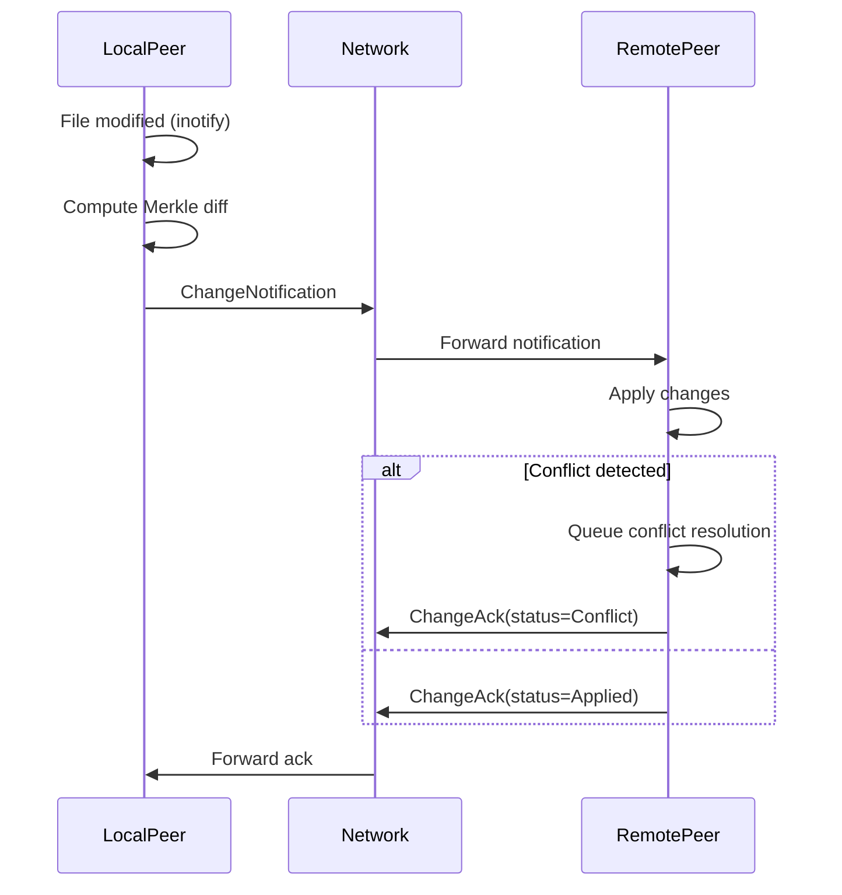
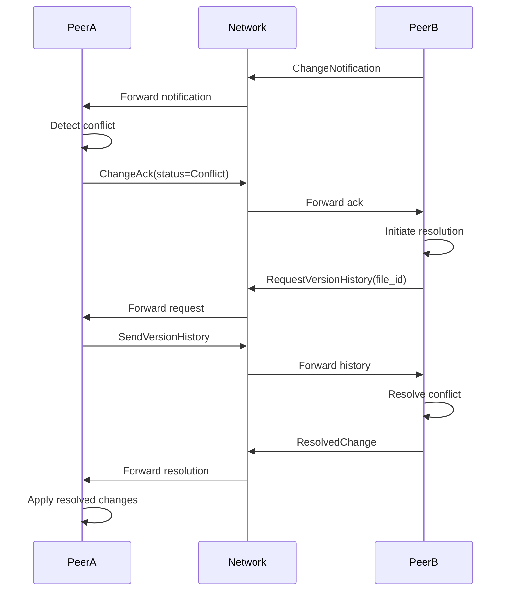

# Phase 2 File Synchronization Protocol Specification

## 1. Message Types

### Change Notification Message
```rust
pub struct ChangeNotification {
    pub file_id: String,           // Content address of modified file
    pub change_type: ChangeType,   // Type of change (CREATE, UPDATE, DELETE)
    pub diff: Vec<ChunkDiff>,      // List of chunk changes
    pub timestamp: DateTime<Utc>,  // Time of change detection
    pub author: String,            // Peer ID of change originator
}

pub enum ChangeType {
    Create,
    Update,
    Delete,
}

pub struct ChunkDiff {
    pub index: u32,                // Chunk index
    pub operation: ChunkOperation, // Operation to perform
    pub hash: Option<String>,      // New chunk hash (for UPDATE/CREATE)
    pub data: Option<Vec<u8>>,     // Chunk data for small changes
}

pub enum ChunkOperation {
    Add,    // New chunk
    Remove, // Deleted chunk
    Modify, // Modified chunk
}
```

### Change Acknowledgement
```rust
pub struct ChangeAck {
    pub file_id: String,           // Content address of modified file
    pub status: ChangeStatus,      // Result of change application
    pub conflicts: Vec<Conflict>,  // List of conflicts if any
}

pub enum ChangeStatus {
    Applied,       // Change successfully applied
    Partial,       // Partial application (some conflicts)
    Conflict,      // Conflicts prevented application
}

pub struct Conflict {
    pub chunk_index: u32,          // Index of conflicting chunk
    pub local_version: String,     // Local chunk hash
    pub remote_version: String,    // Remote chunk hash
}
```

## 2. Sequence Diagrams

### File Change Detection and Propagation


### Conflict Resolution


## 3. API Contracts

### Tauri Commands
```rust
#[tauri::command]
async fn watch_directory(path: String) -> Result<(), String> {
    // Start watching directory for changes
}

#[tauri::command]
async fn get_conflicts() -> Result<Vec<FileConflict>, String> {
    // Get list of current file conflicts
}

#[tauri::command]
async fn resolve_conflict(
    file_id: String, 
    resolution: ConflictResolution
) -> Result<(), String> {
    // Apply conflict resolution
}

pub enum ConflictResolution {
    KeepLocal,
    KeepRemote,
    Merge,
}
```

## 4. Conflict Resolution Strategy

### Conflict Detection
- Compare local and remote Merkle roots
- Detect mismatching chunk hashes
- Track version vectors for each file

### Resolution Process
1. Detect conflicting chunks
2. Request version history from peers
3. Present conflict to user via UI
4. Apply user-selected resolution:
   - Keep local version
   - Keep remote version
   - Manual merge (for text files)

### Automatic Resolution
For non-overlapping changes:
- Apply all CREATE operations
- Apply REMOVE operations last
- For MODIFY conflicts, use timestamp-based resolution (newest wins)

## 5. Error Cases

### Change Application Errors
| Error Case | Handling Strategy |
|------------|-------------------|
| Missing chunks | Request chunks from network |
| Invalid Merkle root | Reject change and request full file |
| Signature verification fail | Reject change and blacklist peer |
| Storage full | Trigger garbage collection |

### Network Errors
| Error Case | Handling Strategy |
|------------|-------------------|
| Peer unreachable | Retry with exponential backoff |
| Network partition | Queue changes for later sync |
| Message timeout | Re-broadcast to different peers |

### Conflict Resolution Failures
| Error Case | Handling Strategy |
|------------|-------------------|
| Unresolvable conflict | Flag for manual intervention |
| Version history unavailable | Use timestamp-based resolution |
| Merge failure | Keep both versions as conflicted copies |