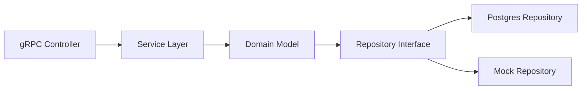

# Cause Management Service Implementation Summary (v2.0)

## Overview
This service provides comprehensive cause management with collaborative features for the CPC platform. Organized using vertical slices and hexagonal architecture.

## Vertical Slices

### 1. Cause Management
- **Models**:
  - `Cause` with validation logic
  - Request/response structures
- **Repository**:
  - CRUD operations
  - Pagination and filtering
- **Service**:
  - gRPC handlers for cause operations
  - Input validation
  - Error mapping

### 2. Discussion System
- **Models**:
  - `DiscussionThread` with comments
  - User mentions and reactions
- **Repository**:
  - Thread creation/updating
  - Nested comment storage
- **Service**:
  - Real-time updates via gRPC streams
  - Notification triggers

### 3. Updates & Announcements
- **Models**:
  - `CauseUpdate` with multimedia support
  - Update metadata
- **Repository**:
  - Versioned updates
  - Scheduled publishing
- **Service**:
  - Update broadcasting
  - Subscriber notifications

## Hexagonal Architecture


## Key Features
- **Collaboration Tools**:
  - Discussion threads on causes
  - Real-time updates
  - User mentions
- **Social Features**:
  - Cause sharing
  - Update subscriptions
  - Activity feeds
- **Enhanced Architecture**:
  - Feature-based vertical slices
  - Clear domain boundaries
  - Testable interfaces

## Protocol Buffers
```protobuf
// Discussion system
message DiscussionThread {
  string id = 1;
  string cause_id = 2;
  repeated Comment comments = 3;
}

message CreateThreadRequest {
  string cause_id = 1;
  string initial_comment = 2;
}

// Cause updates
message CauseUpdate {
  string id = 1;
  string cause_id = 2;
  string content = 3;
  repeated string media_urls = 4;
}
```

## Database Schema
```sql
CREATE TABLE discussion_threads (
  id UUID PRIMARY KEY,
  cause_id UUID REFERENCES causes(id),
  created_at TIMESTAMPTZ NOT NULL
);

CREATE TABLE cause_updates (
  id UUID PRIMARY KEY,
  cause_id UUID REFERENCES causes(id),
  content TEXT NOT NULL,
  media_urls JSONB,
  published_at TIMESTAMPTZ
);
```

## Future Enhancements
- Volunteer opportunity management
- Skill-based volunteering integration
- Advanced impact analytics