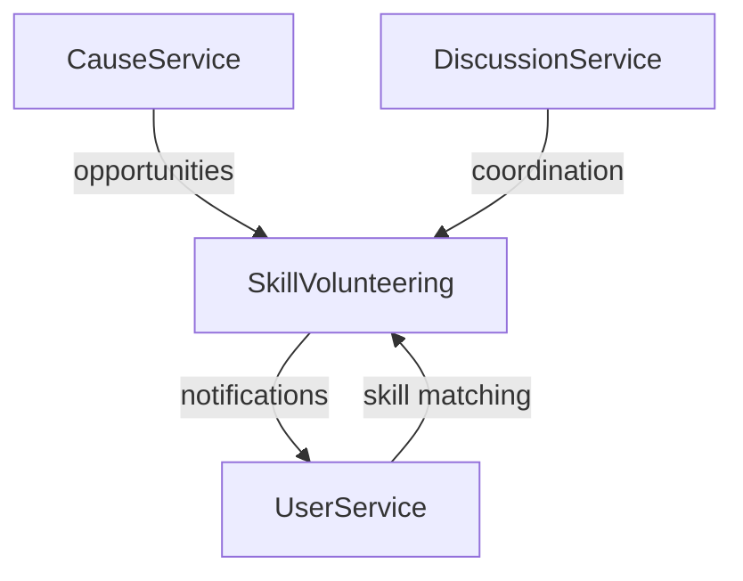

# Cause Management Service Integration Guide

## Overview

This guide explains how to integrate the Cause Management Service with the existing CPay Core service and other components of the CPC platform.

## Service Architecture

The Cause Management Service is designed as a separate microservice that works alongside the CPay Core service. Both services share the same proto definitions but handle different aspects of the platform:

- **CPay Core**: Handles payment processing, transaction history, and financial operations
- **Cause Management**: Handles cause creation, management, and donation tracking

## Integration Points

### 1. Shared Protocol Buffers

Both services use the same `cpay.proto` definition file, which allows them to:
- Share message definitions (Cause, PaymentRequest, etc.)
- Maintain consistent API interfaces
- Enable service-to-service communication

### 2. Database Integration

While each service manages its own database tables, they can reference each other's data:
- CPay Core transactions can reference cause IDs
- Cause Management service can track donations from transaction data

### 3. gRPC Communication

Services communicate through gRPC calls:
- CPay Core can call Cause Management to retrieve cause details
- Cause Management can call CPay Core to get transaction data for donation calculations

## Implementation Example

### Using the Cause Management Service

```rust
use cause_management::{CauseManagementServiceImpl, service::CauseServiceImpl, repository::PostgresCauseRepository};
use sqlx::PgPool;
use std::sync::Arc;

// Database setup
let pool = PgPool::connect("postgresql://localhost:5432/cpc").await?;

// Repository setup
let cause_repository = Arc::new(PostgresCauseRepository::new(pool));

// Service setup
let cause_service = Arc::new(CauseServiceImpl::new(cause_repository));
let cause_management_service = CauseManagementServiceImpl::new(cause_service);

// Start the gRPC server
let addr = "0.0.0.0:50051".parse()?;
cause_management_service.start_grpc_server(addr).await?;
```

### Calling from CPay Core

```rust
// In cpay_core, you can call the cause management service
use cause_management::proto::cpay_service_client::CpayServiceClient;
use cause_management::proto::{GetCauseRequest, Cause};

let mut client = CpayServiceClient::connect("http://localhost:50051").await?;
let request = tonic::Request::new(GetCauseRequest {
    cause_id: "some-cause-id".to_string(),
});

let response = client.get_cause(request).await?;
let cause: Cause = response.into_inner().cause;
```

## Database Schema Integration

### Cause Management Tables
- `causes` - Cause information and donation tracking
- `discussion_threads` - Threads for cause discussions
- `comments` - Individual comments in threads
- `cause_updates` - Updates and announcements

```sql
CREATE TABLE discussion_threads (
  id UUID PRIMARY KEY,
  cause_id UUID REFERENCES causes(id),
  title TEXT NOT NULL,
  created_at TIMESTAMPTZ NOT NULL DEFAULT NOW()
);

CREATE TABLE comments (
  id UUID PRIMARY KEY,
  thread_id UUID REFERENCES discussion_threads(id),
  user_id UUID NOT NULL,
  content TEXT NOT NULL,
  media_urls JSONB,
  created_at TIMESTAMPTZ NOT NULL DEFAULT NOW()
);

CREATE TABLE cause_updates (
  id UUID PRIMARY KEY,
  cause_id UUID REFERENCES causes(id),
  title TEXT NOT NULL,
  content TEXT NOT NULL,
  media_urls JSONB,
  published_at TIMESTAMPTZ
);
```

## Collaborative Features Integration

### Discussion System
- Real-time updates using gRPC streams:
  ```protobuf
  service DiscussionService {
    rpc StreamThreadUpdates(StreamThreadRequest) returns (stream ThreadUpdate);
  }
  ```
- Push notifications for new comments
- Moderation hooks for content filtering

### Cause Updates
- Scheduled publishing via background workers
- Subscription system for update notifications
- Multimedia content handling

## Skill Volunteering Integration
The new Skill Volunteering module will integrate with:
- CauseService to link opportunities with causes
- DiscussionService for volunteer coordination
- User profiles for skill matching



## Future Integration
- Social graph for volunteer connections
- Skill validation system
- Impact scoring for volunteer work