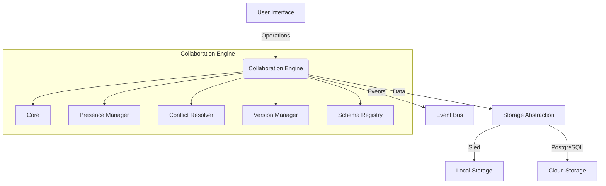

# Collaboration Engine Architecture

## Overview
The Collaboration Engine provides real-time document collaboration capabilities using Operational Transformation (OT) and Conflict-free Replicated Data Types (CRDT) algorithms. It follows hexagonal architecture principles with clear separation between domain logic, application services, and infrastructure concerns.

## High-Level Architecture Diagram

## Component Responsibilities

### Core Module
- **Document**: Manages document state, content, and operation history
- **Operations**: Represents atomic changes (Insert, Delete, Replace) with position tracking
- **CRDTDocument**: Implements conflict-free replicated data types for distributed editing
- Responsibilities:
  - Apply operations while maintaining document integrity
  - Handle remote operations synchronization
  - Convert between position and index representations
  - Maintain operation history for conflict resolution

### Presence Manager
- Tracks user presence in collaborative sessions
- Responsibilities:
  - Update cursor positions and selection ranges
  - Monitor user activity and typing status
  - Clean up inactive sessions
  - Broadcast presence updates via event bus
  - Provide presence data to UI components

### Conflict Resolver
- Detects and resolves editing conflicts using Operational Transformation (OT)
- Responsibilities:
  - Identify conflicting operations using position analysis
  - Apply resolution strategies (timestamp, priority, merge)
  - Manage user priority settings
  - Provide conflict resolution hooks for custom strategies
  - Notify users of detected conflicts via event bus
  - Transform operations using OT algorithms
  - Integrate with Presence Manager for QoS-based priority
  - Integrate with Version Manager to create versions after resolution

### Version Manager
- Manages document version history
- Responsibilities:
  - Create document snapshots with metadata
  - Support branching and tagging
  - Compare versions and generate diffs
  - Manage storage of historical versions
  - Integrate with storage abstraction layers

### Schema Registry
- Manages event schemas and transformations
- Responsibilities:
  - Register and version event schemas
  - Validate events against schemas
  - Transform events between versions
  - Manage schema deprecation lifecycle
  - Provide transformation functions for backward compatibility

## Data Flow
1. User actions generate **Operations** that are sent to the Core module
2. Core processes operations and updates document state
3. Presence Manager updates user presence information
4. Conflict Resolver checks for operation conflicts
5. Conflict Resolver creates new document versions via Version Manager after conflict resolution
6. Schema Registry validates all outgoing events
7. Processed events are published to the Event Bus
8. External systems consume events and update their state

## Data Flow Updates
- Document content flows from Core to Conflict Resolver for range calculations and transformations
- Conflict Resolver integrates with Version Manager to create versions after conflict resolution
- Transformation history is recorded for audit and debugging purposes

## Event Bus Integration
- **Published Events**:
  - OperationApplied
  - PresenceUpdated
  - ConflictDetected
  - VersionCreated
  - SchemaRegistered
- **Subscribed Events**:
  - UserJoinedDocument
  - UserLeftDocument
  - RemoteOperation
- Integration points:
  - All components can publish events via injected event bus
  - Core module handles RemoteOperation and user join/leave events
  - Schema Registry validates all outgoing events

## Storage Abstraction Layers
- **Sled**: Used for local caching and offline editing
- **PostgreSQL**: Used for cloud persistence and synchronization
- **In-memory**: Used for testing and ephemeral sessions
- Storage handles:
  - Document metadata and content
  - Operation history
  - Presence information
  - Version history
  - Schema definitions

## Performance Considerations
- **Network Efficiency**:
  - Operation batching to reduce traffic
  - Delta compression for operation transmission
  - Operation garbage collection
- **Storage Optimization**:
  - Efficient serialization formats (MessagePack, Protobuf)
  - Lazy loading for version history
  - Indexed operation storage
- **Real-time Responsiveness**:
  - Efficient data structures for presence tracking
  - Throttling for cursor updates
  - Prioritization of critical operations
- **Concurrency**:
  - Lock-free data structures where possible
  - Async I/O operations
  - Horizontal scaling through partitioning

## Error Handling Strategies
- **Error Types**:
  - InvalidPosition: Position doesn't exist in document
  - InvalidRange: Invalid operation range (start > end)
  - OperationConflict: Unresolvable conflict detected
  - DocumentNotFound: Referenced document doesn't exist
- **Handling Approaches**:
  - Result-based error propagation
  - Comprehensive error enums with contextual information
  - Automatic conflict resolution fallbacks
  - Schema validation for all events
  - Dead-letter queue for unprocessable events
  - Retry mechanisms for transient errors
  - Circuit breakers for storage operations
- **Monitoring**:
  - Structured logging with tracing
  - Metrics for error rates and types
  - Alerting on critical error patterns