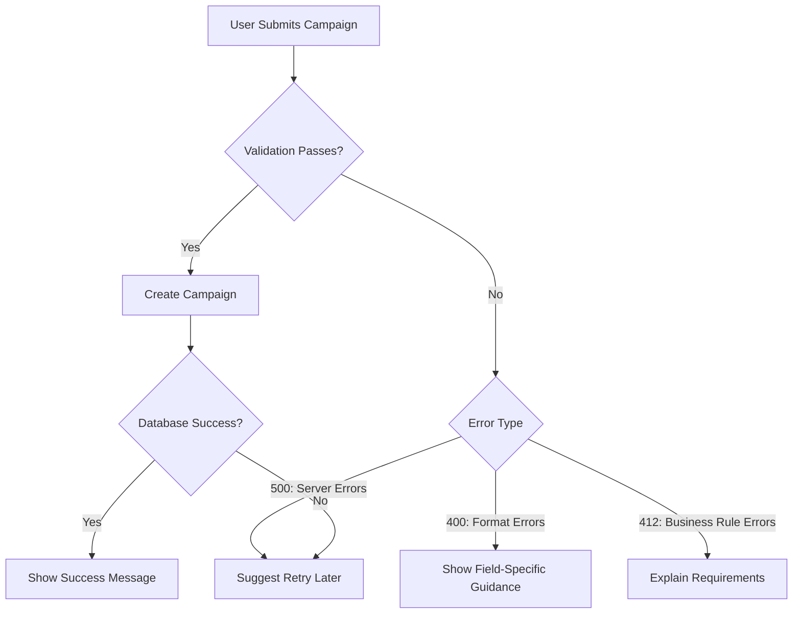

# Cooperative Fundraising Campaign Creation API Integration Guide

This guide provides frontend developers with everything needed to implement robust error handling for the campaign creation feature using Rust and Yew. By following these patterns, you'll create compassionate user experiences that guide cooperatives toward successful campaign launches.

## Error Flow Overview



## Standard Error Response Format

All errors follow this JSON structure:

```json
{
  "code": 3,
  "message": "Exact error message from backend",
  "details": {
    "field": "title",
    "value": "Too short"
  }
}
```

Where `code` corresponds to the [gRPC status code](https://grpc.github.io/grpc/core/md_doc_statuscodes.html).

## Real Error Examples

### 1. Title Validation Error (400 INVALID_ARGUMENT)

```json
{
  "code": 3,
  "message": "Title must be between 5 and 100 characters",
  "details": {
    "field": "title",
    "value": "Hi"
  }
}
```

**Recommended UI Treatment**:
`<ErrorMessage message_key="campaign.errors.title_length" />`
```rust
#[derive(Properties, PartialEq)]
pub struct Props {
    pub message_key: String,
}

#[function_component(ErrorMessage)]
pub fn error_message(props: &Props) -> Html {
    let i18n = use_i18n();
    html! {
        <div class="error">
            {i18n.t(&props.message_key)}
        </div>
    }
}

// Usage example
html! {
    <ErrorMessage message_key="campaign.errors.title_length" />
}
```

### 2. Description Validation Error (400 INVALID_ARGUMENT)

```json
{
  "code": 3,
  "message": "Description must be between 20 and 1000 characters",
  "details": {
    "field": "description",
    "value": "Too short"
  }
}
```

### 3. Membership Campaign Requirements (412 FAILED_PRECONDITION)

```json
{
  "code": 9,
  "message": "Membership campaigns require max_participants > 0",
  "details": {
    "field": "max_participants",
    "value": "0"
  }
}
```

**Recommended UI Treatment**:  
Highlight membership requirements section with:  
`Membership campaigns require at least 1 participant slot`

### 4. Donation Campaign Requirements (412 FAILED_PRECONDITION)

```json
{
  "code": 9,
  "message": "Donation funding_goal must be positive",
  "details": {
    "field": "funding_goal",
    "value": "-100"
  }
}
```

And:

```json
{
  "code": 9,
  "message": "Donation campaigns must have an external use case",
  "details": {
    "field": "external_use_case",
    "value": ""
  }
}
```

### 5. Status Constraint Error (412 FAILED_PRECONDITION)

```json
{
  "code": 9,
  "message": "Only DRAFT status allowed when creating a new campaign",
  "details": {
    "field": "status",
    "value": "ACTIVE"
  }
}
```

### 6. Database Error (500 INTERNAL)

```json
{
  "code": 13,
  "message": "Database or unexpected error: connection timed out",
  "details": {}
}
```

### 7. Donation Campaign Funding Goal Required (412 FAILED_PRECONDITION)

```json
{
  "code": 9,
  "message": "Donation campaigns require a funding_goal",
  "details": {
    "field": "funding_goal",
    "value": ""
  }
}
```

**Recommended UI Treatment**:
`Donation campaigns must specify a funding goal amount`

### 8. Donation Campaign Details Required (412 FAILED_PRECONDITION)

```json
{
  "code": 9,
  "message": "Donation campaigns must have details",
  "details": {
    "field": "donation_details",
    "value": "null"
  }
}
```

**Recommended UI Treatment**:
`Donation campaigns require complete funding details`

### 9. Membership Campaign Requirements Required (412 FAILED_PRECONDITION)

```json
{
  "code": 9,
  "message": "Membership campaigns must have requirements",
  "details": {
    "field": "membership_requirements",
    "value": "null"
  }
}
```

**Recommended UI Treatment**:
`Membership campaigns require participant requirements`

## User-Friendly Message Mapping
| Raw Error Message | Recommended User Message |
|-------------------|--------------------------|
| "Title must be between 5 and 100 characters" | "Please enter a title between 5 and 100 characters" |
| "Description must be between 20 and 1000 characters" | "Description should be 20-1000 characters to provide enough context" |
| "Membership campaigns require max_participants > 0" | "You must allow at least 1 participant for membership campaigns" |
| "Donation funding_goal must be positive" | "Funding goal must be a positive amount" |
| "Donation campaigns must have an external use case" | "Please describe how funds will be used" |
| "Only DRAFT status allowed when creating a new campaign" | "Your campaign must start as a Draft before activation" |
| "Donation campaigns require a funding_goal" | "Donation campaigns must specify a funding goal amount" |
| "Donation campaigns must have details" | "Donation campaigns require complete funding details" |
| "Membership campaigns must have requirements" | "Membership campaigns require participant requirements" |

## Localization Strategy

1. **Extract all error messages** into your i18n system using consistent keys:
   ```json
   {
     "campaign.errors.title_length": "Please enter a title between 5 and 100 characters",
     "campaign.errors.max_participants": "You must allow at least 1 participant"
   }
   ```

2. **Preserve field references** for programmatic handling:
   ```rust
   if let Some(field) = &error.details.field {
       if field == "title" {
           html! {
               <ErrorMessage message_key="campaign.errors.title_length" />
           }
       }
   }
   ```

3. **Add context notes** for translators:
   ```json
   {
     "campaign.errors.funding_goal": {
       "message": "Funding goal must be a positive amount",
       "context": "Refers to the minimum funding target for donation campaigns"
     }
   }
   ```

## Retry Strategy Guidance

| Error Type | Should Retry? | Strategy |
|------------|---------------|----------|
| 400 (INVALID_ARGUMENT) | ❌ No | Fix user input and resubmit |
| 412 (FAILED_PRECONDITION) | ❌ No | Correct business rule violations |
| 500 (INTERNAL) | ✅ Yes | Exponential backoff: attempt 2-3 times with 1s, 2s, 4s delays |
| Network errors | ✅ Yes | Same as 500 errors |

**Implementation example:**
```rust
use reqwest::Client;
use reqwest::StatusCode;
use std::time::Duration;
use yew::callback::Callback;

async fn create_campaign(data: CampaignData) -> Result<Campaign, ApiError> {
    let client = Client::new();
    let max_retries = 3;
    let mut retry_delay = Duration::from_secs(1);
    
    for attempt in 0..max_retries {
        let response = client
            .post("/campaigns")
            .json(&data)
            .send()
            .await;
            
        match response {
            Ok(res) if res.status().is_success() => return res.json().await.map_err(|_| ApiError::DeserializationError),
            Err(e) if e.is_status() && e.status() == Some(StatusCode::INTERNAL_SERVER_ERROR) => {
                // Exponential backoff
                tokio::time::sleep(retry_delay).await;
                retry_delay *= 2;
            }
            Err(e) => return Err(e.into()),
            _ => continue,
        }
    }
    Err(ApiError::MaxRetriesExceeded)
}
```
```

## Quality Checklist for Implementation

- [x] All error cases from proto documentation are documented (COMPLETED)
- [ ] User messages match the exact patterns in this guide
- [ ] Error messages are properly localized
- [ ] Retry logic implemented only for server errors (500)
- [ ] Field-specific errors highlight the correct form fields
- [ ] Empty state guidance provided for each error type
- [ ] Error handling uses Result types appropriately
- [ ] All components use Yew's reactive patterns
- [ ] Async operations use proper Rust futures

By implementing these patterns, you're directly supporting our mission to make cooperative fundraising accessible to all communities. Clear error handling reduces frustration and helps cooperatives succeed on their first attempt!