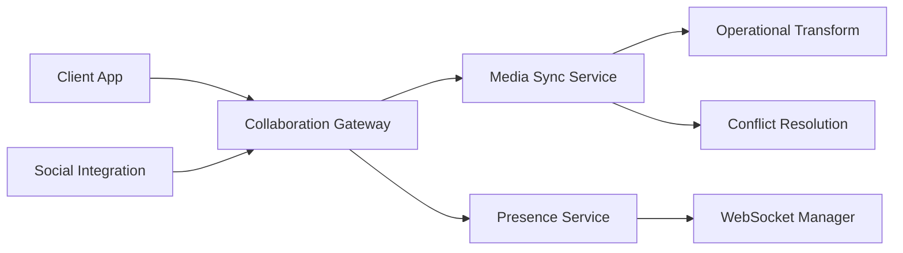
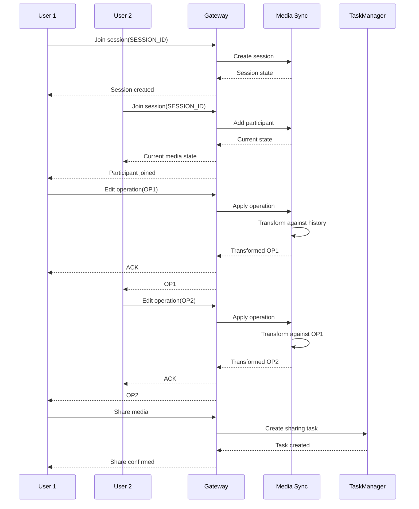
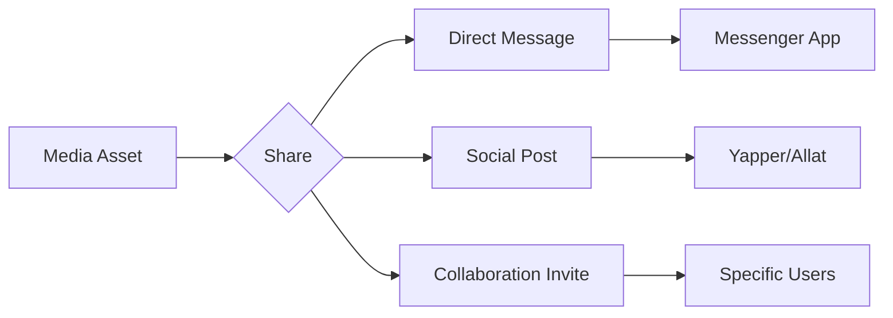

# Real-time Collaboration Design

## Architecture Overview


## Core Components

### 1. Collaboration Gateway
- Manages WebSocket connections
- Routes messages to appropriate services
- Enforces authentication and permissions
- Handles rate limiting

### 2. Media Sync Service
- Implements Operational Transformation (OT) for media edits
- Uses CRDTs (Conflict-free Replicated Data Types) for state synchronization
- Maintains edit history for undo/redo

### 3. Presence Service
- Tracks online participants
- Manages cursor positions
- Handles permission levels in real-time

## Collaboration Workflow


## Social Integration Points

### 1. Unified Comments
```protobuf
message MediaComment {
  string id = 1;
  string asset_id = 2;
  string author_id = 3;
  string content = 4;
  Timestamp timestamp = 5;
  optional string parent_id = 6; // For threaded comments
  repeated Annotation annotations = 7; // Linked to media regions
}
```

### 2. Sharing Workflow


## Performance Optimization

### Delta Compression
```rust
pub struct MediaDelta {
    base_version: u64,
    operations: Vec<EditOp>,
}

impl MediaDelta {
    pub fn compress(&self) -> CompressedDelta {
        // Apply run-length encoding to operations
    }
}
```

### Bandwidth Management
| Connection Quality | Update Frequency | Resolution |
|--------------------|------------------|------------|
| Excellent (>50Mbps) | 60fps | Full HD |
| Good (10-50Mbps) | 30fps | 720p |
| Fair (5-10Mbps) | 15fps | 480p |
| Poor (<5Mbps) | 5fps | Thumbnail |

## Security Model

### Permission Levels
| Level | Capabilities |
|-------|--------------|
| Owner | Full control, manage permissions |
| Editor | Edit content, invite collaborators |
| Commenter | Add comments, suggest edits |
| Viewer | View only |

### Access Control
```rust
fn check_permission(
    session: &CollaborationSession,
    user_id: &str,
    required: PermissionLevel,
) -> bool {
    if let Some(participant) = session.participants.get(user_id) {
        participant.level >= required
    } else {
        false
    }
}
```

## Failure Recovery
- Automatic version snapshots every 5 minutes
- Conflict-free data structures for eventual consistency
- Offline editing support with reconciliation on reconnect
- End-to-end encryption for sensitive collaborations

## Integration with Media Processing
```mermaid
flowchart TB
    A[Collaboration Session] --> B[Edit Operations]
    B --> C[Media Processor]
    C --> D[Preview Generator]
    D --> E[Real-time Preview]
    E --> F[Participant Clients]
    
## Task-Based Collaboration
Collaboration activities are tracked as tasks in the Task Manager:

```rust
use media_services::collaboration::MediaCollaborationService;
use media_services::collaboration::RecognitionType;

// Share a media asset with other users
MediaCollaborationService::share_media_asset(
    asset_id,
    sharer_id,
    recipients
).await?;

// Award non-monetary recognition for contributions
let reward = MediaCollaborationService::award_recognition(
    asset_id,
    creator_id,
    RecognitionType::CommunitySpotlight
)?;
```

## Non-Monetary Rewards System
The collaboration system includes a non-monetary rewards system to recognize contributions:

| Reward Type | Description |
|-------------|-------------|
| Featured Creator | Highlighted in community showcases |
| Community Spotlight | Featured in community newsletters |
| Achievement Badges | Collectible badges for milestones |
| Social Recognition | Public acknowledgment in feeds |