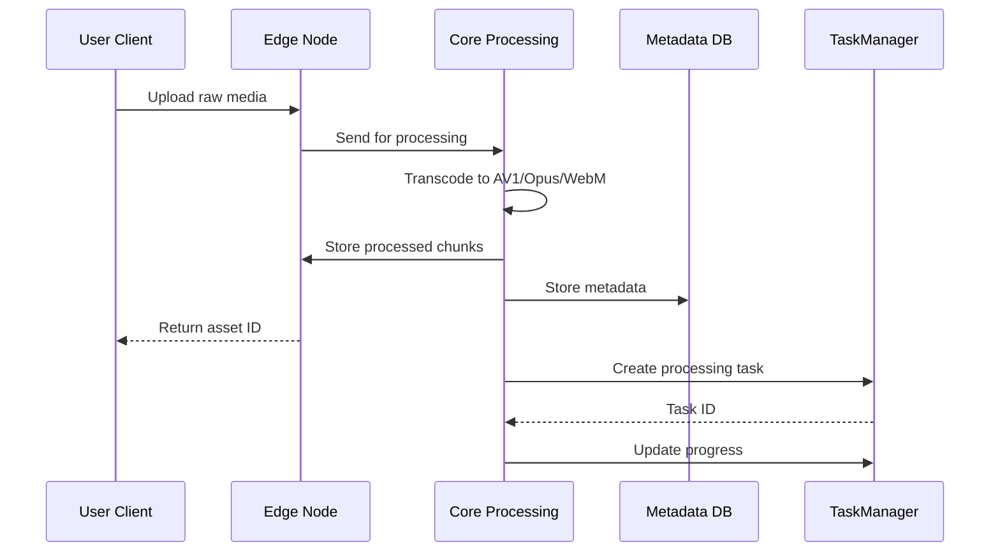
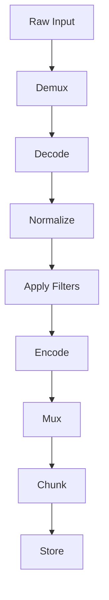
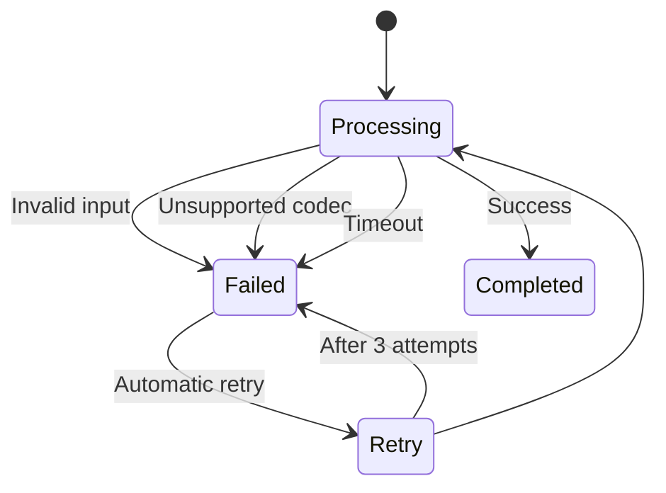

# Media Processing Pipeline

## Overview
The media processing pipeline handles ingestion, transformation, and delivery of media assets. It leverages ffmpeg.wasm for browser-based processing with royalty-free codecs (AV1/Opus/WebM).



## Processing Stages

### 1. Ingestion
- Accepts uploads via WebRTC for large files
- Supports drag-and-drop in UI
- File type validation
- Chunked upload with resumable transfers

### 2. Transcoding Pipeline
```rust
pub async fn transcode_media(
    input: MediaInput,
    output_format: OutputFormat,
) -> Result<ProcessedMedia, ProcessingError> {
    // 1. Decode input
    let decoded = ffmpeg::decode(input.data, input.format)?;
    
    // 2. Apply processing chain
    let processed = processing_chain(decoded, output_format)?;
    
    // 3. Encode to target format
    let encoded = ffmpeg::encode(processed, output_format)?;
    
    // 4. Generate previews
    let previews = generate_previews(&processed)?;
    
    Ok(ProcessedMedia { encoded, previews })
}
```

### 4. Task-Based Processing
Media processing operations are managed as tasks through the Task Manager:

```rust
use media_services::processing::MediaProcessingService;
use task_manager::task_core::value_objects::RecurrencePattern;

// Create a processing task for a media asset
let task = MediaProcessingService::create_processing_task(
    asset_id,
    "Transcode video".to_string(),
    "Convert video to WebM format".to_string()
).await?;

// Schedule a recurring backup job
let backup_task = MediaProcessingService::schedule_recurring_job(
    "Daily backup".to_string(),
    "Backup media assets".to_string(),
    RecurrencePattern::Daily,
    1
)?;
```

### 3. Processing Chain


## Performance Optimization

### Web Worker Pool
```rust
struct WorkerPool {
    workers: Vec<Worker>,
    task_queue: Arc<Mutex<VecDeque<Task>>>,
}

impl WorkerPool {
    pub fn new(size: usize) -> Self {
        // Initialize worker threads
    }
    
    pub async fn process(&self, task: Task) -> Result<Output> {
        // Distribute tasks to workers
    }
}
```

### Edge Caching with Sled
```rust
pub struct MediaCache {
    db: sled::Db,
}

impl MediaCache {
    pub fn get(&self, key: &str) -> Option<MediaChunk> {
        self.db.get(key).unwrap().map(|v| deserialize(&v))
    }
    
    pub fn set(&self, key: &str, value: MediaChunk, ttl: Duration) {
        self.db.insert(key, serialize(value)).unwrap();
        self.db.set_ttl(key, ttl);
    }
}
```

## Supported Operations

| Operation | Input Formats | Output Formats | Performance* |
|-----------|---------------|----------------|--------------|
| Video Transcoding | MP4, MOV, AVI | WebM (AV1) | 2x realtime |
| Audio Conversion | MP3, WAV, FLAC | WebM (Opus) | 5x realtime |
| Image Processing | JPEG, PNG, HEIC | AVIF, WebP | 100ms/image |
| Thumbnail Generation | Any video | WebP | 500ms/video |

*Performance metrics based on M1 Pro CPU

## Error Handling


## Security Considerations
- Sandboxed Web Workers for isolated processing
- Input validation against malicious files
- Memory limits per processing task
- Rate limiting to prevent abuse