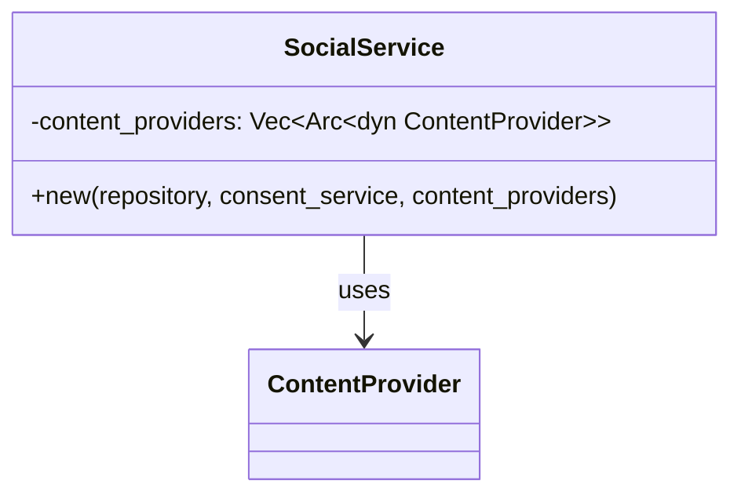

# Social Graph Consent Architecture Improvements

## Overview
This document summarizes the changes made to implement the consent architecture improvements for the social graph package.

## New Components Created

### 1. Domain Service Layer
- **File**: `src/domain/service/consent_service.rs`
- **Content**: `ConsentService` trait and `ConsentError` enum

### 2. Infrastructure Implementation
- **File**: `src/infrastructure/consent_service_impl.rs`
- **Content**: `ConsentServiceImpl` with caching and relationship checks

### 3. Repository Pattern Implementation
- **Files**: 
  - `src/infrastructure/repositories/social_post_repository.rs`
  - `src/infrastructure/repositories/video_repository.rs`
- **Content**: Repository traits and implementations with pagination support

### 4. Error Handling
- **File**: `src/error.rs`
- **Content**: `SocialGraphError` enum wrapping all possible errors

### 5. Test Utilities
- **File**: `tests/test_utils/mocks.rs`
- **Content**: `MockConsentService` for testing

## Modified Components

### 1. Social Service
- **File**: `src/application/social_service.rs`
- **Changes**: Replaced placeholder `apply_consent` and implemented streaming feed aggregation

### 2. Content Providers
- **Files**: 
  - `src/infrastructure/content_providers/social_post.rs`
  - `src/infrastructure/content_providers/video.rs`
- **Changes**: Added `owner_id` field to `ContentItem` creation

### 3. Domain Model
- **File**: `src/domain/model/feed.rs`
- **Changes**: Added `owner_id` field to `ContentItem` struct

## Module Exports
Updated module files to export new components:
- `src/lib.rs`
- `src/domain/mod.rs`
- `src/domain/service/mod.rs`
- `src/infrastructure/mod.rs`
- `src/infrastructure/repositories/mod.rs`
- `tests/test_utils/mod.rs`

## Dependencies
Updated `Cargo.toml` to add new dependencies:
- `lru = "0.12"`
- `thiserror = "1.0"`
- `postgres-types = { version = "0.2", features = ["derive"] }`

## Tests
Created new test files:
- `tests/consent_service_test.rs` - Unit tests for consent service
- `tests/social_service_integration_test.rs` - Integration tests with social service
- `tests/integration_consent_test.rs` - Comprehensive integration tests

## Architecture Benefits
1. **Hexagonal Architecture**: Clear separation of domain logic from infrastructure
2. **Vertical Slicing**: Consent functionality is self-contained and testable
3. **Performance**: Streaming feed aggregation with min-heap for efficient merging
4. **Caching**: LRU cache for friendship checks to reduce database queries
5. **Extensibility**: Easy to add new content types and consent rules
6. **Testability**: Mock implementations for testing different scenarios

## Design Improvements (2025-08-04)

### FeedItem Relocation
- Moved `FeedItem` struct from nested position in `get_universal_feed` to module level
- Improves code organization and maintainability

### Constructor-Based Provider Registration

- **Benefits**:
  1. Ensures fully initialized service at creation
  2. Prevents runtime modification of dependencies
  3. Enhances testability through dependency injection