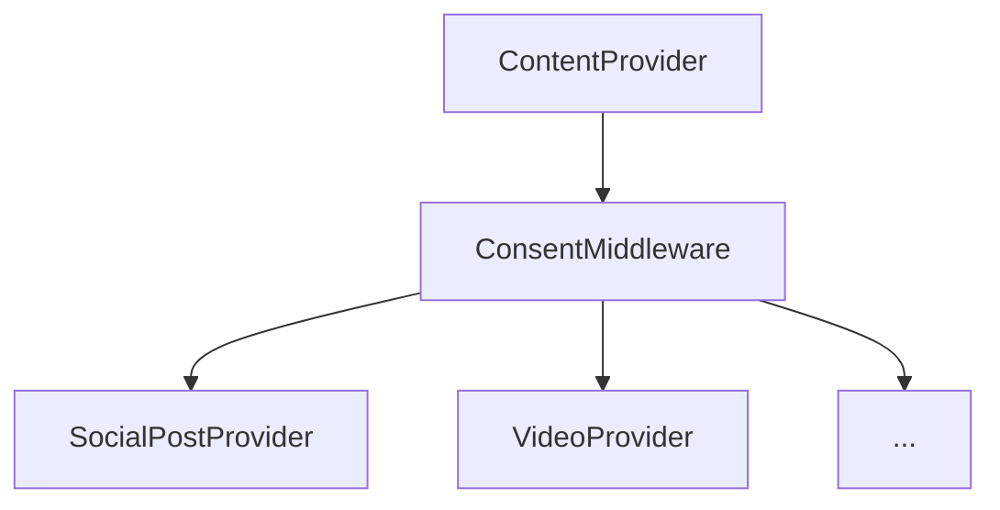

# Consent Middleware Architecture



## Components
- `ConsentMiddleware`: Wraps content providers and filters results
  - Implements `ContentProvider` trait
  - Contains reference to `ConsentService`
- `ConsentService`: Manages user consent preferences

## Flow
1. Request received by middleware
2. Fetch content from wrapped provider
3. Apply consent filters
4. Return filtered content

## Usage
```rust
use social_graph::infrastructure::consent_middleware::ConsentMiddleware;
use std::sync::Arc;

let middleware = ConsentMiddleware::new(provider, consent_service);
```