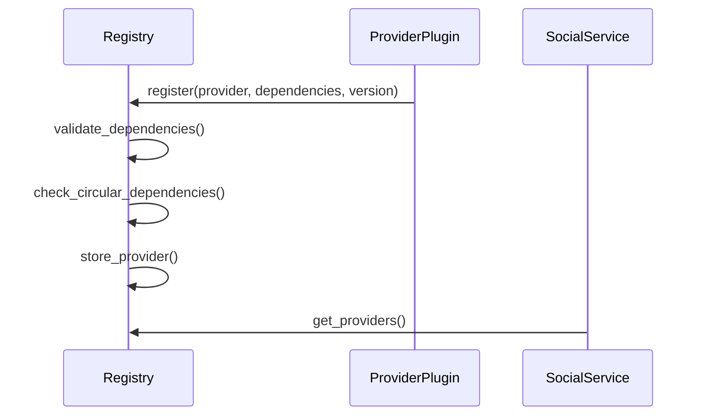

# Dynamic Content Provider System



## Key Features
- Runtime registration via `ContentProviderRegistry`
- Dependency declaration in provider metadata
- Semantic version validation with detailed error reporting
- Circular dependency detection
- Thread-safe access with `RwLock`
- State migration for hot-swapping providers
- Dependency-aware hot-swapping with version compatibility checks

## Components
- `ContentProviderRegistry`: Central registry for managing providers
- `ProviderMetadata`: Metadata for each registered provider
- `DependencyResolver`: Handles dependency validation and version checking
- `StateMigrator`: Manages state transfer during provider updates
- `SocialService::with_registry()`: Constructor that uses the registry

## Dependency Validation
Dependencies are validated using the following rules:
- Semantic version matching using semver crate
- Interface compatibility checks
- Directed acyclic graph (DAG) verification to prevent circular dependencies
- Detailed error reporting including:
  - Missing dependencies
  - Version conflicts
  - Interface mismatches
  - Circular dependency chains
  
  ### Dependency Conflict Resolution Workflow
  
  The registry follows this workflow to resolve dependency conflicts:
  
  ```mermaid
  graph TD
    A[Provider Registration/Update Request] --> B{Check Dependencies}
    B -->|Missing| C[Return MissingDependencyError]
    B -->|Version Conflict| D[Return VersionConflictError]
    B -->|Circular| E[Return CircularDependencyError]
    B -->|Valid| F[Proceed with Registration]
    C --> G[Notify Requester]
    D --> G
    E --> G
  ```
  
  ### Version Conflict Handling
  
  When version conflicts occur:
  1. Registry compares required vs available versions using semantic versioning
  2. If version requirement uses range syntax (e.g., "^1.2.3"), registry checks compatibility
  3. When versions are incompatible:
      - Operation is aborted
      - Detailed error returned with required/available versions
      - Providers remain in original state
  4. When versions are compatible:
      - Registry proceeds with registration/update
      - Dependent providers are notified of changes
  
  ### Circular Dependency Prevention
  
  The registry prevents circular dependencies by:
  1. Maintaining a dependency graph of all providers
  2. Performing depth-first search during registration
  3. Rejecting any dependency chain that forms a cycle
  4. Providing the exact dependency path in error messages
  
  > **Hot-Swapping Considerations**: Dependency validation is critical for hot-swapping providers. When updating a provider, the registry first validates that all dependency versions are satisfied. If dependencies are missing or have incompatible versions, the hot-swap will fail to prevent system instability. This ensures that provider updates don't break dependent functionality.
  
## State Migration Protocol
When replacing providers:
1. New provider declares compatibility range in metadata
2. Registry checks state version compatibility
3. If compatible:
   - Old provider serializes state using `serialize_state` hook
   - New provider deserializes state using `deserialize_state` hook
4. If incompatible:
   - Migration scripts are executed (if defined)
   - Fallback to empty state if migration fails
5. Atomic swap performed after successful migration

## Error Handling During Migration

The migration process includes comprehensive error handling:

- **Serialization failures**: If the old provider fails to serialize its state, the migration is aborted and the original provider remains active
- **Deserialization failures**: If the new provider fails to deserialize the state, the migration is aborted and the original provider remains active
- **Rollback mechanism**: All-or-nothing approach ensures system stability during provider updates

## Concurrent Access Handling

The registry uses a read-write lock to handle concurrent access during migrations:

1. During serialization:
   - Acquires a read lock on providers map
   - Allows other threads to continue reading providers
2. During state transfer:
   - Briefly upgrades to write lock for atomic provider swap
   - Minimizes write lock duration to reduce contention
3. After swap:
   - Releases write lock and resumes normal read operations

This design ensures safe concurrent access while maintaining performance.

> **Learn more**: See the [State Migration Guide](state_migration_guide.md) for detailed implementation instructions and best practices.

## Usage
```rust
use social_graph::infrastructure::content_providers::{ContentProviderRegistry, ProviderMetadata};
use social_graph::infrastructure::content_providers::{SocialPostProvider, VideoProvider};
use std::sync::Arc;
use uuid::Uuid;

// Create registry
let registry = Arc::new(ContentProviderRegistry::new(consent_service));

// Register providers
let social_post_provider = Arc::new(SocialPostProvider);
let social_post_metadata = ProviderMetadata {
    id: Uuid::new_v4(),
    name: "SocialPostProvider".to_string(),
    content_type: ContentType::SocialPost,
    version: "1.0.0".to_string(),
    dependencies: vec!["VideoProvider@^1.2".to_string()],
    state_schema_version: "1.0.0".to_string(),
    compatible_previous_versions: vec![],
    required_interfaces: vec![],
};

registry.register_provider(social_post_provider, social_post_metadata).unwrap();

// Update provider with state migration
let new_provider = Arc::new(ImprovedSocialPostProvider);
let new_metadata = ProviderMetadata {
    id: provider_id, // Same ID for update
    name: "SocialPostProvider".to_string(),
    content_type: ContentType::SocialPost,
    version: "2.0.0".to_string(),
    dependencies: vec!["VideoProvider@^1.2".to_string()],
    state_schema_version: "2.0.0".to_string(),
    compatible_previous_versions: vec!["1.0.0".to_string()],
    required_interfaces: vec![],
};

registry.update_provider(new_provider, new_metadata).unwrap();

// Create social service with registry
let social_service = SocialService::new(repository, consent_service, registry).unwrap();
```

## Examples

See the following examples for complete demonstrations:

- `shared_packages/social_graph/examples/dynamic_provider_example.rs`: Dependency resolution and conflict handling
- `shared_packages/social_graph/examples/state_migration_example.rs`: State migration with error handling
- `shared_packages/social_graph/examples/hot_swap_example.rs`: Hot-swapping with state preservation