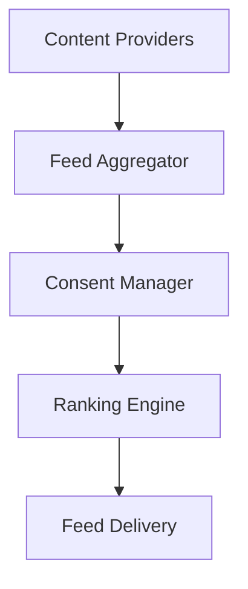

# Universal Feed Architecture Design

## Overview
The universal feed aggregates and displays multiple content types from across the CPC ecosystem while respecting consent and privacy settings. The system is designed to be extensible, allowing new content types to be added without major architectural changes.

## Core Components

### 1. Content Aggregation System


#### Content Provider Interface
```rust
pub trait ContentProvider: Send + Sync {
    fn content_type(&self) -> ContentType;
    async fn get_content(
        &self,
        user_id: Uuid,
        after: Option<DateTime<Utc>>,
        limit: usize,
        filters: &[FeedFilter]
    ) -> Result<Vec<ContentItem>, Box<dyn std::error::Error>>;
}
```

### 2. Unified Data Model

#### ContentItem
```rust
pub enum ContentType {
    SocialPost,
    Video,
    JobPosting,
    CourseSnippet,
    BusinessPlan,
    CommunityEvent,
    Custom(String),
}

pub struct ContentItem {
    pub id: Uuid,
    pub content_type: ContentType,
    pub source_package: String,
    pub metadata: JsonValue,
    pub timestamp: DateTime<Utc>,
    pub visibility: Visibility,
    pub relevance_score: f32,
}

pub enum Visibility {
    Public,
    FriendsOnly,
    GroupMembers,
    Private,
}
```

### 3. Consent & Visibility Workflow
- Content items are filtered through three consent checks:
  1. **Package-level consent**: User must consent to the source package
  2. **Content-type consent**: User must consent to the content type
  3. **Visibility rules**:
     - Public: Visible to all
     - FollowersOnly: Only visible to people who follow the user
     - FriendsOnly: Only visible if user is friends with owner
     - GroupMembers: Only visible to group members
     - Private: Only visible to owner

### 4. Ranking & Filtering
- **Ranking**:
  - Primary sort: relevance_score (descending)
  - Secondary sort: timestamp (descending)
  - Custom algorithms can be implemented via providers
  
- **Filtering**:
  - Providers handle type/package-specific filtering
  - Aggregator applies global visibility/consent rules
  - User filters refine final results

### 5. Performance Considerations
- **Pagination**: cursor-based using timestamp + UUID
- **Caching**: 
  - Sled for edge caching of feed segments
  - Redis for hot content caching
- **Lazy Loading**:
  - Placeholders for rich media
  - Progressive content hydration

### 6. Database Schema Changes
```sql
ALTER TABLE social_activities
    ADD COLUMN content_type VARCHAR(50) NOT NULL DEFAULT 'SocialPost',
    ADD COLUMN source_package VARCHAR(255) NOT NULL DEFAULT 'social_graph',
    ADD COLUMN visibility VARCHAR(20) NOT NULL DEFAULT 'Public',
    ALTER COLUMN metadata TYPE JSONB USING metadata::jsonb;
```

### 7. Extended GraphQL API
```graphql
type ActivityFeedItem {
    id: ID!
    contentType: ContentType!
    package: String!
    content: Json!
    timestamp: String!
    visibility: Visibility!
}

enum ContentType {
    SOCIAL_POST
    VIDEO
    JOB_POSTING
    COURSE_SNIPPET
    BUSINESS_PLAN
    COMMUNITY_EVENT
    CUSTOM
}

enum Visibility {
    PUBLIC
    FRIENDS_ONLY
    GROUP_MEMBERS
    PRIVATE
}

extend type Query {
    getActivityFeed(
        userId: ID!
        after: String
        limit: Int = 20
        filters: [FeedFilter!]
    ): [ActivityFeedItem!]!
}

input FeedFilter {
    contentType: ContentType
    package: String
    visibility: Visibility
}
```

## Integration Points
1. **Content Providers**:
   - Each package implements ContentProvider trait
   - Register providers via dependency injection

2. **Consent Manager**:
   - Central consent verification point
   - Handles GDPR-compliant data filtering

3. **Federation**:
   - p2panda integration for decentralized content
   - Content signatures for verification

## Implementation Roadmap
1. Implement ContentProvider trait and registry
2. Update get_universal_feed to:
   - Collect content from registered providers
   - Apply consent checks
   - Sort by relevance_score and timestamp
3. Add consent integration to content pipeline
4. Implement default ranking algorithm
5. Update GraphQL API to handle new filters
6. Add performance optimizations:
   - Provider-level caching
   - Batched consent checks
   - Streaming responses