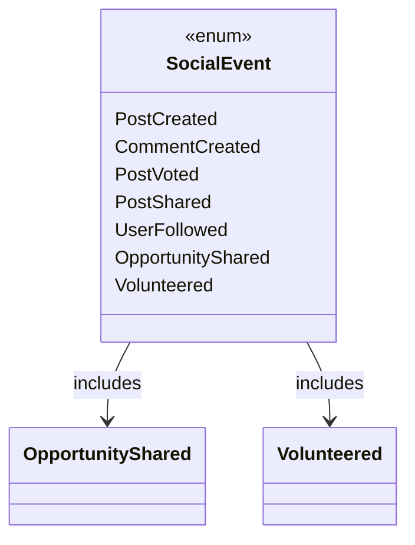
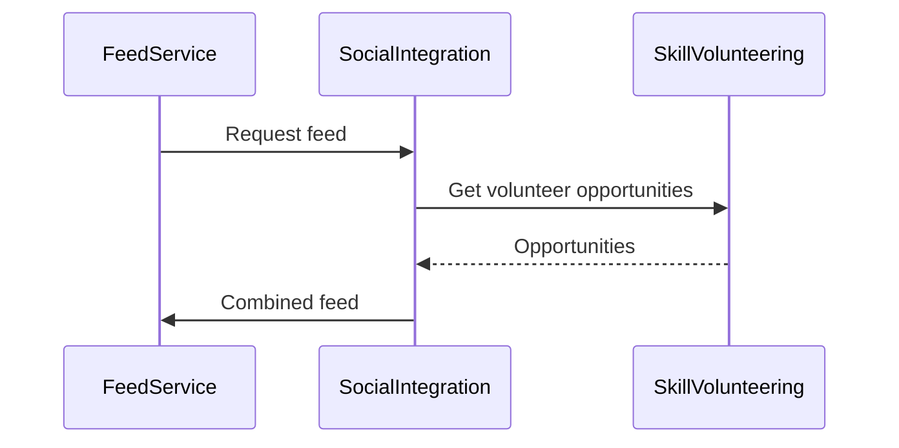
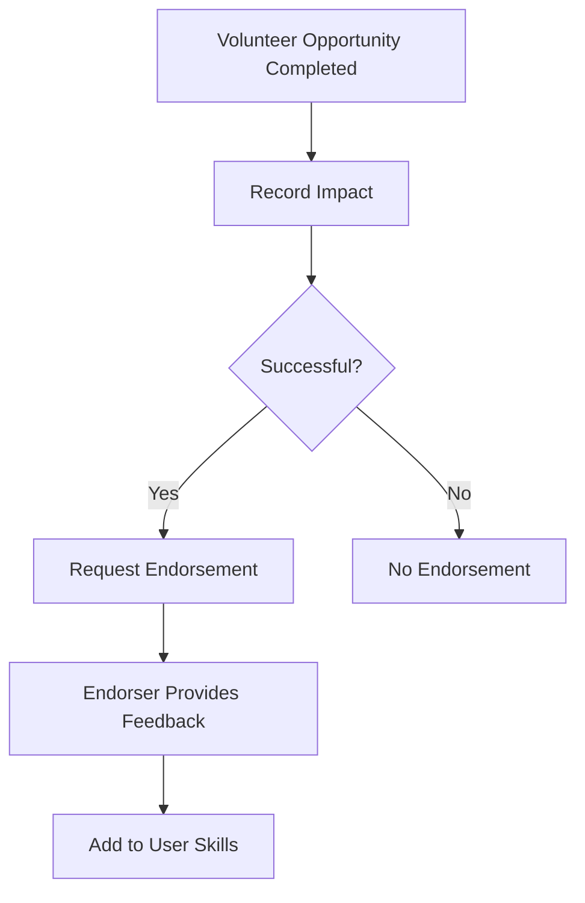

# Social Integration for Skill Volunteering

## Overview
This document outlines the integration of volunteer opportunities into our social platform, including feed visibility, social events, skill endorsements, and new GraphQL queries.

## Architectural Changes

### 1. Social Event Extensions


### 2. Feed Integration


### 3. Skill Endorsement Flow


## Implementation Details

### 1. New Social Event Types
Add to `social_event.rs`:
```rust
pub enum SocialEvent {
    // Existing variants...
    OpportunityShared {
        user_id: Uuid,
        opportunity_id: Uuid,
        timestamp: DateTime<Utc>,
    },
    Volunteered {
        user_id: Uuid,
        opportunity_id: Uuid,
        hours_contributed: f32,
        timestamp: DateTime<Utc>,
    }
}

// Update user_id() and timestamp() methods to handle new variants
```

### 2. Feed Integration Enhancements
Modify `feed_algorithms.rs` to:
- Add opportunity scoring based on:
  - Followed organizations (2x boost)
  - Connections' activities (1.5x boost)
  - Location proximity
- Add new algorithm variant `OpportunityPrioritized`

### 3. Skill Endorsement System
Add to `skill_volunteering/src/service.rs`:
```rust
struct Endorsement {
    endorser_id: Uuid,
    skill_id: Uuid,
    recipient_id: Uuid,
    opportunity_id: Uuid,
    comment: String,
    rating: u8,
}

// New gRPC methods:
// - record_endorsement()
// - get_endorsements_for_user()
```

### 4. GraphQL Extensions
Add to GraphQL schema:
```graphql
type Query {
    opportunitiesNearMe(location: GeoPoint!): [VolunteerOpportunity]
    volunteeringActivity(userId: ID!): [VolunteeringActivity]
}

type VolunteeringActivity {
    opportunity: VolunteerOpportunity
    hours: Float
    date: DateTime
    skillsUsed: [Skill]
}
```

## Integration Points
1. When opportunity is shared:
   - Generate `OpportunityShared` event
   - Add to followers' feeds
2. When volunteering is completed:
   - Generate `Volunteered` event
   - Trigger endorsement workflow
   - Update user skill profiles
3. Feed algorithms prioritize:
   - Opportunities from followed organizations
   - Volunteering activities from connections

## Next Steps
1. Implement event handlers in SocialIntegrationService
2. Extend feed algorithms with opportunity scoring
3. Add endorsement recording to skill volunteering service
4. Implement new GraphQL queries