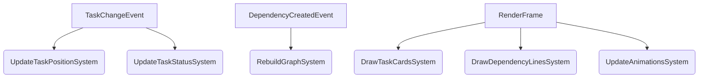

# Task Visualization with Bevy

## Overview
The Task Manager UI uses Bevy's Entity Component System (ECS) to render interactive task boards. This provides:
- Real-time updates
- Smooth animations
- Hardware acceleration
- Dependency graph visualization

## Core UI Components

### Task Card Component
```rust
struct TaskCard {
    id: Uuid,
    position: Vec2,
    size: Vec2,
    status: TaskStatus,
    priority: TaskPriority,
    progress: f32, // 0.0 - 1.0
    assignee: Option<Uuid>,
}
```

### Visualization Features
1. **Kanban Board View**
   - Columns: Not Started, In Progress, Blocked, Completed
   - Drag-and-drop task movement
   - Visual priority indicators (color-coded borders)

2. **Timeline View**
   - Gantt-style timeline
   - Dependency lines between tasks
   - Critical path highlighting

3. **Dependency Graph**
   - Force-directed graph layout
   - Interactive node selection
   - Path highlighting on hover

## Bevy ECS Architecture

### Systems


### Materials
- `TaskMaterial`: Custom shader for task cards
- `LineMaterial`: Animated dependency lines
- `HighlightMaterial`: Selection glow effect

## Performance Optimization
1. **Instanced Rendering**
   - Batch task card rendering
   - GPU instancing for identical elements

2. **Spatial Partitioning**
   - QuadTree for efficient collision detection
   - Viewport culling

3. **LOD (Level of Detail)**
   - Simplified meshes at distance
   - Texture streaming

## Interaction Patterns
1. **Task Selection**
   - Ray casting for 3D interaction
   - Context menu for actions

2. **Dependency Creation**
   - Drag from task to create dependency
   - Snap-to-grid for clean layouts

3. **Timeline Navigation**
   - Pan and zoom controls
   - Timescale adjustment

## Animation System
- Spring physics for smooth movements
- Tweening for status transitions
- Particle effects for task completion

## Example: Creating a Task Board
```rust
fn setup_task_board(mut commands: Commands) {
    commands.spawn(Camera2dBundle::default());
    
    // Create columns
    for (i, status) in TaskStatus::iter().enumerate() {
        commands.spawn((
            TaskColumn { status },
            Transform::from_xyz(i as f32 * 300.0, 0.0, 0.0),
        ));
    }
    
    // Spawn task cards
    for task in load_tasks() {
        commands.spawn((
            TaskCard::from(task),
            Draggable,
            Interactable,
        ));
    }
}